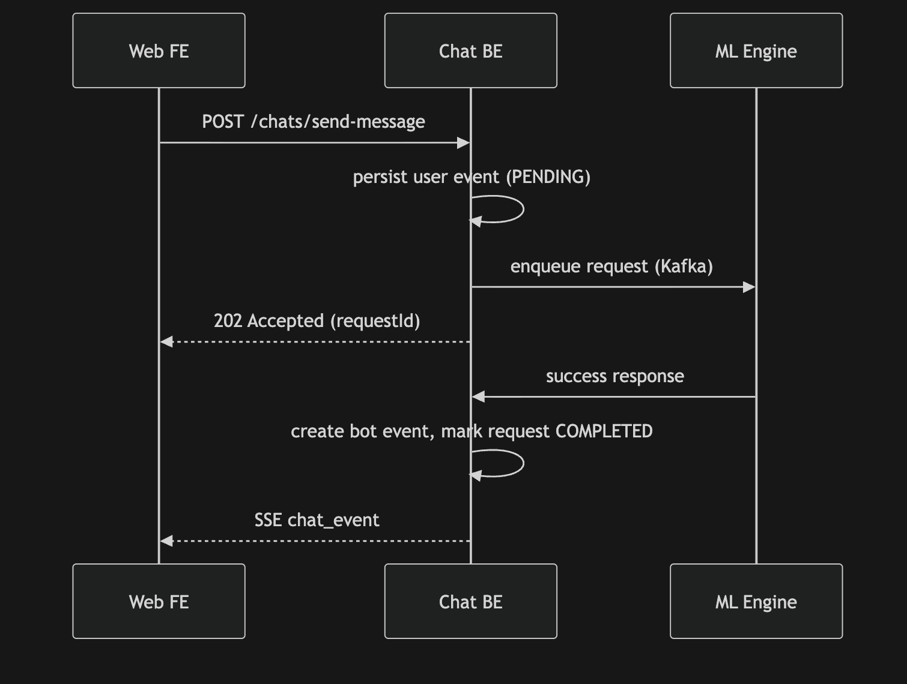
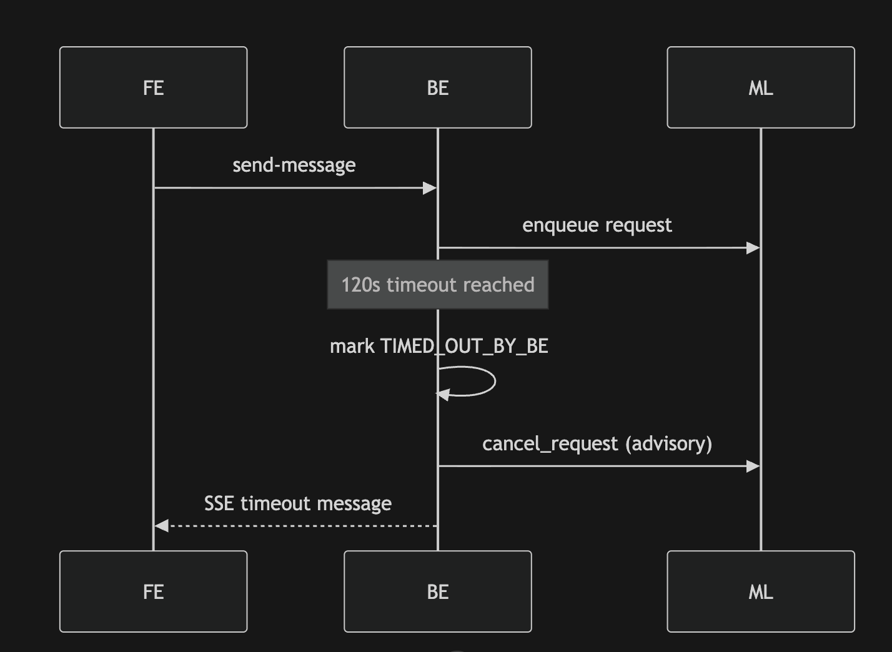
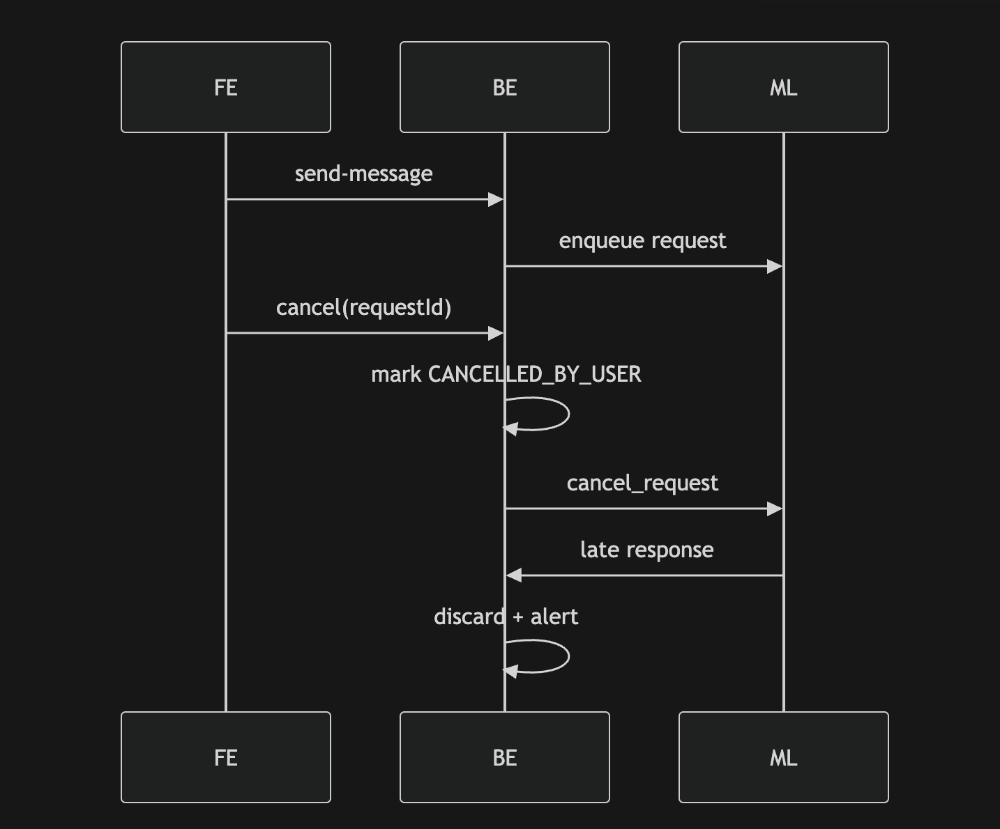
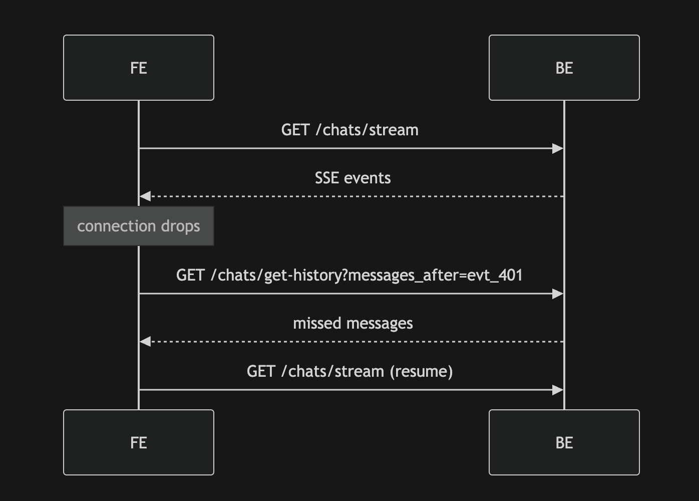

# Chat System Architecture & API Specification  
## **Frozen v1.0**

This document is the **canonical, frozen v1.0 specification** for the Chat system, covering:
- API contracts
- Request lifecycle & state machine
- ML ↔ BE envelopes
- SSE framing & connection rules
- Backend database schemas
- System invariants

This file is intended to be **downloaded, versioned, and committed** as a single source of truth.

---

## 1. Formal Request State Machine

### Lifecycle Diagram (Request-Centric)

```
REQUEST_CREATED
      |
      v
   PENDING
      |
      |-------------------------------|
      |               |               |
      v               v               v
 COMPLETED     ERRORED_AT_ML   TIMED_OUT_BY_BE
                                       |
                                       v
                             (cancel signal to ML)

      |
      v
CANCELLED_BY_USER
(soft delete user event)
```

---

## 2. State Semantics

| State | Meaning |
|------|--------|
| PENDING | Awaiting ML response |
| COMPLETED | ML response processed successfully |
| ERRORED_AT_ML | ML returned explicit error |
| TIMED_OUT_BY_BE | No ML response within BE timeout (120s) |
| CANCELLED_BY_USER | User cancelled request |

---

## 3. Hard Invariants (Request Handling)

- Only **PENDING** requests may accept ML responses
- All other ML responses are **discarded and alerted**
- Cancellation is **advisory** to ML
- Requests never transition out of terminal states
- User request event is soft-deleted only for `CANCELLED_BY_USER`

---

## 4. API Contracts

### 4.1 `GET /chats/get-conversation-id`

Returns the active conversation ID (single chat in Phase 1).

**Response**
```json
{
  "conversationId": "conv_1",
  "isNew": false
}
```

`isNew` is a demo-app convenience flag and is not required in production contract responses.

---

### 4.2 `GET /chats/get-chats`

Returns all chats for the user.
Ordering: **latest chat first** (descending by `lastActivityAt`).

```json
{
  "chats": [
    {
      "conversationId": "conv_1",
      "createdAt": "2026-02-06T09:00:00Z",
      "lastActivityAt": "2026-02-06T10:05:00Z"
    }
  ]
}
```

---

### 4.3 `GET /chats/get-history`

**Pagination**
```
/chats/get-history?conversationId=conv_1&page=0&page_size=3
```

**Response**
```json
{
  "conversationId": "conv_1",
  "messages": [
    {
      "eventId": "evt_201",
      "eventType": "message",
      "sender": { "type": "bot", "id": "re_bot" },
      "payload": { ... },
      "createdAt": "2026-02-06T10:00:01Z"
    }
  ],
  "hasMore": true
}
```

**After Event**
```
/chats/get-history?conversationId=conv_1&messages_after=evt_401
```

**Response**
```json
{
  "conversationId": "conv_1",
  "messages": [ { "eventId": "evt_401", "payload": {} } ]
}
```

---

### 4.4 `POST /chats/send-message`

```json
{
  "event": {
    "eventType": "message",
    "sender": { "type": "user" },
    "payload": {
      "messageType": "text",
      "content": { "text": "show me properties" }
    }
  }
}
```

**Response**
If `Accept: text/event-stream`, the BE returns an SSE stream (Phase 1 merged transport).

**SSE (example)**
```txt
event: connection_ack
data: {"eventId":"evt_301","requestState":"PENDING"}

id: evt_401
event: chat_event
data: {JSON_CHAT_EVENT}

event: connection_close
data: {"reason":"response_complete"}
```

If `Accept` is not `text/event-stream`, the BE returns JSON:
```json
{ "eventId": "evt_301", "requestState": "PENDING" }
```

**Message payload enrichment**
- Each persisted message may include top-level `requestState` with one of:
  - `PENDING`
  - `COMPLETED`
  - `ERRORED_AT_ML`
  - `TIMED_OUT_BY_BE`
  - `CANCELLED_BY_USER`
- FE uses this to decide rendering behavior per message.

---

### 4.5 `POST /chats/cancel`

```json
{ "eventId": "evt_301" }
```

---

### 4.6 Streaming responses (Phase 1)

In Phase 1, FE opens a new stream **per message** by calling `POST /chats/send-message` with
`Accept: text/event-stream`. This eliminates the need for a long-lived `GET /chats/stream` connection.

---

## 5. ML ↔ BE Envelopes (Phase 1)

### 5.1 ML Input (BE → ML)

```json
{
  "requestId": "req_123",
  "conversationId": "conv_1",
  "userEventId": "evt_456",
  "event": { "...": "ChatEvent" },
  "ttlMs": 120000
}
```

---

### 5.2 ML Success Output

```json
{
  "requestId": "req_123",
  "respondingToEventId": "evt_456",
  "status": "success",
  "event": { "...": "Bot ChatEvent" }
}
```

---

### 5.3 ML Error Output

```json
{
  "requestId": "req_123",
  "respondingToEventId": "evt_456",
  "status": "error",
  "error": {
    "code": "500",
    "message": "Cannot process request"
  }
}
```

---

### 5.4 Cancel Signal (BE → ML)

```json
{
  "type": "cancel_request",
  "requestId": "req_123",
  "reason": "TIMED_OUT_BY_BE"
}
```

---

## 6. SSE Rules

- SSE is **BE → FE only**
- `id` always equals `eventId` for chat events
- Ordering strictly by creation time
- Analytics & context events are **never sent**
- FE uses history APIs for replay

### 6.1 SSE event types

The stream uses the following **event** values and comment lines:

| Event / line | When | Format | FE handling |
|--------------|------|--------|-------------|
| **`event: chat_event`** | Bot (or visible info) event to display | `id: <eventId>\nevent: chat_event\ndata: <JSON ChatEvent>\n\n` | Parse `data` as `ChatEvent`; append to messages; `id` equals `eventId`. |
| **`event: connection_close`** | BE closing the stream (response complete / no-response / inactivity) | `event: connection_close\ndata: {"reason":"..."}\n\n` | Treat connection as closed for this request stream. |
| **Comment** (no event) | On open | `: connected\n\n` | Keeps connection alive; client detects stream open. |
| **Comment** (no event) | Keepalive while pending ML | `: keepalive\n\n` | Not delivered to EventSource listeners; used to refresh activity so BE does not close at 60s. |

**Chat events (`event: chat_event`)**  
- Only events that should be shown in the chat (e.g. bot messages, visible info) are sent with `event: chat_event`.
- Each line: `id: <eventId>\nevent: chat_event\ndata: <JSON ChatEvent>\n\n`.
- `data` is a single JSON object: the full `ChatEvent` (including `eventId`, `eventType`, `sender`, `payload`, `createdAt`, etc.).

**Other event values**  
- **`connection_close`**: Sent by the BE once, immediately before closing the stream when:
  - inactivity `>= 15s`, or
  - `responseRequired === false`, or
  - final bot response received (`isFinal === true`).

**Comments** (lines starting with `:`) do not set an `event` type and are not delivered to `EventSource` message listeners; they are used for connection liveness and keepalive only.

---

## 7. Connection Lifecycle Rules

### BE
- Close SSE when any of:
  - inactivity `>= 15s`
  - `responseRequired === false`
  - final bot response emitted (`isFinal === true`)

### FE
- Treat each `send-message` stream as request-scoped and terminal on `connection_close`.

---

## 8. Backend Database Schemas

### 8.1 `conversations`

```sql
conversation_id VARCHAR PK
user_id VARCHAR
ga_id VARCHAR
created_at TIMESTAMP
updated_at TIMESTAMP
```

---

### 8.2 `chat_events` (Immutable)

```sql
event_id VARCHAR PK
conversation_id VARCHAR
sender_type ENUM('user','bot','system')
event_type ENUM('message','info')
message_type VARCHAR
payload JSONB
source ENUM('FE','ML','SYSTEM')
visibility ENUM('active','soft_deleted')
created_at TIMESTAMP
```

---

### 8.3 `chat_requests` (Mutable)

```sql
request_id VARCHAR PK
conversation_id VARCHAR
user_event_id VARCHAR
state ENUM(
  'PENDING',
  'COMPLETED',
  'ERRORED_AT_ML',
  'TIMED_OUT_BY_BE',
  'CANCELLED_BY_USER'
)
retry_of_request_id VARCHAR
created_at TIMESTAMP
updated_at TIMESTAMP
```

---

## 9. System Invariants (Non-Negotiable)

1. One user message → one request
2. Only PENDING requests accept ML output
3. Event log is append-only
4. Request table is mutable
5. FE never talks to ML
6. ML never talks to FE
7. BE is the single source of truth
8. Late ML responses are discarded and logged

---

## 10. Sequence Diagrams (Non-Negotiable)

### 10.1 User Message → ML → FE (Happy Path)


```
sequenceDiagram
    participant FE as Web FE
    participant BE as Chat BE
    participant ML as ML Engine

    FE->>BE: POST /chats/send-message (Accept: text/event-stream)
    BE->>BE: persist user event (PENDING)
    BE-->>FE: SSE connection_ack (eventId)
    BE->>ML: invoke ML (method call)

    ML->>BE: success response
    BE->>BE: create bot event, mark request COMPLETED
    BE-->>FE: SSE chat_event (repeat until isFinal=true)
    BE-->>FE: SSE connection_close (response_complete)
```
---

### 10.2 Timeout at BE (No ML Response)

```
sequenceDiagram
    participant FE
    participant BE
    participant ML

    FE->>BE: send-message
    BE->>ML: enqueue request

    Note over BE: 120s timeout reached
    BE->>BE: mark TIMED_OUT_BY_BE
    BE->>ML: cancel_request (advisory)
    BE-->>FE: SSE timeout message

```
---

### 10.3 Cancel by User

```
sequenceDiagram
    participant FE
    participant BE
    participant ML

    FE->>BE: send-message
    BE->>ML: enqueue request

    FE->>BE: cancel(eventId)
    BE->>BE: mark CANCELLED_BY_USER
    BE->>ML: cancel_request

    ML->>BE: late response
    BE->>BE: discard + alert

```

---

### 10.4 SSE Reconnect Flow

```
sequenceDiagram
    participant FE
    participant BE

    FE->>BE: GET /chats/stream
    BE-->>FE: SSE events

    Note over FE: connection drops

    FE->>BE: GET /chats/get-history?messages_after=evt_401
    BE-->>FE: missed messages

    FE->>BE: GET /chats/stream (resume)

```

---

## Appendix A: Implementation diversions (this app)

This section records how the **chat-demo** implementation diverges from or extends the frozen spec above. The spec remains canonical; these notes describe actual behaviour in this codebase.

### A.1 get-history

- **Pagination**: In addition to `page`, `page_size`, and `messages_after`, the implementation supports:
  - **`messages_before`** + **`page_size`**: returns up to `page_size` messages *before* the given event ID (for “Load older messages”).
  - **`last`**: returns the last N messages (e.g. initial load with `last=6`).
- **Soft-deleted events**: Events that are the user request event for a request in state **CANCELLED_BY_USER** are excluded from history (soft-deleted per §3). No other event types are filtered.
- This filtering is done in BE `get-history` itself before response payload is returned to FE.

### A.2 FE reply timeout and UI

- **FE timeout**: The FE uses a 25s reply timeout (spec does not define FE timeout). After 25s without a bot final reply, the FE shows “Request timed out” with **Retry** and **Dismiss**.
- **Awaiting indicator**: While awaiting, FE shows a single inline status (“Running through the details...”).
- **Input/CTA behavior**:
  - While `sending`, input submit is disabled.
  - While `awaiting`, template actions are disabled and **Cancel** is shown in the composer.
  - On timeout/error, Retry/Dismiss actions are shown.

### A.3 SSE

- **Per-message stream**: FE uses `POST /chats/send-message` with `Accept: text/event-stream` per request (no long-lived `GET /chats/stream`).
- **connection_close**: BE emits `event: connection_close` with `{"reason":"response_complete"}` when final response is sent.
- **Ack + events**: stream starts with `connection_ack`, followed by `chat_event` entries until final.

### A.4 Cancel

- **Cancel button**: A **Cancel** button is shown next to **Send** while awaiting a reply. It calls `POST /chats/cancel` with the current user `eventId` and then clears the awaiting state so the user can send again.
- **Advisory cancellation, strict BE gate**: cancellation signal to ML is advisory, but BE strictly ignores late updates for cancelled/non-pending requests (`isPending` gate before append/broadcast).

### A.7 UI behavior for requestState

- `PENDING`, `COMPLETED`: render as usual.
- `ERRORED_AT_ML`, `TIMED_OUT_BY_BE`: FE renders generic error text (“Something went wrong. Please try again.”).
- `CANCELLED_BY_USER`: FE does not render that message.
- `requestState` is attached at top-level event field (`event.requestState`), not inside payload.

### A.5 Template and action handling

- **Transient templates**: `share_location`, `shortlist_property`, `contact_seller`, and `nested_qna` are rendered only when they are the latest message.
- **nested_qna contract shape**: `template.data.selections[]` with per-question `questionId` and options; FE submits `user_action` with `action: "nested_qna_selection"` and `selections`.
- **Share location behavior**: ML always returns `share_location` for near-me queries; FE `ShareLocation` auto-sends `location_shared` when permission is already granted, and may not render the permission template in that case.
- **Auth gating for actions**: shortlist/contact/brochure actions are FE-gated behind login bottom sheet; successful action posts send hidden/shown `user_action` events back to BE/ML.

### A.6 Demo mode (`/chat?demo=true`)

- On demo mode, FE runs a scripted sequence (text + real UI clicks) with 2s pacing.
- Includes login auto-fill (phone/OTP), nested_qna option/text flows, brochure click, and location-permission pauses.
- Debug tracing is available in browser console with `[demo]` log prefix.

---