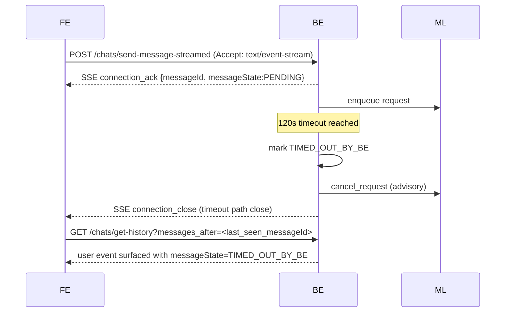
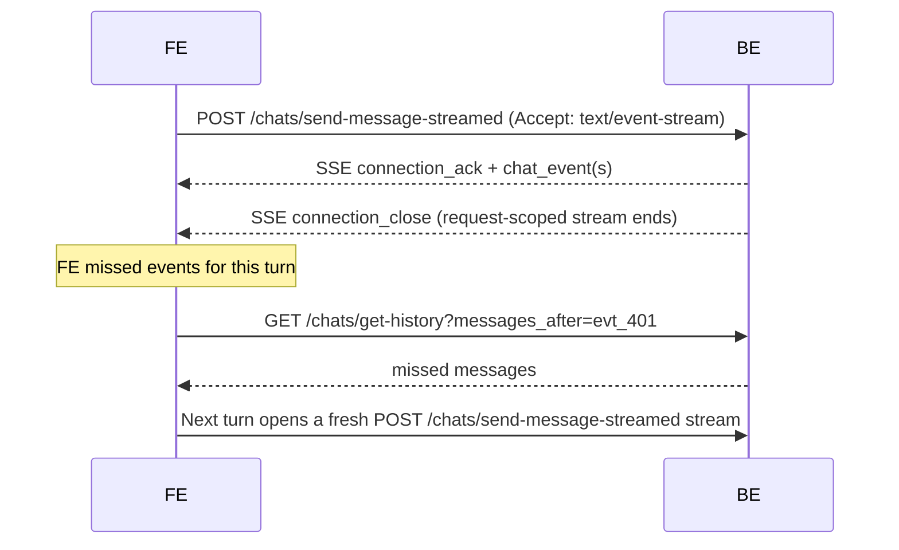
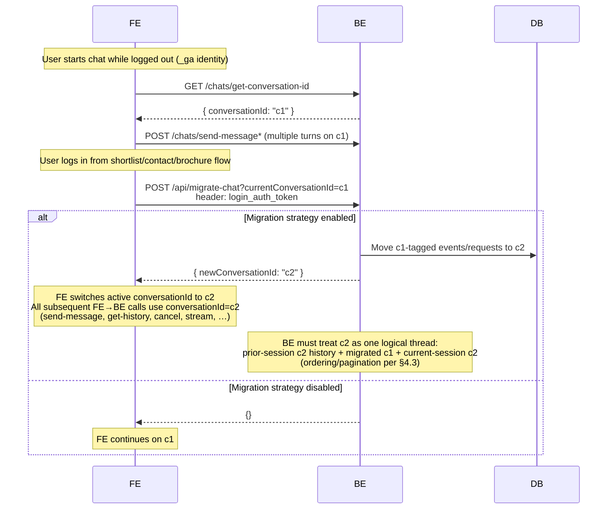

# Chat Platform Specification — v1

Final published **v1** specification for this repository.
This file is the canonical consolidated reference for architecture, API contract, and rich-text rendering.

## Open Items (Not Closed Yet)

1. Property carousel metadata: `property_count` vs `hasViewMore`.
2. Chat migration behavior when a user logs in mid-session.
3. **Context-out (Option 3 — proposed, not closed):** Wider team alignment is still pending; **Option 3** is the **preferred** direction in this document. ML does **not** attach rolling context to every bot payload. When user intent / search context changes in a way FE must know, ML emits a standalone **`messageType: "context"`** in the same `sourceMessageId` chain, using the **same `content.data` schema** as FE/system context on chat open (Part B §4.1). Context messages are **optional and infrequent**. **`messageState: COMPLETED`** on the **last** ML→BE event for that turn (after any context + all visible response parts) ends the request; BE must not mark the source user message `COMPLETED` on an intermediate `context` event alone. See §5.2, Part B §2 matrix, §10.6.

---

## Part A — System Architecture and API

## 1. Formal Request State Machine

### Lifecycle Diagram (Request-Centric)

```
REQUEST_CREATED
      |
      v
   PENDING
      |
      v
 IN_PROGRESS
      |
      |-------------------------------|
      |               |               |
      v               v               v
 COMPLETED     ERRORED_AT_ML   TIMED_OUT_BY_BE
                                      |
                                      v
                            (cancel signal to ML)
      |
      v
CANCELLED_BY_USER
(soft delete user event)
          |
          v
 (cancel signal to ML)
```

---

## 2. State Semantics

| State | Meaning |
|------|--------|
| PENDING | Accepted by BE and queued for ML |
| IN_PROGRESS | ML has started processing |
| COMPLETED | ML response processed successfully |
| ERRORED_AT_ML | ML returned explicit error |
| TIMED_OUT_BY_BE | No ML response within BE timeout (120s) |
| CANCELLED_BY_USER | User cancelled request |

---

## 3. Hard Invariants (Request Handling)

- Only **PENDING** or **IN_PROGRESS** source messages may accept ML responses
- BE ignores ML responses for source messages in all other states
- Cancellation is **advisory** to ML
- Requests never transition out of terminal states
- User request event is soft-deleted only for `CANCELLED_BY_USER`

---

## 4. API Contracts

### 4.0 Contract Interfaces (from [`lib/contract-types.ts`](lib/contract-types.ts))

- [`Sender`](lib/contract-types.ts#L19): base sender shape (`type`).
- [`SenderForML`](lib/contract-types.ts#L23) extends [`Sender`](lib/contract-types.ts#L19): sender plus optional `userId`/`gaId` derived by BE from headers.
- [`ChatPayloadContent`](lib/contract-types.ts#L29): content envelope (`text`, `templateId`, `data`, `derivedLabel`).
- [`ChatEventFromUser`](lib/contract-types.ts#L38): FE -> BE event shape for send-message APIs.
- [`ChatEventToML`](lib/contract-types.ts#L51): BE -> ML event shape for user turn dispatch.
- [`CancelEventToML`](lib/contract-types.ts#L65): BE -> ML cancellation signal shape.
- [`ChatEventFromML`](lib/contract-types.ts#L76): ML -> BE event shape (includes `sourceMessageId`, `messageType`, `messageState`, `sequenceNumber`, `content`, optional `error`).
- [`ChatEventToUser`](lib/contract-types.ts#L94): BE -> FE event shape for history and stream delivery.
- [`SendMessageResponse`](lib/contract-types.ts#L123): ack shape for send-message/send-message-streamed (`messageId`, `messageState?`).
- [`GetHistoryResponse`](lib/contract-types.ts#L128): history API shape (`conversationId`, `messages`: [`ChatEventToUser`](lib/contract-types.ts#L94)`[]`, `hasMore`).
- [`GetConversationIdResponse`](lib/contract-types.ts#L134): conversation lookup shape (`conversationId`, `isNew`).
- [`GetChatsResponse`](lib/contract-types.ts#L139): list shape for chat threads.
- [`ChatEvent`](lib/contract-types.ts#L116) (union): [`ChatEventFromUser`](lib/contract-types.ts#L38) | [`ChatEventToML`](lib/contract-types.ts#L51) | [`CancelEventToML`](lib/contract-types.ts#L65) | [`ChatEventFromML`](lib/contract-types.ts#L76) | [`ChatEventToUser`](lib/contract-types.ts#L94).

---

### 4.1 `GET /chats/get-conversation-id`

Returns the active conversation ID for the caller.
In Phase 1, this is a stable 1:1 mapping:
- one `conversationId` per authenticated `userId`, or
- one `conversationId` per anonymous `_ga`.
So repeated calls for the same user/`_ga` return the same `conversationId`.

**Interfaces**
- Response: `GetConversationIdResponse`

**Response**
```json
{
  "conversationId": "conv_1",
  "isNew": false
}
```

`isNew` is a demo-app convenience flag and is not required in production contract responses.

---

### 4.2 `GET /chats/get-chats`

Returns all chats for the user.
Ordering: **latest chat first** (descending by `lastActivityAt`).

> Phase 1 note: this endpoint is not required for core flow because BE maintains exactly one conversation per user (`userId`/`_ga`), so clients can rely on `GET /chats/get-conversation-id`.

**Interfaces**
- Response: `GetChatsResponse`

**Response**
```json
{
  "chats": [
    {
      "conversationId": "conv_2",
      "createdAt": "2025-01-12T11:00:00.000Z",
      "lastActivityAt": "2025-01-12T11:15:20.000Z"
    },
    {
      "conversationId": "conv_1",
      "createdAt": "2025-01-12T10:00:00.000Z",
      "lastActivityAt": "2025-01-12T10:45:05.000Z"
    }
  ]
}
```

---

### 4.3 `GET /chats/get-history`

Query params:
- `conversationId` (required)
- `page_size` (optional, default `6`)
- `messages_before` (optional, exclusive cursor)
- `messages_after` (optional, exclusive cursor)

Rules:
- `messages_before` and `messages_after` are mutually exclusive.
- Returned `messages` are in ascending creation order.
- User request events whose request state is `CANCELLED_BY_USER` are excluded by BE in `get-history` response.
- **Post-login migration (§4.4.1)**: After guest `c1` is migrated to authenticated `c2`, any `get-history` with `conversationId=c2` must return a **single logical thread** for that user: messages that existed on `c2` from **earlier authenticated sessions** (if any), **plus** messages **migrated from `c1`**, **plus** messages created on `c2` **after** migration in the current session. Cursor/pagination rules above apply to this merged ordering.


Example (`messages_before`):
`GET /chats/get-history?conversationId=conv_1&page_size=6&messages_before=msg_420`

Returns latest 6 messages before `msg_420`.

Example (`messages_after`):
`GET /chats/get-history?conversationId=conv_1&page_size=6&messages_after=msg_401`

Returns latest 6 messages strictly after `msg_401` (e.g. `msg_402..msg_407`).

**Interfaces**
- Response: `GetHistoryResponse` (`messages` items are `ChatEventToUser`)

**Response**
```json
{
  "conversationId": "conv_1",
  "messages": [
    { "messageId": "msg_402", "messageType": "...", "content": {} },
    { "messageId": "msg_403", "messageType": "...", "content": {} },
    { "messageId": "msg_404", "messageType": "...", "content": {} },
    { "messageId": "msg_405", "messageType": "...", "content": {} },
    { "messageId": "msg_406", "messageType": "...", "content": {} },
    { "messageId": "msg_407", "messageType": "...", "content": {} }
  ],
  "hasMore": true
}
```

---

### 4.4 `POST /chats/send-message` (non-streaming)

```json
{
  "conversationId": "conv_1",
  "sender": { "type": "user" },
  "messageType": "text",
  "content": { "text": "show me properties" }
}
```

**Interfaces**
- Request body: `ChatEventFromUser`
- Response: `SendMessageResponse`

**Response**
JSON only:
```json
{ "messageId": "msg_301", "messageState": "COMPLETED" }
```

**Usage**
- Canonical for fire-and-forget turns (`responseRequired === false`).
- If `responseRequired === true` (or user text), FE must use `POST /chats/send-message-streamed`.
- `conversationId` is mandatory in `event` payload for send-message APIs (not passed as query param).

**Message event enrichment**
- Each persisted message may include top-level `messageState` with one of:
  - `PENDING`
  - `IN_PROGRESS`
  - `COMPLETED`
  - `ERRORED_AT_ML`
  - `TIMED_OUT_BY_BE`
  - `CANCELLED_BY_USER`
- FE rendering by `messageState`:
  - `PENDING`, `IN_PROGRESS`, `COMPLETED`: render as usual
  - `ERRORED_AT_ML`, `TIMED_OUT_BY_BE`: render generic error text
  - `CANCELLED_BY_USER`: do not render message

---

### 4.5 `POST /chats/cancel`

```json
{ "messageId": "msg_301", "conversationId": "conv_1" }
```

**Interfaces**
- BE -> ML advisory cancellation object: `CancelEventToML`

- FE invokes cancel using the active user `messageId`.
- Cancellation is advisory toward ML, but BE strictly ignores late updates for cancelled/non-pending requests.

---

### 4.6 `POST /chats/send-message-streamed` (SSE)

Request body is a flattened `ChatEventFromUser` (no `event` envelope). This endpoint requires `Accept: text/event-stream`.

Before dispatching to ML, BE authenticates with `login_auth_token` when present and forwards derived identity under `sender.userId` / `sender.gaId`.
`sender.userId` is BE-derived from auth/identity request headers.

**Interfaces**
- FE -> BE request body: `ChatEventFromUser`
- BE -> ML dispatch event: `ChatEventToML`
- ML -> BE event: `ChatEventFromML`
- BE -> FE stream payload (`chat_event`): `ChatEventToUser`
- BE -> FE ack (`connection_ack`): `SendMessageResponse`

**SSE (example)**
```txt
event: connection_ack
data: {"messageId":"msg_301","messageState":"PENDING"}

id: msg_401
event: chat_event
data: {JSON_CHAT_EVENT}

event: connection_close
data: {"reason":"response_complete"}
```

**Usage**
- Canonical for response-required turns (`responseRequired === true` and user text).
- One request-scoped stream per turn; no long-lived `GET /chats/stream` connection.

### 4.7 FE Request UI Semantics (canonical)

- **Awaiting indicator**: FE shows inline awaiting status only when:
  - outbound event has `responseRequired === true`, and
  - the turn has not yet reached a terminal outcome: no bot `chat_event` with `messageState: COMPLETED | ERRORED_AT_ML`, and no surfaced `chat_event` with `messageState: TIMED_OUT_BY_BE` for this request (see §6 SSE).
- **Timeout**: FE maintains a local reply timeout safeguard (current app value: `25s`); after timeout UI is shown, FE relies on polling (`get-history` with `messages_after`) until it receives the response for that message.
- **Input/CTA behavior**:
  - while `sending`: composer submit disabled
  - while `awaiting`: template actions disabled, composer shows **Cancel**
  - on `timeout`/`error`: **Retry** and **Dismiss** actions shown
- **Dismiss/Cancel semantics**:
  - FE dismiss/cancel transitions the active request to `CANCELLED_BY_USER`
  - cancelled message is hidden by rendering rules
  - if dismiss happens before `connection_ack` arrives, FE still marks local pending user event as `CANCELLED_BY_USER`; if ack arrives later, FE immediately cancels by that `messageId`.

### 4.8 Template and Action Handling (canonical)

- **Transient templates**: `share_location`, `shortlist_property`, `contact_seller`, and `nested_qna` render only when they are the latest message.
- **nested_qna contract shape**: `template.data.selections[]` with per-question `questionId` and options.
- FE submission for nested QnA uses `user_action`:
  - `action: "nested_qna_selection"`
  - `selections: [...]`
- **Share location**:
  - ML always returns `share_location` for near-me prompts.
  - FE `ShareLocation` may auto-send `location_shared` when permission is already granted, and template may not be visibly rendered in that case.
- **Auth gating**: shortlist/contact/brochure actions are FE-gated behind login; successful actions post hidden/shown `user_action` events back to BE/ML.

---

## 5. ML ↔ BE Envelopes (Phase 1)

### 5.1 ML Input (BE → ML)

```json
{
  "conversationId": "conv_1",
  "messageId": "msg_u_456",
  "messageType": "text",
  "messageState": "PENDING",
  "createdAt": "2026-03-16T10:00:00.000Z",
  "sender": { "type": "user", "userId": "usr_123", "gaId": "GA1.2.12345.67890" },
  "content": { "text": "show me properties" },
  "responseRequired": true
}
```

---

### 5.2 ML Success Output

```json
{
  "conversationId": "conv_1",
  "sender": { "type": "bot" },
  "sourceMessageId": "msg_u_456",
  "messageType": "template",
  "messageState": "COMPLETED",
  "sequenceNumber": 1,
  "content": {
    "templateId": "property_carousel",
    "data": { "...": "template payload" }
  }
}
```

**Context-out (Option 3 — proposed)**  
- **Not a closed org decision** — Option 3 is the **preferred** approach here; finalize with the larger team.  
- There is **no** `summarisedChatContext` (or equivalent) on ML bot payloads. Rolling context updates are conveyed only via **`messageType: "context"`** when ML decides FE must be notified (e.g. filters, city, service changed). Those events use the **same `content.data` shape** as the context event FE sends on chat open (system) — see Part B §4.1.  
- Context is **not** sent on every ML response—only when intent/context materially changes.  
- Context and all user-visible bot parts for a turn share the same **`sourceMessageId`** and are ordered by **`sequenceNumber`**.  
- **`messageState: COMPLETED`** on the **final** ML output for that `sourceMessageId` means the full response (including any preceding `context` and bot content events) is complete. Earlier events in the chain use **`IN_PROGRESS`** (or non-terminal states as defined by BE/ML). BE applies **`COMPLETED`** to the **source user message** only when processing that **final** event—not when a standalone `context` message arrives mid-chain.

BE persistence semantics for ML outputs:
- BE persists each ML output as a new message with a newly generated `messageId`. Bot-visible rows use `sender.type = "bot"`; `messageType: "context"` from ML may also use `sender.type: "bot"` (Part B §2 matrix).
- BE applies the source user message’s terminal `messageState` from the **last** ML event in the chain for that `sourceMessageId` (see above).

---

### 5.3 ML Error Output

```json
{
  "conversationId": "conv_1",
  "sender": { "type": "bot" },
  "sourceMessageId": "msg_u_456",
  "messageType": "text",
  "messageState": "ERRORED_AT_ML",
  "sequenceNumber": 0,
  "error": {
    "code": "500",
    "message": "Cannot process request"
  },
  "content": {
    "text": "Something went wrong while processing this request."
  }
}
```

---

### 5.4 Cancel Signal (BE → ML)

```json
{
  "sender": {
    "type": "system",
    "userId": "usr_123",
    "gaId": "GA1.2.12345.67890"
  },
  "conversationId": "conv_1",
  "messageIdToCancel": "msg_u_456",
  "cancelReason": "TIMED_OUT_BY_BE"
}
```

---

## 6. SSE Rules

- SSE is **BE → FE only**
- `id` always equals `messageId` for chat events
- Ordering strictly by creation time
- Analytics & context events are **never sent**
- FE uses history APIs for replay

### 6.1 SSE event types

The stream uses the following **event** values and comment lines:

| Event / line | When | Format | FE handling |
|--------------|------|--------|-------------|
| **`event: chat_event`** | Bot (or visible info) event to display | `id: <messageId>\nevent: chat_event\ndata: <JSON ChatEvent>\n\n` | Parse `data` as `ChatEvent`; append to messages; `id` equals `messageId`. |
| **`event: connection_close`** | BE closing the stream (response complete / no-response / inactivity) | `event: connection_close\ndata: {"reason":"..."}\n\n` | Treat connection as closed for this request stream. |
| **Comment** (no event) | On open | `: connected\n\n` | Keeps connection alive; client detects stream open. |
| **Comment** (no event) | Keepalive while pending ML | `: keepalive\n\n` | Not delivered to EventSource listeners; used to refresh activity so BE does not close at 60s. |

**Chat events (`event: chat_event`)**  
- Only events that should be shown in the chat (e.g. bot messages, visible info) are sent with `event: chat_event`.
- Each line: `id: <messageId>\nevent: chat_event\ndata: <JSON ChatEvent>\n\n`.
- `data` is a single JSON object: the full `ChatEvent` (including `messageId`, `sender`, `messageType`, `content`, `createdAt`, etc.).

**Other event values**  
- **`connection_close`**: Sent by the BE once, immediately before closing the stream when:
  - inactivity `>= 15s`, or
  - `responseRequired === false`, or
  - terminal turn outcome received on the stream (e.g. bot `chat_event` with `messageState: COMPLETED | ERRORED_AT_ML`, or surfaced `TIMED_OUT_BY_BE` for the request per §6).

**Comments** (lines starting with `:`) do not set an `event` type and are not delivered to `EventSource` message listeners; they are used for connection liveness and keepalive only.

---

## 7. Connection Lifecycle Rules

### BE
- Close SSE when any of:
  - inactivity `>= 15s`
  - `responseRequired === false`
  - terminal turn outcome emitted (e.g. bot `messageState: COMPLETED | ERRORED_AT_ML`, or request surfaced as `TIMED_OUT_BY_BE` per §6)

### FE
- Treat each `send-message-streamed` stream as request-scoped and terminal on `connection_close`.

---

## 8. Backend Database Schemas

### 8.1 `conversations`

```sql
conversation_id VARCHAR PK
user_id VARCHAR
ga_id VARCHAR
created_at TIMESTAMP
updated_at TIMESTAMP
```

---

### 8.2 `chat_messages` (Immutable)

```sql
message_id VARCHAR PK
conversation_id VARCHAR
sender_type ENUM('user','bot','system')
message_type VARCHAR
content JSONB
source_message_id VARCHAR
message_state VARCHAR
response_required BOOLEAN
sequence_number INT
is_visible BOOLEAN
created_at TIMESTAMP
updated_at TIMESTAMP
```

---

## 9. System Invariants (Non-Negotiable)

1. One user message → one request lifecycle
2. Only PENDING/IN_PROGRESS source messages accept ML output
3. Message log is append-only
4. FE never talks to ML
5. ML never talks to FE
6. BE is the single source of truth
7. Late ML responses are discarded and logged

---

## 10. Sequence Diagrams (Non-Negotiable)

### 10.1 User Message → ML → FE (Happy Path)

**Interfaces used**
- FE -> BE: `ChatEventFromUser`
- BE -> ML: `ChatEventToML`
- ML -> BE: `ChatEventFromML`
- BE -> FE (`chat_event`): `ChatEventToUser`
- BE -> FE (`connection_ack`): `SendMessageResponse`


---

### 10.2 Timeout at BE (No ML Response)

**Interfaces used**
- FE -> BE: `ChatEventFromUser`
- BE -> ML cancel advisory: `CancelEventToML`
- FE polling response: `GetHistoryResponse` (`ChatEventToUser[]`)


---

### 10.3 Cancel by User

**Interfaces used**
- FE -> BE: `ChatEventFromUser`
- FE cancel call triggers BE -> ML advisory: `CancelEventToML`
- Any ML late response is typed as `ChatEventFromML` and discarded by BE state gate


---

### 10.4 SSE Reconnect Flow

**Interfaces used**
- Initial turn request: `ChatEventFromUser`
- Stream payloads: `ChatEventToUser`
- Recovery API response: `GetHistoryResponse` (`ChatEventToUser[]`)



---

### 10.5 Conversation Migration After Login

**Interfaces used**
- Conversation lookup: `GetConversationIdResponse`
- Optional history refresh: `GetHistoryResponse` (`ChatEventToUser[]`) — FE may call anytime; **not required** immediately after migrate (see §4.3 / §4.4.1).



---

### 10.6 Context-Out Option 3 (Separate ML `context` Message)

**Interfaces used**
- FE -> BE: `ChatEventFromUser`
- BE -> ML: `ChatEventToML`
- ML -> BE: `ChatEventFromML` (bot `text`/`markdown`/`template` and, when needed, `messageType: "context"` with same `content.data` as system context)
- BE -> FE (`chat_event`): `ChatEventToUser`

**Rules**  
- Context is emitted **only when** ML detects user intent / search context changed such that FE should update client-side context—not on every reply.  
- All parts for the turn share **`sourceMessageId`**. Use **`sequenceNumber`** for ordering.  
- Intermediate events (including a mid-chain **`context`** row) use **`messageState: IN_PROGRESS`** on the ML envelope as appropriate; **`messageState: COMPLETED`** appears **only on the last** ML→BE event for that `sourceMessageId`. BE then marks the **source user message** `COMPLETED` and may emit **`connection_close`**.  
- **Locality intent shift (example):** e.g. user pivots from **Sector 21 → Sector 32** (or the reverse). ML may emit **`context`** with updated **`filters.poly`** (or equivalent) before the visible template (e.g. `nested_qna`). Part B §4.1.1 shows a concrete envelope.

```mermaid
sequenceDiagram
    participant FE
    participant BE
    participant ML

    FE->>BE: POST /chats/send-message-streamed (ChatEventFromUser)
    BE-->>FE: SSE connection_ack {messageId, messageState:PENDING}
    BE->>ML: dispatch ChatEventToML

    ML->>BE: bot markdown (messageState=IN_PROGRESS, sourceMessageId=msg_u_1, sequenceNumber=0)
    BE-->>FE: SSE chat_event

    Note over ML: User intent / context changed — notify FE
    ML->>BE: context (messageType=context, sender=bot, sourceMessageId=msg_u_1, sequenceNumber=1, messageState=IN_PROGRESS)
    BE-->>FE: SSE chat_event (not rendered; same content.data schema as system context)

    ML->>BE: bot template (messageState=COMPLETED, sourceMessageId=msg_u_1, sequenceNumber=2)
    BE->>BE: mark source msg_u_1 COMPLETED (final event in chain)
    BE-->>FE: SSE chat_event (final bot content)
    BE-->>FE: SSE connection_close (response_complete)
```

---

## Appendix A: Implementation diversions (this app)

This section records how the **chat-demo** implementation diverges from or extends the frozen spec above. The spec remains canonical; these notes describe actual behaviour in this codebase.

### A.1 get-history

- Cursor behavior and soft-delete filtering are documented in canonical section §4.3.

### A.2 FE reply timeout and UI

- Canonical FE request UI semantics are documented in §4.7.

### A.3 SSE

- Canonical SSE behavior is documented in §4.6 and §6.

### A.4 Cancel

- Canonical cancel behavior is documented in §4.5 and §4.7.

### A.7 UI behavior for messageState

- Canonical messageState placement and rendering rules are documented in §4.4.

### A.5 Template and action handling

- Canonical template/action rules are documented in §4.8.

### A.6 Demo mode (`/chat?demo=true`)

- On demo mode, FE runs a scripted sequence (text + real UI clicks) with 2s pacing.
- Includes login auto-fill (phone/OTP), nested_qna option/text flows, brochure click, and location-permission pauses.
- Debug tracing is available in browser console with `[demo]` log prefix.

### A.8 Context-out (Option 3) in this app

- Canonical rules are §5.2, Part B §2 matrix, §10.6. **`summarisedChatContext` is removed** from the TypeScript contract and mock ML payloads.
- The **mock `ml-flow`** emits a mid-turn **`messageType: "context"`** (`messageState: IN_PROGRESS`, then `nested_qna` as `COMPLETED`) when the user message targets **only Sector 32** (“learn more / tell more about sector 32”, …) or **only Sector 21** (“tell more about sector 21”, …), with **`content.data`** matching the system-context shape (Part B §4.1) and **different `filters.poly`** per locality. The **`/chat?demo=true`** scripted steps for those phrases exercise this path. **`send-message-streamed`** persists ML **`messageState`** as-is (no forced `COMPLETED` on intermediate rows).

---

## Part B — Chat API Contract and Rich Text Examples

## 0. Core Principles (v1.0)

- **One primary enum**: `messageType`: `context | text | template | user_action | markdown` *(analytics — Phase 2)*
- **Message origin**: `system` and `user` messages are generated by the **client app**; `bot` messages are generated by **ML** and relayed via BE.  
  **Rendering rule:** `system` and `bot` messages are rendered as bot-side messages, while only `sender.type = user` is rendered in user bubbles.
- **Message IDs**: `messageId` is generated by **BE** (not FE/ML) for all persisted messages. Every message delivered to FE must include `messageId`.
- **Every bot message MUST have `messageId`, `sourceMessageId`, `sequenceNumber`, and `messageState`**
- **`sourceMessageId`** ties all bot response messages back to the user message that triggered them
- In FE-facing events, `sourceMessageId` is optional and generally not required for rendering logic.
- **`user_action` visibility**: hidden by default — only rendered when `isVisible === true` and `derivedLabel` is set
- **For `user_action` replies to prior bot/template messages, use `content.data.replyToMessageId`** (instead of `messageId` inside `data`)
- **`responseRequired`** on `user_action` and user `text`: tells ML whether to generate a response — always `true` for user text, conditional for user_action
- **Templates are FE-owned** (custom rendering is allowed and expected)
- **Templates MUST provide a `fallbackText`** *(Phase 2 — not rendered in Phase 1)*
- **Context is never rendered** (including ML-originated `messageType: "context"` under Option 3). **Analytics** messageType is **Phase 2** — not in Phase 1 scope.
- **Context-out (Option 3 — proposed, not closed):** ML may append `messageType: "context"` with `sender.type: "bot"` in the `sourceMessageId` chain when intent changes; `content.data` matches system context (§4.1). No `summarisedChatContext` on bot payloads. Terminal **`COMPLETED`** only on the **last** ML event for the turn (§5.2, §10.6).
- **All future changes must be additive (v1.x)**

---

## 1. JSON Schema (Draft 7)

```json
{
  "$schema": "http://json-schema.org/draft-07/schema#",
  "title": "ChatEvent",
  "type": "object",
  "required": ["sender", "messageType", "content"],
  "properties": {
    "messageId": {
      "type": "string",
      "description": "Unique ID for this message. Always generated by BE. FE and ML must not generate messageId."
    },
    "sourceMessageId": {
      "type": "string",
      "description": "BE sends user messageId to ML; ML echoes it back on all response messages for turn correlation. Required when sender.type = bot."
    },
    "sequenceNumber": {
      "type": "integer",
      "minimum": 0,
      "description": "0-based position within the response sequence for a single user turn. Required when sender.type = bot."
    },
    "responseRequired": {
      "type": "boolean",
      "description": "FE-controlled. true = FE expects ML response; false/absent = fire-and-forget."
    },
    "messageType": {
      "type": "string",
      "enum": ["context", "text", "template", "user_action", "markdown"],
      "description": "analytics is Phase 2 — not in Phase 1 schema."
    },
    "isVisible": {
      "type": "boolean",
      "description": "Only meaningful for messageType = user_action."
    },
    "content": {
      "type": "object",
      "properties": {
        "text": {
          "type": "string",
          "description": "Plain text or Markdown depending on messageType"
        },
        "templateId": { "type": "string" },
        "data": { "type": "object" },
        "fallbackText": {
          "type": "string",
          "description": "[Phase 2] Renderable rich text used when template is unsupported (plain text | Markdown preferred)"
        },
        "derivedLabel": {
          "type": "string",
          "description": "FE-authored display text for user_action. Persisted by BE so history can render the same shown action text."
        }
      },
      "additionalProperties": false
    },
    "conversationId": { "type": "string" },

    "sender": {
      "type": "object",
      "required": ["type"],
      "properties": {
        "type": { "type": "string", "enum": ["user", "bot", "system"] }
      }
    },

    "messageState": {
      "type": "string",
      "enum": [
        "PENDING",
        "IN_PROGRESS",
        "COMPLETED",
        "ERRORED_AT_ML",
        "TIMED_OUT_BY_BE",
        "CANCELLED_BY_USER"
      ],
      "description": "BE-resolved request lifecycle state for this message/turn."
    },
  },

  "allOf": [
    {
      "if": {
        "properties": {
          "sender": { "properties": { "type": { "const": "bot" } } }
        }
      },
      "then": {
        "properties": {
          "messageId": { "type": "string" }
        }
      }
    },
    {
      "if": {
        "properties": {
          "messageType": { "const": "user_action" }
        }
      },
      "then": {
        "properties": {
          "content": {
            // content.data is required; derivedLabel is required only when isVisible = true
            "required": ["data"]
          }
        }
      }
    }
  ]
}
```
---

## 2. Allowed `messageType` by Sender

| messageType | user | bot | system | responseRequired |
|------------|------|-----|--------|-----------------|
| context | ❌ | ✅ | ✅ | no |
| text | ✅ | ✅ | ✅ | yes when FE expects reply (`responseRequired: true`) |
| markdown | ❌ | ✅ | ❌ | NA |
| template | ❌ | ✅ | ❌ | NA |
| user_action | ✅ | ❌ | ✅ | yes when FE expects a response |

*Analytics is **Phase 2** — not in Phase 1.*

**Context-out (Option 3 — proposed)**  
- ML may emit `messageType: "context"` with `sender.type: "bot"` (matrix above). `content.data` matches the **same schema** as FE/system context (Part B §4.1). FE does not render `context` rows (§3 decision table).  
- See §5.2 and §10.6 for ordering, `sequenceNumber`, and when `messageState: COMPLETED` closes the request.

---

## 3. FE Rendering Rules (Decision Table)

| Condition | FE Behavior |
|---------|-------------|
| messageType = context | Do not render |
| messageState = CANCELLED_BY_USER | Do not render |
| messageState = ERRORED_AT_ML or TIMED_OUT_BY_BE | Render generic error text (“Something went wrong. Please try again.”) |
| messageType = user_action AND isVisible != true | Do not render (hidden by default) |
| messageType = user_action AND isVisible = true | Render derivedLabel |
| template supported | Render template |
| markdown | Safe render |
| action scope = template_item | Render per item — **[Phase 2]**  |
| action scope = message | Render once — **[Phase 2]**  |
| replyType = hidden | No echo, no LLM — **[Phase 2]**  |
| template unsupported | Render fallbackText (rich text) — **[Phase 2]** |

---

## 4. Examples

Property payload shape reference APIs (for template `data.property` / `data.properties[]`):

- Venus project details: [PROJECT_DEDICATED_DETAILS](https://venus.housing.com/api/v9/new-projects/288866/android?fixed_images_hash=true&include_derived_floor_plan=true&api_name=PROJECT_DEDICATED_DETAILS&source=android)
- Casa resale details: [RESALE_DEDICATED_DETAILS](https://casa.housing.com/api/v2/flat/18151449/resale/details?api_name=RESALE_DEDICATED_DETAILS&source=android)

### 4.1 Context on Chat Open (SRP)

> 📎 **Filter Reference:** See [`filterMap.js`](https://github.com/elarahq/housing.brahmand/blob/a17bf76ad06f0da180b270c840b1fb4ab14eb627/common/modules/filter-encoder/source/filterMap.js) for all possible filter keys.  
> 📎 **page_type values:** See [`pageTypes.js`](https://github.com/elarahq/housing.brahmand/blob/master/common/constants/pageTypes.js).

```json
{
  "sender": { "type": "system" },
  "messageType": "context",
  "content": {
    "data": {
      "page_type": "SRP",
      "service": "buy",
      "category": "residential",
      "city": "526acdc6c33455e9e4e9",
      "filters": {
          
        "poly": ["dce9290ec3fe8834a293"], // list of polygon uuids for polygon SRP
        "est": 194298, // landmark SRP page - this is landmark/establishment id
        // below 2 fields are used when chat is initiated either from project SRP or from project dedicated page. 
        "region_entity_id": 31817,
        "region_entity_type": "project",
        "uuid": [], // builder uuid when searching for properties posted by a builder - builder SRP page
        "qv_resale_id": 1234, // property id when chat is initiated from resale details page 
        "qv_rent_id": 12345 // property id when chat is initiated from rent details page 

      // below are all filters
        "apartment_type_id": [1, 2],
        "contact_person_id": [1, 2],
        "facing": ["east", "west"],
        "has_lift": true,
        "is_gated_community": true,
        "is_verified": true,
        "max_area": 4000,
        "max_poss": 0,
        "max_price": 4800000,
        "radius": 3000,
        "routing_range": 10,
        "routing_range_type": "time",
        "min_price": 100,
        "property_type_id": [1, 2],
        "type": "project", // project/resale
      }
    },
  }
}
```

### 4.1.1 ML context-out — locality intent shift (examples)

**Scenario:** User shifts focus from one locality to another (e.g. **Sector 21 → Sector 32**). ML emits **`messageType: "context"`** first (same `content.data` schema as §4.1), then the visible reply (e.g. `nested_qna`). **`sequenceNumber`** orders the chain; **`messageState: IN_PROGRESS`** on the context row; **`COMPLETED`** only on the **last** ML event for that `sourceMessageId`. See §5.2, §10.6.

**1) Intent narrowed to Sector 32, Gurgaon (abridged):**

```json
{
  "sender": { "type": "bot" },
  "messageType": "context",
  "sourceMessageId": "msg_u_9",
  "sequenceNumber": 0,
  "messageState": "IN_PROGRESS",
  "content": {
    "data": {
      "page": "SRP",
      "service": "buy",
      "category": "residential",
      "city": "526acdc6c33455e9e4e9",
      "filters": {
        "type": "project",
        "poly": ["dce9290ec3fe8834a293"],
        "apartment_type_id": [1, 2],
        "min_price": 100,
        "max_price": 4800000,
        "property_type_id": [1, 2]
      }
    }
  }
}
```

**2) Intent narrowed to Sector 21, Gurgaon (abridged):** same envelope; **`filters.poly`** differs (e.g. mock uses `["a1b2c3d4e5f6sector21gurgaonpoly"]` to distinguish from Sector 32). The next event in the chain is typically `nested_qna` with `sequenceNumber: 1`, `messageState: COMPLETED`.

---
### 4.2 Transport-level SSE examples

`POST /chats/send-message-streamed` with `Accept: text/event-stream`:

```txt
event: connection_ack
data: {"messageId":"msg_user_001","messageState":"PENDING"}

id: msg_bot_010
event: chat_event
data: {"sender":{"type":"bot"},"messageId":"msg_b1","sourceMessageId":"msg_u1","sequenceNumber":0,"messageState":"IN_PROGRESS","messageType":"text","content":{"text":"Here are 2bhk properties in sector 32 gurgaon"}}

id: msg_bot_011
event: chat_event
data: {"sender":{"type":"bot"},"messageId":"msg_b2","sourceMessageId":"msg_u1","sequenceNumber":1,"messageState":"COMPLETED","messageType":"template","content":{"templateId":"property_carousel","data":{"properties":[{"id":"p1","type":"project","title":"2, 3 BHK Apartments","name":"Godrej Air","short_address":[{"display_name":"Sector 85"},{"display_name":"Gurgaon"}],"is_rera_verified":true,"inventory_canonical_url":"https://example.com/property/p1","thumb_image_url":"https://images.unsplash.com/photo-1560448204-e02f11c3d0e2?w=600","property_tags":["Ready to move"],"formatted_min_price":"3 Cr","formatted_max_price":"3.5 Cr","unit_of_area":"sq.ft.","display_area_type":"Built up area","min_selected_area_in_unit":2500,"max_selected_area_in_unit":4750,"inventory_configs":[]},{"id":"p2","type":"rent","title":"3 BHK flat","short_address":[{"display_name":"Sector 33"},{"display_name":"Sohna"},{"display_name":"Gurgaon"}],"region_entities":[{"name":"M3M Solitude Ralph Estate"}],"is_rera_verified":false,"is_verified":true,"inventory_canonical_url":"https://example.com/property/p2","thumb_image_url":"https://images.unsplash.com/photo-1560448204-e02f11c3d0e2?w=600","property_tags":[],"formatted_price":"30,000","unit_of_area":"sq.ft.","display_area_type":"Built up area","inventory_configs":[{"furnish_type_id":2,"area_value_in_unit":4750}]},{"id":"p4","type":"rent","title":"2 BHK independent floor","short_address":[{"display_name":"Sector 23"},{"display_name":"Sohna"},{"display_name":"Gurgaon"}],"is_rera_verified":true,"is_verified":false,"inventory_canonical_url":"https://example.com/property/p4","thumb_image_url":"https://images.unsplash.com/photo-1560448204-e02f11c3d0e2?w=600","property_tags":[],"formatted_price":"12,000","unit_of_area":"sq.ft.","display_area_type":"Built up area","inventory_configs":[{"furnish_type_id":3,"area_value_in_unit":750}]}]}}}

event: connection_close
data: {"reason":"response_complete"}
```

> **Important:** For non-streaming turns (`responseRequired: false`), FE uses `POST /chats/send-message` and receives JSON `{ messageId, messageState: "COMPLETED" }`.

---

### 4.3 Demo-flow-aligned examples

#### 4.3.1 User text: non-real-estate intent
```json
{
  "sender": { "type": "user" },
  "messageType": "text",
  "responseRequired": true,
  "content": { "text": "hi. tell me about modiji" }
}
```

#### 4.3.2 Bot text fallback
```json
{
  "sender": { "type": "bot" },
  "messageId": "msg_b_001",
  "sourceMessageId": "msg_u_001",
  "sequenceNumber": 0,
  "messageState": "COMPLETED",
  "messageType": "text",
  "content": { "text": "Hey! I'm still learning. Wont be able to help you with this. Anything else?" }
}
```

#### 4.3.3 User text: property discovery
```json
{
  "sender": { "type": "user" },
  "messageType": "text",
  "responseRequired": true,
  "content": { "text": "show me properties according to my preference" }
}
```

#### 4.3.4 Bot multipart: intro text + property carousel
```json
{
  "sender": { "type": "bot" },
  "messageId": "msg_b_010",
  "sourceMessageId": "msg_u_010",
  "sequenceNumber": 0,
  "messageState": "IN_PROGRESS",
  "messageType": "text",
  "content": { "text": "Here are 2bhk properties in sector 32 gurgaon" }
}
```
```json
{
  "sender": { "type": "bot" },
  "messageId": "msg_b_011",
  "sourceMessageId": "msg_u_010",
  "sequenceNumber": 1,
  "messageState": "COMPLETED",
  "messageType": "template",
  "content": {
      "templateId": "property_carousel",
      "data": {
        // this is still under discussion, required to power "view all" button. discuss if this should be replaced with "hasViewMore"
        "property_count": 15,
        "service": "buy",
        "category": "residential",
        "city": "526acdc6c33455e9e4e9",
        "filters": {
          "poly": ["dce9290ec3fe8834a293"],
          "est": 194298,
          "region_entity_id": 31817,
          "region_entity_type": "project",
          "uuid": [],
          "qv_resale_id": 1234,
          "qv_rent_id": 12345,
          "apartment_type_id": [1, 2],
          "contact_person_id": [1, 2],
          "facing": ["east", "west"],
          "has_lift": true,
          "is_gated_community": true,
          "is_verified": true,
          "max_area": 4000,
          "max_poss": 0,
          "max_price": 4800000,
          "radius": 3000,
          "routing_range": 10,
          "routing_range_type": "time",
          "min_price": 100,
          "property_type_id": [1, 2],
          "type": "project"
        },
        // structure should be similar to corresponding venus/casa APIs. this is just sample
        "properties": [
          {
            "id": "p1",
            "type": "project",
            "title": "2, 3 BHK Apartments",
            "name": "Godrej Air",
            "short_address": [{ "display_name": "Sector 85" }, { "display_name": "Gurgaon" }],
            "is_rera_verified": true,
            "inventory_canonical_url": "https://example.com/property/p1",
            "thumb_image_url": "https://images.unsplash.com/photo-1560448204-e02f11c3d0e2?w=600",
            "property_tags": ["Ready to move"],
            "formatted_min_price": "3 Cr",
            "formatted_max_price": "3.5 Cr",
            "unit_of_area": "sq.ft.",
            "display_area_type": "Built up area",
            "min_selected_area_in_unit": 2500,
            "max_selected_area_in_unit": 4750,
            "inventory_configs": []
          },
          {
            "id": "p2",
            "type": "rent",
            "title": "3 BHK flat",
            "short_address": [{ "display_name": "Sector 33" }, { "display_name": "Sohna" }, { "display_name": "Gurgaon" }],
            "region_entities": [{ "name": "M3M Solitude Ralph Estate" }],
            "is_rera_verified": false,
            "is_verified": true,
            "inventory_canonical_url": "https://example.com/property/p2",
            "thumb_image_url": "https://images.unsplash.com/photo-1560448204-e02f11c3d0e2?w=600",
            "property_tags": [],
            "formatted_price": "30,000",
            "unit_of_area": "sq.ft.",
            "display_area_type": "Built up area",
            "inventory_configs": [{ "furnish_type_id": 2, "area_value_in_unit": 4750 }]
          },
          {
            "id": "p3",
            "type": "resale",
            "title": "3 BHK apartment",
            "short_address": [{ "display_name": "Sector 33" }, { "display_name": "Sohna" }, { "display_name": "Gurgaon" }],
            "region_entities": [{ "name": "M3M Solitude Ralph Estate" }],
            "is_rera_verified": false,
            "is_verified": true,
            "inventory_canonical_url": "https://example.com/property/p3",
            "thumb_image_url": "https://images.unsplash.com/photo-1502672260266-1c1ef2d93688?w=600",
            "property_tags": ["Possession by March, 2026"],
            "formatted_min_price": "3 Cr",
            "unit_of_area": "sq.ft.",
            "display_area_type": "Built up area",
            "inventory_configs": [{ "furnish_type_id": null, "area_value_in_unit": 4750 }]
          }
        ]
      }
    }
  }
}
```

#### 4.3.5 FE action: shortlist from card (hidden signal)
```json
{
  "sender": { "type": "system" },
  "messageType": "user_action",
  "responseRequired": false,
  "isVisible": false,
  "content": {
    "data": {
      "action": "shortlist",
      "replyToMessageId": "msg_b_011",
      "property": { "id": "p2", "type": "rent" }
    }
  }
}
```

#### 4.3.6 FE action: contact seller (shown as bot-side text)
```json
{
  "sender": { "type": "system" },
  "messageType": "user_action",
  "responseRequired": false,
  "isVisible": true,
  "content": {
    "data": {
      "action": "crf_submitted",
      "replyToMessageId": "msg_b_011",
      "property": { "id": "p2", "type": "rent" }
    },
    "derivedLabel": "The seller has been contacted, someone will reach out to you soon!"
  }
}
```

#### 4.3.7 FE action: learn_more_about_property -> markdown replies
```json
{
  "sender": { "type": "user" },
  "messageType": "user_action",
  "responseRequired": true,
  "isVisible": true,
  "content": {
    "data": {
      "action": "learn_more_about_property",
      "replyToMessageId": "msg_b_011",
      "property": { "id": "p1", "type": "project" }
    },
    "derivedLabel": "Tell me more about Godrej Air"
  }
}
```
```json
{
  "sender": { "type": "bot" },
  "messageId": "msg_b_019",
  "sourceMessageId": "msg_u_018",
  "sequenceNumber": 1,
  "messageState": "COMPLETED",
  "messageType": "markdown",
  "content": { "text": "# 3 BHK Apartment\nBy Godrej Properties Ltd.\n📍 Godrej Nature Plus, Sector 85, Gurgaon\n\n---\n\n**Property Overview**\nHere is an excellent 3 BHK Apartment available for buy in Gurgaon. Surrounded by natural greens and equipped with numerous amenities, this spacious home offers a comfortable lifestyle with good connectivity to major landmarks.\n\n---\n\n**Configuration**\nType: 3 BHK Apartment\nBuilt-up Area: 1,820 sq.ft.\nBedrooms: 3 | Bathrooms: 3 | Balconies: 3\nFloor: 17\nFurnishing: Semi-Furnished\nPrice: ₹2.8 Cr\nParking: 2 parking space(s)\n\n---\n\n**Amenities**\nParking, Regular Water Supply, Gym, Swimming Pool, Kids Area, Sports Facility, Lift, Power Backup, Intercom, CCTV\n\n---\n\n**Property Manager**\nGodrej Properties Ltd is the real estate segment of the 120-year Godrej Group, known for excellent craftsmanship in contemporary housing projects." }
}
```

#### 4.3.7 Text fallback: shortlist/contact template route
```json
{
  "sender": { "type": "user" },
  "messageType": "text",
  "responseRequired": true,
  "content": { "text": "shortlist this property" }
}
```
```json
{
  "sender": { "type": "bot" },
  "messageId": "msg_b_020",
  "sourceMessageId": "msg_u_020",
  "sequenceNumber": 0,
  "messageState": "COMPLETED",
  "messageType": "template",
  "content": {
      "templateId": "shortlist_property",
      "data": {
        // structure should be similar to corresponding venus/casa APIs. this is just sample
        "property": {
          "id": "p2",
          "type": "rent",
          "title": "3 BHK flat",
          "short_address": [{ "display_name": "Sector 33" }, { "display_name": "Sohna" }, { "display_name": "Gurgaon" }],
          "region_entities": [{ "name": "M3M Solitude Ralph Estate" }],
          "is_rera_verified": false,
          "is_verified": true,
          "inventory_canonical_url": "https://example.com/property/p2",
          "thumb_image_url": "https://images.unsplash.com/photo-1560448204-e02f11c3d0e2?w=600",
          "property_tags": [],
          "formatted_price": "30,000",
          "unit_of_area": "sq.ft.",
          "display_area_type": "Built up area",
          "inventory_configs": [{ "furnish_type_id": 2, "area_value_in_unit": 4750 }]
        }
      }
    }
  }
}
```
```json
{
  "sender": { "type": "bot" },
  "messageId": "msg_b_021",
  "sourceMessageId": "msg_u_021",
  "sequenceNumber": 0,
  "messageState": "COMPLETED",
  "messageType": "template",
  "content": {
      "templateId": "contact_seller",
      "data": {
        // structure should be similar to corresponding venus/casa APIs. this is just sample
        "property": {
          "id": "p2",
          "type": "rent",
          "title": "3 BHK flat",
          "short_address": [{ "display_name": "Sector 33" }, { "display_name": "Sohna" }, { "display_name": "Gurgaon" }],
          "region_entities": [{ "name": "M3M Solitude Ralph Estate" }],
          "is_rera_verified": false,
          "is_verified": true,
          "inventory_canonical_url": "https://example.com/property/p2",
          "thumb_image_url": "https://images.unsplash.com/photo-1560448204-e02f11c3d0e2?w=600",
          "property_tags": [],
          "formatted_price": "30,000",
          "unit_of_area": "sq.ft.",
          "display_area_type": "Built up area",
          "inventory_configs": [{ "furnish_type_id": 2, "area_value_in_unit": 4750 }]
        }
      }
    }
  }
}
```

```json
{
  "sender": { "type": "user" },
  "messageType": "text",
  "responseRequired": true,
  "content": { "text": "show trending localties" }
}
```

#### Locality carousel sample (ML response)
```json
{
  "sender": { "type": "bot" },
  "messageId": "msg_b_025",
  "sourceMessageId": "msg_u_025",
  "sequenceNumber": 0,
  "messageState": "COMPLETED",
  "messageType": "template",
  "content": {
      "templateId": "locality_carousel",
      "data": {
        "localities": [
          {
            "id": "l1",
            "name": "Sector 32",
            "city": "Gurgaon",
            "url": "https://example.com/locality/sector-32-gurgaon",
            "image": "https://images.unsplash.com/photo-1449824913935-59a10b8d2000?w=1200&auto=format&fit=crop&q=80",
            "priceTrend": 26.7,
            "rating": 4
          },
          {
            "id": "l3",
            "name": "Sector 21",
            "city": "Gurgaon",
            "url": "https://example.com/locality/sector-21-gurgaon",
            "image": "https://images.unsplash.com/photo-1469474968028-56623f02e42e?w=1200&auto=format&fit=crop&q=80",
            "priceTrend": 22,
            "rating": 4
          }
        ]
      }
    }
  }
}
```

#### 4.3.8 Ambiguous locality query -> nested_qna
```json
{
  "sender": { "type": "user" },
  "messageType": "text",
  "responseRequired": true,
  "content": { "text": "locality comparison of sector 32, sector 21" }
}
```
```json
{
  "sender": { "type": "bot" },
  "messageId": "msg_b_030",
  "sourceMessageId": "msg_u_030",
  "sequenceNumber": 1,
  "messageState": "COMPLETED",
  "messageType": "template",
  "content": {
      "templateId": "nested_qna",
      "data": {
        "selections": [
          {
            "questionId": "sub_intent_1",
            "title": "Which sector 32 are you referring to?",
            "type": "locality_single_select",
            "options": [
              { "id": "uuid1", "title": "Sector 32", "city": "Gurgaon", "type": "Locality" },
              { "id": "uuid2", "title": "Sector 32", "city": "Faridabad", "type": "Locality" }
            ]
          },
          {
            "questionId": "sub_intent_2",
            "title": "Which sector 21 are you referring to?",
            "type": "locality_single_select",
            "entity": "sector 21",
            "options": [
              { "id": "uuid3", "title": "Sector 21", "city": "Gurgaon", "type": "Locality" },
              { "id": "uuid4", "title": "Sector 21", "city": "Faridabad", "type": "Locality" }
            ]
          }
        ]
      }
    }
  }
}
```

#### 4.3.9 FE submission for nested_qna
```json
{
  "sender": { "type": "user" },
  "messageType": "user_action",
  "responseRequired": true,
  "isVisible": true,
  "content": {
    "data": {
      "action": "nested_qna_selection",
      "replyToMessageId": "msg_b_030",
      "selections": [
        { "questionId": "sub_intent_1", "text": "sector 32 gurgaon" },
        { "questionId": "sub_intent_2", "skipped": true }
      ]
    },
    "derivedLabel": "Q. Which sector 32 are you referring to?\nA. sector 32 gurgaon\n\nQ. Which sector 21 are you referring to?\nA. Skipped"
  }
}
```
```json
{
  "sender": { "type": "bot" },
  "messageId": "msg_b_031",
  "sourceMessageId": "msg_u_030",
  "sequenceNumber": 0,
  "messageState": "IN_PROGRESS",
  "messageType": "markdown",
  "content": { "text": "# Sector 46, Gurgaon: Peaceful Living with Great Connectivity\n\n---\n\n**Summary: Why Sector 46 is a Great Choice**\n- Mid-range residential locality with apartments, builder floors, and independent houses\n- Well connected: 10 km from Gurgaon railway, 20 km from IGI Airport, near NH-8 and metro\n- Ample amenities: 9 schools, 10 hospitals, 67 restaurants, plus shopping centers nearby\n- Notable places include Manav Rachna International School and Amity International School\n- Real estate demand supported by proposed metro expansion and local commercial hubs\n\n---\n\nWould you like me to show available properties in Sector 46, Gurgaon or compare it with nearby areas?" }
}
```
```json
{
  "sender": { "type": "bot" },
  "messageId": "msg_b_032",
  "sourceMessageId": "msg_u_030",
  "sequenceNumber": 1,
  "messageState": "COMPLETED",
  "messageType": "markdown",
  "content": { "text": "# Sector 46, Gurgaon: Peaceful Living with Great Connectivity\n\n---\n\n**Summary: Why Sector 46 is a Great Choice**\n- Mid-range residential locality with apartments, builder floors, and independent houses\n- Well connected: 10 km from Gurgaon railway, 20 km from IGI Airport, near NH-8 and metro\n- Ample amenities: 9 schools, 10 hospitals, 67 restaurants, plus shopping centers nearby\n- Notable places include Manav Rachna International School and Amity International School\n- Real estate demand supported by proposed metro expansion and local commercial hubs\n\n---\n\nWould you like me to show available properties in Sector 46, Gurgaon or compare it with nearby areas?" }
}
```

#### 4.3.10 Near-me flow (ML always sends share_location)
```json
{
  "sender": { "type": "user" },
  "messageType": "text",
  "responseRequired": true,
  "content": { "text": "show trending localities similar to these" }
}
```
```json
{
  "sender": { "type": "bot" },
  "messageId": "msg_b_033",
  "sourceMessageId": "msg_u_033",
  "sequenceNumber": 0,
  "messageState": "COMPLETED",
  "messageType": "template",
  "content": {
      "templateId": "locality_carousel",
      "data": {
        "localities": [
          { "id": "l1", "name": "Sector 32", "city": "Gurgaon", "url": "https://example.com/locality/sector-32-gurgaon", "priceTrend": 26.7, "rating": 4 },
          { "id": "l3", "name": "Sector 21", "city": "Gurgaon", "url": "https://example.com/locality/sector-21-gurgaon", "priceTrend": 22, "rating": 4 }
        ]
      }
    }
  }
}
```
```json
{
  "sender": { "type": "user" },
  "messageType": "user_action",
  "responseRequired": true,
  "isVisible": true,
  "content": {
    "data": {
      "action": "learn_more_about_locality",
      "replyToMessageId": "msg_b_033",
      "locality": { "localityUuid": "l1" }
    },
    "derivedLabel": "Learn more about Sector 32"
  }
}
```
```json
{
  "sender": { "type": "bot" },
  "messageId": "msg_b_034",
  "sourceMessageId": "msg_u_034",
  "sequenceNumber": 0,
  "messageState": "COMPLETED",
  "messageType": "markdown",
  "content": { "text": "# Sector 46, Gurgaon: Peaceful Living with Great Connectivity\n\n---\n\n**Summary: Why Sector 46 is a Great Choice**\n- Mid-range residential locality with apartments, builder floors, and independent houses\n- Well connected: 10 km from Gurgaon railway, 20 km from IGI Airport, near NH-8 and metro\n- Ample amenities: 9 schools, 10 hospitals, 67 restaurants, plus shopping centers nearby\n- Notable places include Manav Rachna International School and Amity International School\n- Real estate demand supported by proposed metro expansion and local commercial hubs\n\n---\n\nWould you like me to show available properties in Sector 46, Gurgaon or compare it with nearby areas?" }
}
```
```json
{
  "sender": { "type": "user" },
  "messageType": "text",
  "responseRequired": true,
  "content": { "text": "show price trends of this locality" }
}
```
```json
{
  "sender": { "type": "bot" },
  "messageId": "msg_b_035",
  "sourceMessageId": "msg_u_035",
  "sequenceNumber": 0,
  "messageState": "COMPLETED",
  "messageType": "markdown",
  "content": { "text": "# Price Trends for Sector 86\n\n---\n\n## Average Price\n\n₹12,220 / sq ft\n\n## 1-Year Growth\n\n11.43%\n\n## Available Properties\n\n188\n\n---\n\n## Price Range\n\n- Minimum – ₹5,666 / sq ft\n- Maximum – ₹29,841 / sq ft\n\n---\n\n## 2025 Quarterly Trends\n\n- Q1 – ₹10,691 / sq ft\n- Q2 – ₹11,442 / sq ft\n- Q3 – ₹11,242 / sq ft\n- Q4 – ₹12,220 / sq ft\n\n---\n\n## Latest Update\n\nQ1 2026 – ₹11,850 / sq ft\n\n---\n\nThis data helps you make informed property decisions." }
}
```
```json
{
  "sender": { "type": "user" },
  "messageType": "text",
  "responseRequired": true,
  "content": { "text": "show rating reviews of this locality" }
}
```
```json
{
  "sender": { "type": "bot" },
  "messageId": "msg_b_036",
  "sourceMessageId": "msg_u_036",
  "sequenceNumber": 0,
  "messageState": "COMPLETED",
  "messageType": "markdown",
  "content": { "text": "# Locality Ratings & Reviews — Sector 46, Gurgaon\n\n---\n\n## Overall Rating\n⭐ **4.09 / 5.0**\nBased on 11 reviews\n\n---\n\n## Rating Distribution\n- 4-star – 9 reviews (82%)\n- 3-star – 2 reviews (18%)\n\n---\n\n## Category Breakdown\n\nSchools & Hospitals – 4.30 / 5.0\nMarkets & Malls – 4.10 / 5.0\nSafety & Security – 4.00 / 5.0\nPublic Transport – 3.80 / 5.0\nTraffic & Roads – 3.70 / 5.0\nCleanliness – 4.20 / 5.0\n\n---\n\n## Key Insights\n\n### Top strengths\n- Good schools and healthcare nearby\n- Strong neighborhood safety perception\n- Everyday shopping options are convenient\n\n### Areas to consider\n\n- Peak-hour traffic congestion on internal roads\n- Public transport access can improve in some pockets\n\n---\n\nRatings are based on user feedback and may change as new reviews are added." }
}
```
```json
{
  "sender": { "type": "user" },
  "messageType": "text",
  "responseRequired": true,
  "content": { "text": "show transaction data of this locality" }
}
```
```json
{
  "sender": { "type": "bot" },
  "messageId": "msg_b_037",
  "sourceMessageId": "msg_u_037",
  "sequenceNumber": 0,
  "messageState": "COMPLETED",
  "messageType": "markdown",
  "content": { "text": "# Transaction Data Analysis\n\n---\n\n## Project Details\n\nName: Godrej Gold County\nLocation: Tumkur Road, Bengaluru\nTotal Transactions: 395\n\n---\n\n## Transaction Breakdown\n\nSales: 272 | Mortgages: 123\n\n---\n\n## Area Statistics\n\nAverage Area: 2,550.0 sq ft\nSize Range: 1,200.0 – 3,800.0 sq ft\n\n---\n\n## Recent Activity (Last 6 Months)\n\nActive Transactions: 28 | Recent Mortgages: 11\n\n---\n\n## Latest Transactions\n\n- Unit A-1203 – 3 BHK | 2,420 sq ft | ₹2.35 Cr | 2026-01-12\n- Unit B-904 – 4 BHK | 3,180 sq ft | ₹3.12 Cr | 2025-12-28\n- Unit C-701 – 3 BHK | 2,150 sq ft | ₹2.08 Cr | 2025-12-14\n\n---\n\n## Market Insights\n\nLeased Properties: 54 (13.67%)\nMarket Activity: Stable with moderate upward demand\n\n---\nData based on registered transactions and may have slight reporting delay.\nWould you like a unit-type wise transaction split for this project?" }
}
```

#### 4.3.10.18 User text: tell more about sector 21
```json
{
  "sender": { "type": "user" },
  "messageType": "text",
  "responseRequired": true,
  "content": { "text": "tell more about sector 21" }
}
```
#### 4.3.10.19 Bot template: nested_qna for sector 21
```json
{
  "sender": { "type": "bot" },
  "messageType": "template",
  "content": {
      "templateId": "nested_qna",
      "data": {
        "selections": [
          {
            "questionId": "sub_intent_2",
            "title": "Which sector 21 are you referring to?",
            "type": "locality_single_select",
            "options": [
              { "id": "uuid3", "title": "Sector 21", "city": "Gurgaon", "type": "Locality" },
              { "id": "uuid4", "title": "Sector 21", "city": "Faridabad", "type": "Locality" }
            ]
          }
        ]
      }
    }
  }
}
```
#### 4.3.10.20 User action: selects first sector 21 option
```json
{
  "sender": { "type": "user" },
  "messageType": "user_action",
  "responseRequired": true,
  "isVisible": true,
  "content": {
    "data": {
      "action": "nested_qna_selection",
      "selections": [{ "questionId": "sub_intent_2", "selection": "uuid3" }]
    },
    "derivedLabel": "Q. Which sector 21 are you referring to?\nA. Sector 21, Gurgaon"
  }
}
```
#### 4.3.10.21 Bot markdown: learn more sector 21
```json
{
  "sender": { "type": "bot" },
  "messageType": "markdown",
  "content": {
    "text": "# Sector 46, Gurgaon: Peaceful Living with Great Connectivity\n\n---\n\n**Summary: Why Sector 46 is a Great Choice**\n- Mid-range residential locality with apartments, builder floors, and independent houses\n- Well connected: 10 km from Gurgaon railway, 20 km from IGI Airport, near NH-8 and metro\n- Ample amenities: 9 schools, 10 hospitals, 67 restaurants, plus shopping centers nearby\n- Notable places include Manav Rachna International School and Amity International School\n- Real estate demand supported by proposed metro expansion and local commercial hubs\n\n---\n\nWould you like me to show available properties in Sector 46, Gurgaon or compare it with nearby areas?"
  }
}
```
#### 4.3.10.22 User text: to learn more about sector 32
```json
{
  "sender": { "type": "user" },
  "messageType": "text",
  "responseRequired": true,
  "content": { "text": "to learn more about sector 32" }
}
```
#### 4.3.10.23 Bot template: nested_qna for sector 32
```json
{
  "sender": { "type": "bot" },
  "messageType": "template",
  "content": {
      "templateId": "nested_qna",
      "data": {
        "selections": [
          {
            "questionId": "sub_intent_1",
            "title": "Which sector 32 are you referring to?",
            "type": "locality_single_select",
            "options": [
              { "id": "uuid1", "title": "Sector 32", "city": "Gurgaon", "type": "Locality" },
              { "id": "uuid2", "title": "Sector 32", "city": "Faridabad", "type": "Locality" }
            ]
          }
        ]
      }
    }
  }
}
```
#### 4.3.10.24 User action: types sector 32 faridabad
```json
{
  "sender": { "type": "user" },
  "messageType": "user_action",
  "responseRequired": true,
  "isVisible": true,
  "content": {
    "data": {
      "action": "nested_qna_selection",
      "selections": [{ "questionId": "sub_intent_1", "text": "sector 32 faridabad" }]
    },
    "derivedLabel": "Q. Which sector 32 are you referring to?\nA. sector 32 faridabad"
  }
}
```
#### 4.3.10.25 Bot markdown: learn more sector 32
```json
{
  "sender": { "type": "bot" },
  "messageType": "markdown",
  "content": {
    "text": "# Sector 46, Gurgaon: Peaceful Living with Great Connectivity\n\n---\n\n**Summary: Why Sector 46 is a Great Choice**\n- Mid-range residential locality with apartments, builder floors, and independent houses\n- Well connected: 10 km from Gurgaon railway, 20 km from IGI Airport, near NH-8 and metro\n- Ample amenities: 9 schools, 10 hospitals, 67 restaurants, plus shopping centers nearby\n- Notable places include Manav Rachna International School and Amity International School\n- Real estate demand supported by proposed metro expansion and local commercial hubs\n\n---\n\nWould you like me to show available properties in Sector 46, Gurgaon or compare it with nearby areas?"
  }
}
```
#### 4.3.10.26 User text: locality comparison of sector 32, sector 21
```json
{
  "sender": { "type": "user" },
  "messageType": "text",
  "responseRequired": true,
  "content": { "text": "locality comparison of sector 32, sector 21" }
}
```
#### 4.3.10.27 Bot template: nested_qna for sector 32 + sector 21
```json
{
  "sender": { "type": "bot" },
  "messageType": "template",
  "content": {
      "templateId": "nested_qna",
      "data": {
        "selections": [
          { "questionId": "sub_intent_1", "title": "Which sector 32 are you referring to?" },
          { "questionId": "sub_intent_2", "title": "Which sector 21 are you referring to?" }
        ]
      }
    }
  }
}
```
#### 4.3.10.28 User action: sector 32 gurgaon + skip sector 21
```json
{
  "sender": { "type": "user" },
  "messageType": "user_action",
  "responseRequired": true,
  "isVisible": true,
  "content": {
    "data": {
      "action": "nested_qna_selection",
      "selections": [
        { "questionId": "sub_intent_1", "text": "sector 32 gurgaon" },
        { "questionId": "sub_intent_2", "skipped": true }
      ]
    },
    "derivedLabel": "Q. Which sector 32 are you referring to?\nA. sector 32 gurgaon\n\nQ. Which sector 21 are you referring to?\nA. Skipped"
  }
}
```
#### 4.3.10.29 Bot markdown: learn more sector 32 gurgaon
```json
{
  "sender": { "type": "bot" },
  "messageType": "markdown",
  "content": {
    "text": "# Sector 46, Gurgaon: Peaceful Living with Great Connectivity\n\n---\n\n**Summary: Why Sector 46 is a Great Choice**\n- Mid-range residential locality with apartments, builder floors, and independent houses\n- Well connected: 10 km from Gurgaon railway, 20 km from IGI Airport, near NH-8 and metro\n- Ample amenities: 9 schools, 10 hospitals, 67 restaurants, plus shopping centers nearby\n- Notable places include Manav Rachna International School and Amity International School\n- Real estate demand supported by proposed metro expansion and local commercial hubs\n\n---\n\nWould you like me to show available properties in Sector 46, Gurgaon or compare it with nearby areas?"
  }
}
```
#### 4.3.10.30 User text: show properties near me
```json
{
  "sender": { "type": "user" },
  "messageType": "text",
  "responseRequired": true,
  "content": { "text": "show properties near me" }
}
```
#### 4.3.10.31 Bot template: share_location
```json
{
  "sender": { "type": "bot" },
  "messageType": "template",
  "content": { "templateId": "share_location", "data": {} }
}
```
#### 4.3.10.32 FE action: location_denied
```json
{
  "sender": { "type": "system" },
  "messageType": "user_action",
  "responseRequired": true,
  "content": { "data": { "action": "location_denied" } }
}
```
#### 4.3.10.33 User text: properties near me (retry)
```json
{
  "sender": { "type": "user" },
  "messageType": "text",
  "responseRequired": true,
  "content": { "text": "properties near me" }
}
```
#### 4.3.10.34 Bot template: share_location again
```json
{
  "sender": { "type": "bot" },
  "messageType": "template",
  "content": { "templateId": "share_location", "data": {} }
}
```
#### 4.3.10.35 FE action: location_shared
```json
{
  "sender": { "type": "system" },
  "messageType": "user_action",
  "responseRequired": true,
  "content": { "data": { "action": "location_shared", "coordinates": [28.5355, 77.391] } }
}
```
#### 4.3.10.36 Bot template: property_carousel
```json
{
  "sender": { "type": "bot" },
  "messageType": "template",
  "content": {
      "templateId": "property_carousel",
      "data": {
        // this is still under discussion, required to power "view all" button. discuss if this should be replaced with "hasViewMore"
        "property_count": 15,
        "service": "buy",
        "category": "residential",
        "city": "526acdc6c33455e9e4e9",
        "filters": {
          "poly": ["dce9290ec3fe8834a293"],
          "est": 194298,
          "region_entity_id": 31817,
          "region_entity_type": "project",
          "uuid": [],
          "qv_resale_id": 1234,
          "qv_rent_id": 12345,
          "apartment_type_id": [1, 2],
          "contact_person_id": [1, 2],
          "facing": ["east", "west"],
          "has_lift": true,
          "is_gated_community": true,
          "is_verified": true,
          "max_area": 4000,
          "max_poss": 0,
          "max_price": 4800000,
          "radius": 3000,
          "routing_range": 10,
          "routing_range_type": "time",
          "min_price": 100,
          "property_type_id": [1, 2],
          "type": "project"
        },
        // structure should be similar to corresponding venus/casa APIs. this is just sample
        "properties": [
          {
            "id": "p1",
            "type": "project",
            "title": "2, 3 BHK Apartments",
            "name": "Godrej Air",
            "short_address": [{ "display_name": "Sector 85" }, { "display_name": "Gurgaon" }],
            "is_rera_verified": true,
            "inventory_canonical_url": "https://example.com/property/p1",
            "thumb_image_url": "https://images.unsplash.com/photo-1560448204-e02f11c3d0e2?w=600",
            "property_tags": ["Ready to move"],
            "formatted_min_price": "3 Cr",
            "formatted_max_price": "3.5 Cr",
            "unit_of_area": "sq.ft.",
            "display_area_type": "Built up area",
            "min_selected_area_in_unit": 2500,
            "max_selected_area_in_unit": 4750,
            "inventory_configs": []
          },
          {
            "id": "p2",
            "type": "rent",
            "title": "3 BHK flat",
            "short_address": [{ "display_name": "Sector 33" }, { "display_name": "Sohna" }, { "display_name": "Gurgaon" }],
            "region_entities": [{ "name": "M3M Solitude Ralph Estate" }],
            "is_rera_verified": false,
            "is_verified": true,
            "inventory_canonical_url": "https://example.com/property/p2",
            "thumb_image_url": "https://images.unsplash.com/photo-1560448204-e02f11c3d0e2?w=600",
            "property_tags": [],
            "formatted_price": "30,000",
            "unit_of_area": "sq.ft.",
            "display_area_type": "Built up area",
            "inventory_configs": [{ "furnish_type_id": 2, "area_value_in_unit": 4750 }]
          },
          {
            "id": "p3",
            "type": "resale",
            "title": "3 BHK apartment",
            "short_address": [{ "display_name": "Sector 33" }, { "display_name": "Sohna" }, { "display_name": "Gurgaon" }],
            "region_entities": [{ "name": "M3M Solitude Ralph Estate" }],
            "is_rera_verified": false,
            "is_verified": true,
            "inventory_canonical_url": "https://example.com/property/p3",
            "thumb_image_url": "https://images.unsplash.com/photo-1502672260266-1c1ef2d93688?w=600",
            "property_tags": ["Possession by March, 2026"],
            "formatted_min_price": "3 Cr",
            "unit_of_area": "sq.ft.",
            "display_area_type": "Built up area",
            "inventory_configs": [{ "furnish_type_id": null, "area_value_in_unit": 4750 }]
          }
        ]
      }
    }
  }
}
```
#### 4.3.10.37 User text: 3bhk properties near me
```json
{
  "sender": { "type": "user" },
  "messageType": "text",
  "responseRequired": true,
  "content": { "text": "3bhk properties near me" }
}
```
#### 4.3.10.38 FE auto-action: location_shared without rendering share_location
// Note: This line is explanatory only and not part of API contract payload.
```json
{
  "sender": { "type": "system" },
  "messageType": "user_action",
  "responseRequired": true,
  "content": { "data": { "action": "location_shared", "coordinates": [28.5355, 77.391] } }
}
```
#### 4.3.10.39 Bot template: property_carousel
```json
{
  "sender": { "type": "bot" },
  "messageType": "template",
  "content": {
      "templateId": "property_carousel",
      "data": {
        // this is still under discussion, required to power "view all" button. discuss if this should be replaced with "hasViewMore"
        "property_count": 15,
        "service": "buy",
        "category": "residential",
        "city": "526acdc6c33455e9e4e9",
        "filters": {
          "poly": ["dce9290ec3fe8834a293"],
          "est": 194298,
          "region_entity_id": 31817,
          "region_entity_type": "project",
          "uuid": [],
          "qv_resale_id": 1234,
          "qv_rent_id": 12345,
          "apartment_type_id": [1, 2],
          "contact_person_id": [1, 2],
          "facing": ["east", "west"],
          "has_lift": true,
          "is_gated_community": true,
          "is_verified": true,
          "max_area": 4000,
          "max_poss": 0,
          "max_price": 4800000,
          "radius": 3000,
          "routing_range": 10,
          "routing_range_type": "time",
          "min_price": 100,
          "property_type_id": [1, 2],
          "type": "project"
        },
        // structure should be similar to corresponding venus/casa APIs. this is just sample
        "properties": [
          {
            "id": "p1",
            "type": "project",
            "title": "2, 3 BHK Apartments",
            "name": "Godrej Air",
            "short_address": [{ "display_name": "Sector 85" }, { "display_name": "Gurgaon" }],
            "is_rera_verified": true,
            "inventory_canonical_url": "https://example.com/property/p1",
            "thumb_image_url": "https://images.unsplash.com/photo-1560448204-e02f11c3d0e2?w=600",
            "property_tags": ["Ready to move"],
            "formatted_min_price": "3 Cr",
            "formatted_max_price": "3.5 Cr",
            "unit_of_area": "sq.ft.",
            "display_area_type": "Built up area",
            "min_selected_area_in_unit": 2500,
            "max_selected_area_in_unit": 4750,
            "inventory_configs": []
          },
          {
            "id": "p2",
            "type": "rent",
            "title": "3 BHK flat",
            "short_address": [{ "display_name": "Sector 33" }, { "display_name": "Sohna" }, { "display_name": "Gurgaon" }],
            "region_entities": [{ "name": "M3M Solitude Ralph Estate" }],
            "is_rera_verified": false,
            "is_verified": true,
            "inventory_canonical_url": "https://example.com/property/p2",
            "thumb_image_url": "https://images.unsplash.com/photo-1560448204-e02f11c3d0e2?w=600",
            "property_tags": [],
            "formatted_price": "30,000",
            "unit_of_area": "sq.ft.",
            "display_area_type": "Built up area",
            "inventory_configs": [{ "furnish_type_id": 2, "area_value_in_unit": 4750 }]
          },
          {
            "id": "p3",
            "type": "resale",
            "title": "3 BHK apartment",
            "short_address": [{ "display_name": "Sector 33" }, { "display_name": "Sohna" }, { "display_name": "Gurgaon" }],
            "region_entities": [{ "name": "M3M Solitude Ralph Estate" }],
            "is_rera_verified": false,
            "is_verified": true,
            "inventory_canonical_url": "https://example.com/property/p3",
            "thumb_image_url": "https://images.unsplash.com/photo-1502672260266-1c1ef2d93688?w=600",
            "property_tags": ["Possession by March, 2026"],
            "formatted_min_price": "3 Cr",
            "unit_of_area": "sq.ft.",
            "display_area_type": "Built up area",
            "inventory_configs": [{ "furnish_type_id": null, "area_value_in_unit": 4750 }]
          }
        ]
      }
    }
  }
}
```
#### 4.3.10.40 User text: show me more properties in sector 32, sector 21
```json
{
  "sender": { "type": "user" },
  "messageType": "text",
  "responseRequired": true,
  "content": { "text": "show me more properties in sector 32, sector 21" }
}
```

#### 4.3.11 Location actions from FE template
```json
{
  "sender": { "type": "system" },
  "messageType": "user_action",
  "responseRequired": true,
  "content": { "data": { "action": "location_denied" } }
}
```
```json
{
  "sender": { "type": "system" },
  "messageType": "user_action",
  "responseRequired": true,
  "content": { "data": { "action": "location_shared", "coordinates": [28.5355, 77.391] } }
}
```

#### 4.3.12 Brochure flow
```json
{
  "sender": { "type": "user" },
  "messageType": "text",
  "responseRequired": true,
  "content": { "text": "show me brochure" }
}
```
```json
{
  "sender": { "type": "bot" },
  "messageId": "msg_b_050",
  "sourceMessageId": "msg_u_050",
  "sequenceNumber": 0,
  "messageState": "COMPLETED",
  "messageType": "template",
  "content": {
      "templateId": "download_brochure",
      "data": {
        // structure should be similar to corresponding venus/casa APIs. this is just sample
        "property": {
          "id": "p1",
          "type": "project",
          "title": "2, 3 BHK Apartments",
          "name": "Godrej Air",
          "short_address": [{ "display_name": "Sector 85" }, { "display_name": "Gurgaon" }],
          "is_rera_verified": true,
          "inventory_canonical_url": "https://example.com/property/p1",
          "thumb_image_url": "https://images.unsplash.com/photo-1560448204-e02f11c3d0e2?w=600",
          "property_tags": ["Ready to move"],
          "formatted_min_price": "3 Cr",
          "formatted_max_price": "3.5 Cr",
          "unit_of_area": "sq.ft.",
          "display_area_type": "Built up area",
          "min_selected_area_in_unit": 2500,
          "max_selected_area_in_unit": 4750,
          "inventory_configs": []
        }
      }
    }
  }
}
```
```json
{
  "sender": { "type": "system" },
  "messageType": "user_action",
  "responseRequired": false,
  "isVisible": false,
  "content": {
    "data": {
      "action": "brochure_downloaded",
      "replyToMessageId": "msg_b_050",
      "property": { "id": "p2", "type": "rent" }
    }
  }
}
```

### 4.4 Auth and identity headers

Apps should send identity via cookie headers:

- `login_auth_token` (when available/authenticated),
- otherwise `_ga` as unique identifier:
  - app clients: device identifier in `_ga`,
  - web FE: Google Analytics user identifier in `_ga`.

### 4.4.1 Chat migration after login (mock contract)

When a guest chat (`_ga`) becomes authenticated mid-session:

1. FE has active `currentConversationId` (example: `c1`).
2. FE calls:
   - `POST /api/migrate-chat?currentConversationId=c1`
   - header: `login_auth_token`
3. BE behavior:
   - if migration strategy is enabled, BE returns `{ "newConversationId": "c2" }` and updates stored rows from `c1` to `c2`.
   - if disabled, BE may return `{}` (no switch).
   - **Merge responsibility**: for every subsequent API that uses `conversationId=c2` (`get-history`, `send-message*`, `cancel`, stream URLs, etc.), BE must treat the conversation as **one logical thread**: prior-session `c2` history (if any), migrated `c1` content, and new `c2` messages in this session—so FE does **not** need to merge IDs client-side.
4. FE behavior after successful migration:
   - switch active conversation to `c2` and use `c2` on **all** later BE calls (same as any other conversation id).
   - **Optional**: FE may call `get-history` on `c2` (with/without cursors) to refresh the UI; **not required** immediately after migrate (e.g. in-memory transcript can continue until the next natural history load).
   - include `login_auth_token` on subsequent calls.

**Known edge case:** migration should be done when no in-flight turn is pending; otherwise late events can be split across pre/post migration boundaries.

---

### 4.5 FE runtime behavior notes

- FE starts awaiting UI only when `responseRequired: true` and no final bot event has been received.
- FE stops loader/awaiting and marks response complete on first terminal outcome on the stream: bot `messageState: COMPLETED | ERRORED_AT_ML`, or any surfaced `messageState: TIMED_OUT_BY_BE` for the active request.
- FE treats `connection_close` as stream completion for the turn.
- FE keeps a local timeout safeguard (current app value: 25s). On timeout, FE shows Retry/Dismiss and then relies on polling (`get-history` with `messages_after`) until it receives the response for that message.
- Input/CTA behavior:
  - while sending: input submit disabled
  - while awaiting: template actions disabled and Cancel shown in composer
  - on timeout/error: Retry/Dismiss shown
- Dismiss and Cancel semantics:
  - both map to `CANCELLED_BY_USER` for the active request
  - message in `CANCELLED_BY_USER` is not rendered
  - if dismiss happens before ack, FE marks the pending local user event cancelled; if ack arrives later, FE immediately cancels using ack `messageId`.
- messageState rendering semantics:
  - `PENDING`, `COMPLETED`: render as usual
  - `ERRORED_AT_ML`, `TIMED_OUT_BY_BE`: render generic error text
  - `CANCELLED_BY_USER`: do not render
- Transient templates (`share_location`, `shortlist_property`, `contact_seller`, `nested_qna`) are rendered only when they are the latest message to prevent stale CTA/template duplication in history.
- Sticky `nested_qna`: while active as latest message, FE hides the text composer to avoid parallel free-text input during structured disambiguation.
- `property_carousel`: title row is clickable and opens `inventory_canonical_url` in a new tab.
- `property_carousel`: when `property_count > properties.length`, FE shows a trailing **View all** card that opens `getSRPUrl(service, category, city, filters)` in a new tab.
- `locality_carousel`: locality name is clickable and opens locality `url` in a new tab.
- Nested QnA contract:
  - bot template uses `template.data.selections[]` with `questionId` + options
  - FE submit uses `user_action` with `action: "nested_qna_selection"` and `selections`.
- Share location behavior:
  - ML always returns `share_location` for near-me queries.
  - FE may auto-send `location_shared` when permission is already granted; template may not be visibly rendered in that case.
- Auth gating:
  - shortlist/contact/brochure actions are FE-gated behind login
  - successful action posts hidden/shown `user_action` to BE/ML.
- Cancel API semantics:
  - FE calls `POST /chats/cancel` with current user `messageId`
  - cancellation is advisory to ML; BE ignores late updates for cancelled/non-pending requests.

---
### 4.6 `GET /chats/get-history` cursor contract

- Supported query params:
  - `conversationId` (required)
  - `page_size` (optional, default `6`)
  - `messages_before` (optional, exclusive cursor)
  - `messages_after` (optional, exclusive cursor)
- `messages_before` and `messages_after` are mutually exclusive in one request.
- Returned `messages` are always in ascending `created_at` order.
- Behavior:
  - no cursor: latest `page_size` messages (default latest 6)
  - `messages_before=evt_x`: latest `page_size` messages before `evt_x`
  - `messages_after=evt_x`: all messages after `evt_x`
- `hasMore` remains required for FE pagination controls.
- BE applies soft-delete filtering in this API: user request events with `messageState = CANCELLED_BY_USER` are excluded; no other event types are filtered.

---
## 5. FE Renderer Pseudocode

```ts
function renderRichText(value: string) {
  // Detect and safely render plain text / markdown
}

function renderEvent(event) {
  const { messageType, content, isVisible } = event;

  if (messageType === "context") return;
  // [Phase 2] analytics: never render

  switch (messageType) {
    case "text":
      renderText(content.text);
      break;

    case "markdown":
      renderMarkdown(content.text);
      break;

    case "template":
      if (isTemplateSupported(content.templateId)) {
        renderTemplate(
          content.templateId,
          content.data,
          // [Phase 2] template_item-scoped actions not yet passed through
        );
      } else {
        // [Phase 2] fallbackText rendering not yet implemented
        renderRichText(content.fallbackText || "");
      }
      break;

    case "user_action":
      // hidden by default — only render when isVisible is true
      if (isVisible === true) {
        renderUserBubble(content.derivedLabel);
      }
      break;
  }

  // [Phase 2] message-scoped footer actions are not part of current flat event contract.
}
```

---

## Appendix A: Implementation Notes (chat-demo)

This section documents current behavior in this repository where it differs from or extends the frozen v1.0 examples.

### A.1 Transport and request lifecycle

- FE uses:
  - `POST /api/chats/send-message-streamed` for `responseRequired: true`
  - `POST /api/chats/send-message` for `responseRequired: false`
- Stream sequence is:
  - `connection_ack` (immediate),
  - `chat_event` (0..N),
  - `connection_close` (`reason` in `response_complete | inactivity_15s`).
- FE reply timeout is 25s (`replyStatus: timeout`), with Retry and Dismiss; FE then relies on polling (`get-history` with `messages_after`) until response arrives for that message.
- Canonical stream/cancel/runtime semantics are defined in §4.5 and examples in §4.2.

### A.2 Rendering behavior

- `context` and `analytics` are never rendered.
- `user_action` is rendered only when `isVisible === true` and `derivedLabel` exists.
- Transient templates are rendered only for latest bot message:
  - `share_location`, `shortlist_property`, `contact_seller`, `nested_qna`.
- Input composer is hidden while sticky `nested_qna` is active.

### A.3 Template/action behavior in current app

- Property carousel actions are FE-owned:
  - shortlist sends hidden `user_action` (`action: "shortlist"`) after FE/API success.
  - contact sends shown `user_action` (`action: "crf_submitted"`).
  - learn more sends shown `user_action` (`action: "learn_more_about_property"`).
- `download_brochure` click emits hidden `user_action` (`action: "brochure_downloaded"`).
- `nested_qna` uses `data.selections[]`; submit emits:
  - `action: "nested_qna_selection"`,
  - `selections: [{ questionId, selection? | text? | skipped? }]`.

### A.4 Location flow (important)

- ML always responds to near-me prompts with `templateId: "share_location"`.
- FE `ShareLocation` checks permission state:
  - if already granted, it auto-sends `user_action` `location_shared` and does not render CTA.
  - otherwise user may send `location_shared` or `location_denied` via template interaction.

### A.5 Current mock-trigger notes (`lib/mock/ml-flow.ts`)

- Greeting uses **whole-word** matching for `hi|hello|hey` (avoids false positives from words like `this`).
- **Context-out (Option 3):** user messages that target **only Sector 32** or **only Sector 21** (e.g. “learn more about sector 32”, “tell more about sector 21”) receive a mid-turn **`messageType: "context"`** (IN_PROGRESS) before **`nested_qna`** (COMPLETED), with different **`filters.poly`** in `content.data` per locality (see Part B §4.1.1, first Appendix A.8).
- `locality comparison` returns locality carousel unless text explicitly contains sector ambiguity (`sector 32` / `sector 21`), in which case nested QnA route handles it.
- Additional text triggers supported in implementation include:
  - `show me properties according to my preference`,
  - shortlist/contact via text fallbacks,
  - price trend / ratings & reviews / transaction data markdown reports.

### A.6 Demo mode (`/chat?demo=true`)

- Auto-play script runs one step at a time with 2s delay.
- Uses real DOM clicks for templates, nested_qna typing/selection, and brochure CTA.
- Auth popup is auto-filled (phone + OTP) when shown.
- Near-me steps intentionally pause for user deny/allow actions.
- Debug logs are emitted with `[demo]` prefix in browser console.

### A.7 Feedback row (thumbs up/down + copy)

`FeedbackRow` is FE-rendered metadata UI (not an ML template) and is attached in `ChatMessage` under strict conditions.

#### When it is rendered

- Eligible base condition:
  - `sender.type` is `bot` or `system`, and
  - `messageState === "COMPLETED"` or `messageState === "ERRORED_AT_ML"`, and
  - message is the latest visible message (`isLastMessage`).
- Text/markdown:
  - rendered for final bot/system `text` and `markdown` messages.
- Template:
  - rendered only if template body is actually rendered and template is not blacklisted.
  - blacklisted templates (no feedback row): `nested_qna`, `shortlist_property`, `contact_seller`.
- If not eligible, row is not shown.

#### Copy button behavior

- Copy icon is shown only when `copyText` is non-empty.
- On click: `navigator.clipboard.writeText(copyText)`; toast shows success/failure.

`copyText` source by message/template type:

- `text` / `markdown`: `content.text`.
- `template: property_carousel`: computed by `getClipboardTextForPropertyCarousel(data)`.
  - one line per property.
  - project example format: `<projectName> in <address>. <area-range> <title> <price>. link: <url>`.
  - rent/resale format: `<title> in <address> for <price>. link: <url>`.
  - when `property_count > properties.length`, copy includes: `View all: <srpUrl>` where `srpUrl = getSRPUrl(service, category, city, filters)`.
- `template: locality_carousel`: computed by `getClipboardTextForLocalityCarousel(data)`.
  - one line per locality: `<name> (<rating>/5, <growth>% YoY)[ - <url>]`.
- `template: download_brochure`: computed by `getClipboardTextForDownloadBrochure(data)`.
  - `<projectName> - <priceRange> - <brochureUrl>` (available parts only).
- No copy row/button for templates that do not provide `copyText` (for example `share_location`, `nested_qna`, `shortlist_property`, `contact_seller`).

#### Thumbs up/down analytics behavior

- Current implementation logs feedback payload to console (`sendAnalytics`) and is marked for Phase-2 wiring.
- Logged payload shape:
  - `category: "chatbot"`
  - `action: "message_feedback"`
  - `label`:
    - `"thumbs_up"` for thumbs-up click
    - selected thumbs-down reason for thumbs-down submit
  - `dimensions`:
    - `template_id`, `message_type`, `sender`
    - optional `user_message` (free-text suggestion from thumbs-down sheet)
- Thumbs-down opens a feedback bottom sheet with predefined reasons and optional free-text; submit sends analytics and closes sheet.

---

## Status

**Chat API Contract v1.0 — FROZEN (Rich Text Clarified) ✅**

---

## Part C — Rich Text Rendering Guide (Markdown Only)

## 1) Scope (Phase 1)

Only these event fields are used for rich text rendering:

- `content.text` for `messageType: "text"` and `messageType: "markdown"`

The following are **not used in Phase 1** and should be ignored in renderers:

- `preText`
- `fallbackText`
- `followUpText`

HTML rendering support is dropped for Phase 1; treat content as markdown/plain text only.

---

## 2) Web/FE Current Strategy

### Message-type handling

- `context` and `analytics`: never rendered.
- `text`:
  - user sender -> user bubble with plain text.
  - bot/system sender -> bot-side text block.
- `markdown`:
  - bot/system sender -> rendered through markdown renderer (`RichText` component).
- `user_action`:
  - render only when `isVisible === true` and `derivedLabel` exists.
  - sender `system`/`bot` -> bot-side text style.
  - sender `user` -> user bubble.
- `template`:
  - template components render FE-owned UI (carousel, nested_qna, location, brochure, etc.).
  - some transient templates render only for latest message.

### Markdown-only rendering behavior

- Input is treated as markdown (plain text is valid markdown and renders naturally).
- No HTML detection branch.
- No HTML sanitization branch in Phase 1 rendering guide.

---

## 3) Current Web Implementation Notes

### Feedback row integration

For final bot/system messages, FE may render a `FeedbackRow` (thumbs up/down + optional copy), based on message/template eligibility.

### Copy content source

- text/markdown: copy `content.text`
- property carousel: computed summary lines from property data
- locality carousel: computed locality summary lines
- download brochure: project/price/url summary string

### Sticky nested-qna behavior

- While latest message is `templateId: "nested_qna"`, the main composer is hidden.
- User completes nested selection flow in template UI.

---

## 4) Minimal Web Pseudocode

```ts
function renderEvent(event: ChatEvent) {
  const { sender, messageType, content, isVisible } = event;

  if (messageType === "context" || messageType === "analytics") return null;

  if (messageType === "user_action") {
    if (isVisible !== true || !content.derivedLabel) return null;
    return sender.type === "user"
      ? renderUserBubble(content.derivedLabel)
      : renderBotText(content.derivedLabel);
  }

  if (sender.type === "user" && messageType === "text") {
    return renderUserBubble(content.text ?? "");
  }

  if (messageType === "text") {
    return renderBotText(content.text ?? "");
  }

  if (messageType === "markdown") {
    return renderMarkdown(content.text ?? "");
  }

  if (messageType === "template") {
    return renderTemplate(content.templateId, content.data);
  }

  return null;
}
```

---

## Status

**Phase 1 Rich Text Guide — Markdown-only ✅**
