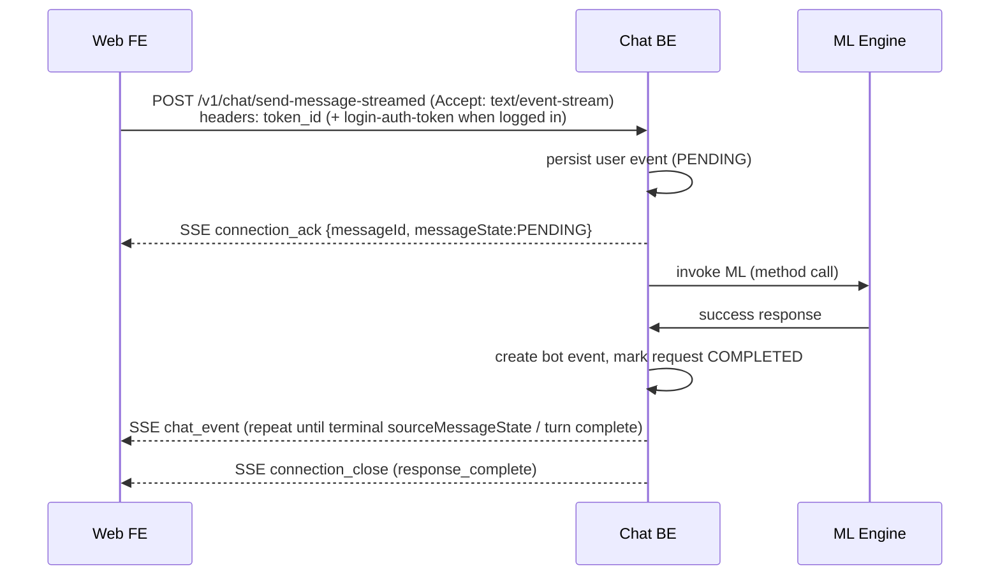
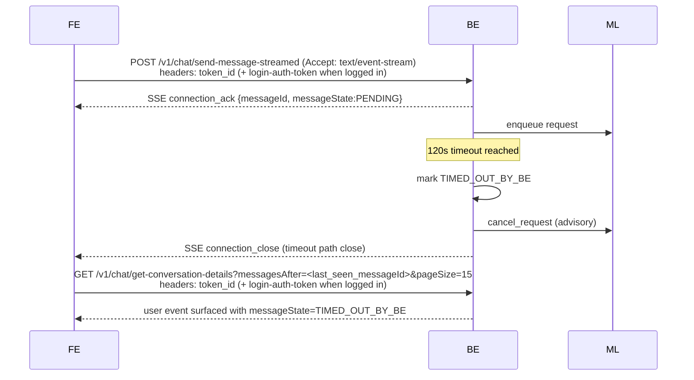
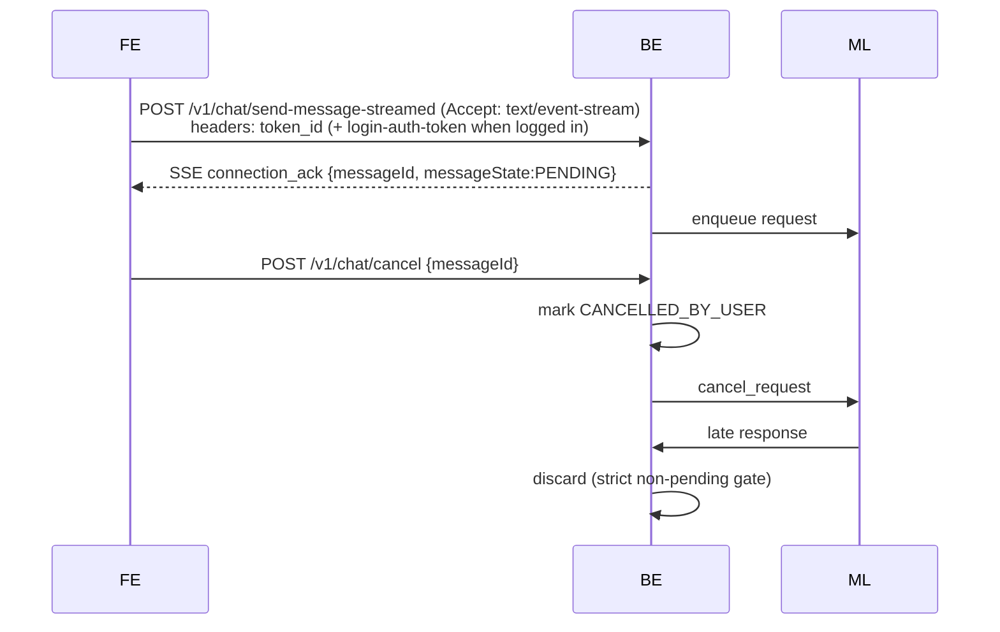
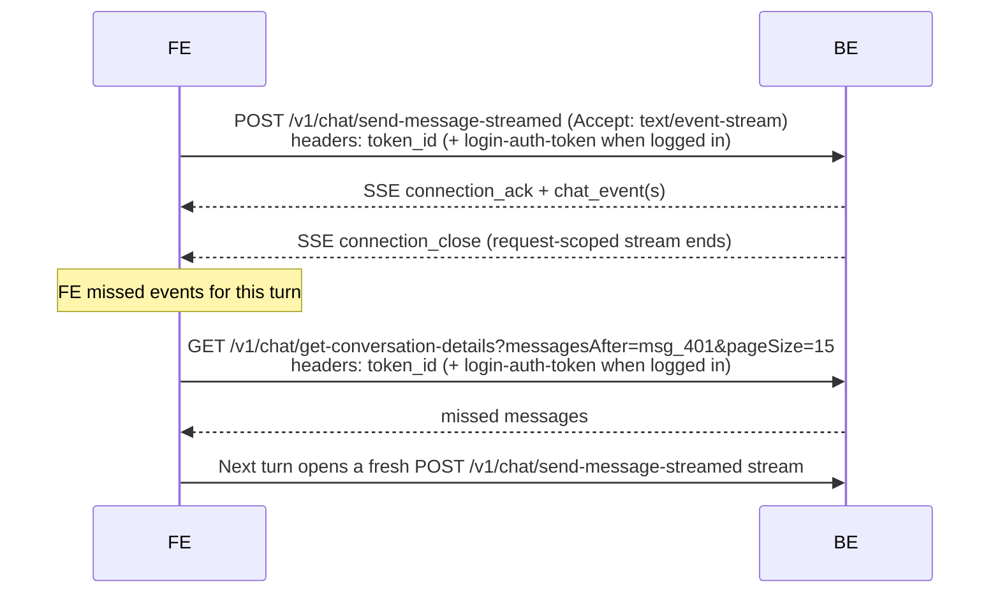
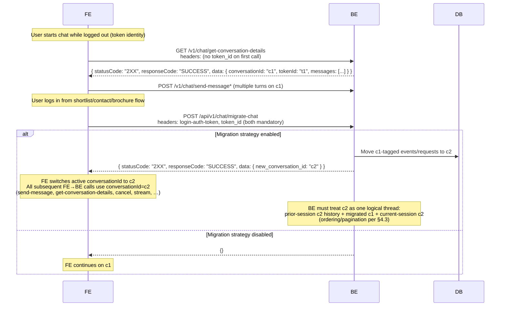
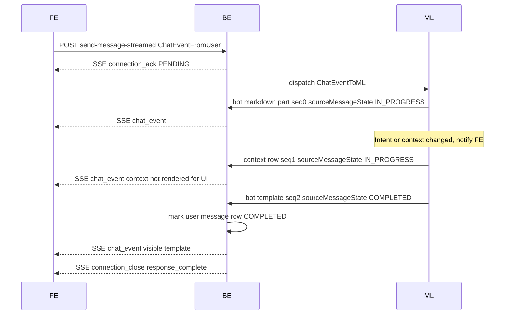

# Chat Platform Specification — v1

Final published **v1** specification for this repository.
This file is the canonical consolidated reference for architecture, API contract, and rich-text rendering.

## Open Items (Not Closed Yet)

1. Property carousel metadata: `property_count` vs `hasViewMore`.
2. Chat migration behavior when a user logs in mid-session.
3. **Context-out (Option 3 — proposed, not closed):** Wider team alignment is still pending; **Option 3** is the **preferred** direction in this document. ML does **not** attach rolling context to every bot payload. When user intent / search context changes in a way FE must know, ML emits a standalone **`messageType: "context"`** in the same `sourceMessageId` chain, using the **same `content.data` schema** as FE/system context on chat open (Part B §4.1). Context messages are **optional and infrequent**. Terminal **`sourceMessageState: COMPLETED`** (ML turn progress; see Appendix A §A.0) on the **last** ML→BE event for that turn (after any context + all visible response parts) ends the request; BE must not mark the source user message `COMPLETED` on an intermediate `context` event alone. See §5.2, Part B §2 matrix, §10.6.

---

## Part A — System Architecture and API

## 1. Formal Request State Machine

### Lifecycle Diagram (Request-Centric)

```
REQUEST_CREATED
      |
      v
   PENDING
      |
      v
 IN_PROGRESS
      |
      |-------------------------------|
      |               |               |
      v               v               v
 COMPLETED     ERRORED_AT_ML   TIMED_OUT_BY_BE
                                      |
                                      v
                            (cancel signal to ML)
      |
      v
CANCELLED_BY_USER
(soft delete user event)
          |
          v
 (cancel signal to ML)
```

---

## 2. State Semantics

| State | Meaning |
|------|--------|
| PENDING | Accepted by BE and queued for ML |
| IN_PROGRESS | ML has started processing |
| COMPLETED | ML response processed successfully |
| ERRORED_AT_ML | ML returned explicit error |
| TIMED_OUT_BY_BE | No ML response within BE timeout (120s) |
| CANCELLED_BY_USER | User cancelled request |

---

## 3. Hard Invariants (Request Handling)

- Only **PENDING** or **IN_PROGRESS** source messages may accept ML responses
- BE ignores ML responses for source messages in all other states
- Cancellation is **advisory** to ML
- Requests never transition out of terminal states
- User request event is soft-deleted only for `CANCELLED_BY_USER`

---

## 4. API Contracts

### 4.0 Contract Interfaces (from [`lib/contract-types.ts`](lib/contract-types.ts))

- [`Sender`](lib/contract-types.ts#L19): base sender shape (`type`).
- [`SenderForML`](lib/contract-types.ts#L23) extends [`Sender`](lib/contract-types.ts#L19): sender plus optional `userId`/`gaId` derived by BE from headers.
- [`ChatPayloadContent`](lib/contract-types.ts#L29): content envelope (`text`, `templateId`, `data`, `derivedLabel`).
  - Note: In `sample_conversation.json`, `content.data` may also appear on `messageType: "text"` as optional metadata (e.g. safety-guard info).
- [`ChatEventFromUser`](lib/contract-types.ts#L38): FE -> BE event shape for send-message APIs.
- [`ChatEventToML`](lib/contract-types.ts#L51): BE -> ML event shape for user turn dispatch.
- [`CancelEventToML`](lib/contract-types.ts#L65): BE -> ML cancellation signal shape.
- [`ChatEventFromML`](lib/contract-types.ts#L76): ML -> BE event shape (includes `sourceMessageId`, **`sourceMessageState`** (ML progress on the **user turn**, not the part row), `messageType`, `sequenceNumber`, `content`, optional `error`).
- [`ChatEventToUser`](lib/contract-types.ts#L94): BE -> FE event shape for history and stream delivery.
- [`SendMessageResponse`](lib/contract-types.ts#L123): ack shape for send-message/send-message-streamed (`messageId`, `messageState?`).
- `GetConversationDetailsResponse`: consolidated conversation bootstrap + history page shape (`conversationId`, `tokenId`, `messages`: `ChatEventToUser[]`, `hasMore`, `isNew`).
- [`ChatEvent`](lib/contract-types.ts#L116) (union): [`ChatEventFromUser`](lib/contract-types.ts#L38) | [`ChatEventToML`](lib/contract-types.ts#L51) | [`CancelEventToML`](lib/contract-types.ts#L65) | [`ChatEventFromML`](lib/contract-types.ts#L76) | [`ChatEventToUser`](lib/contract-types.ts#L94).

---

### 4.1 `GET /v1/chat/get-conversation-details`

This endpoint replaces both **`get-conversation-id`** and **`get-history`**.

Behavior:
- **Creates a new `conversationId`** if one does not exist for the caller.
- Returns a **page of messages** for the active conversation with `hasMore`.
- Returns a **`tokenId`** used to uniquely identify a **non-logged-in** user; FE stores it **permanently** (cookie) and sends it on all future requests.
  - If the request does **not** include either `login-auth-token` or `token_id`, BE **generates a new `tokenId`** and returns it.
  - If `token_id` is sent in the request, the **same** token is returned.
  - After the first successful call, FE includes **both** `token_id` and `login-auth-token` (when logged in) on all subsequent requests (send, cancel, migrate, history polling).

Pagination:
- Default `pageSize` is **15**.
- Supports **exclusive cursors**:
  - `messagesBefore=<messageId>` (older messages)
  - `messagesAfter=<messageId>` (newer messages)
- `messagesBefore` and `messagesAfter` are **mutually exclusive**.
- Returned `messages` are in **ascending** `createdAt` order.

**Interfaces**
- Response: `GetConversationDetailsResponse`

**Headers (production)**
- `login-auth-token` (optional; present only if logged in)
- `token_id` (optional; if present, must be echoed back as-is)

**Query params**
- `pageSize` (optional, default `15`)
- `messagesBefore` (optional, exclusive cursor)
- `messagesAfter` (optional, exclusive cursor)

**Response (example: existing conversation)**
```json
{
  "conversationId": "conv_01KQ78BJY3Y0J02SRN6YDM3PYS",
  "tokenId": "token_01KQ78BJY3Y0J02SRN6YDM3PYT",
  "messages": [
    { "messageId": "msg_01KQ78BZ378EA15Y78V75HE9TJ", "createdAt": "2026-04-27T16:09:40.659265+05:30", "messageType": "text", "content": { "text": "Show trending localities in my area" } }
  ],
  "hasMore": true,
  "isNew": false
}
```

**Response (example: new chat created)**
```json
{
  "conversationId": "conv_01KQ78BJY3Y0J02SRN6YDM3PYS",
  "messages": [],
  "hasMore": false,
  "isNew": true,
  "tokenId": "token_01KQ78BJY3Y0J02SRN6YDM3PYT"
}
```

---

### 4.2 `GET /chats/get-chats` (removed)

This API has been removed. Clients should rely on `GET /v1/chat/get-conversation-details`, which always returns the active conversation and its paginated messages.

---

### 4.3 History pagination (via `get-conversation-details`)

History is paginated via `GET /v1/chat/get-conversation-details` with:
- `pageSize` (optional, default `15`)
- `messagesBefore` (older messages, exclusive cursor)
- `messagesAfter` (newer messages, exclusive cursor)

Rules:
- `messagesBefore` and `messagesAfter` are mutually exclusive.
- Returned `messages` are in ascending `createdAt` order.
- User request events whose request state is `CANCELLED_BY_USER` are excluded by BE in history responses.
- **Post-login migration (§4.4.1)**: After guest `c1` is migrated to authenticated `c2`, any `get-conversation-details` call for `conversationId=c2` must return a **single logical thread** for that user: messages that existed on `c2` from **earlier authenticated sessions** (if any), **plus** messages **migrated from `c1`**, **plus** messages created on `c2` **after** migration in the current session. Cursor/pagination rules above apply to this merged ordering.


Example (`messagesBefore`):
`GET /v1/chat/get-conversation-details?pageSize=15&messagesBefore=msg_01KQ78N926CK91CVV4WA3X5B1D`

Returns a page of messages older than the cursor message.

Example (`messagesAfter`):
`GET /v1/chat/get-conversation-details?pageSize=15&messagesAfter=msg_01KQ790JT1R6QCZ2APCW7PTPQZ`

Returns messages strictly newer than the cursor message (typically used for polling/recovery after SSE disconnect).

---

### 4.4 `POST /v1/chat/send-message` (non-streaming)

Use this endpoint **only** when the client sends a turn that **does not** expect an ML/bot reply in the same request cycle: **`responseRequired === false`**. Typical examples: hidden **`user_action`** signals (e.g. shortlist after FE/API success), or other non-text payloads that are fire-and-forget.

**User `messageType: "text"` always expects a bot response** (implicitly or via `responseRequired: true`) and **must not** be sent here — use **`POST /v1/chat/send-message-streamed`** for all user text.

**Headers (production)**
- `token_id` (required once issued by `get-conversation-details`; stored by FE forever)
- `login-auth-token` (optional; present only if logged in)

```json
{
  "conversationId": "conv_1",
  "sender": { "type": "system" },
  "messageType": "user_action",
  "responseRequired": false,
  "isVisible": false,
  "content": {
    "data": {
      "action": "shortlisted_property",
      "replyToMessageId": "msg_b_011",
      "property": { "_id": "p2__card_1", "id": "p2", "type": "rent" }
    }
  }
}
```

*(Client-originated requests do not include `createdAt` or `messageId`; BE assigns those when persisting.)*

**Interfaces**
- Request body: `ChatEventFromUser`
- Response: `SendMessageResponse`

**Response**
JSON only:
```json
{ "messageId": "msg_301", "messageState": "COMPLETED" }
```

**Usage**
- **Allowed:** `responseRequired === false` only (e.g. hidden **`user_action`**, system signals that do not trigger a streamed ML turn).
- **Not allowed:** `messageType: "text"` (use **`send-message-streamed`**), or any event with `responseRequired === true`.
- `conversationId` is mandatory in `event` payload for send-message APIs (not passed as query param).

**Message event enrichment**
- Each persisted message may include top-level `messageState` with one of:
  - `PENDING`
  - `IN_PROGRESS`
  - `COMPLETED`
  - `ERRORED_AT_ML`
  - `TIMED_OUT_BY_BE`
  - `CANCELLED_BY_USER`
- FE rendering by `messageState`:
  - `PENDING`, `IN_PROGRESS`, `COMPLETED`: render as usual
  - `ERRORED_AT_ML`, `TIMED_OUT_BY_BE`: render generic error text
  - `CANCELLED_BY_USER`: do not render message

---

### 4.5 `POST /v1/chat/cancel`

```json
{ "messageId": "msg_301", "conversationId": "conv_1" }
```

**Interfaces**
- BE -> ML advisory cancellation object: `CancelEventToML`

- FE invokes cancel using the active user `messageId`.
- Cancellation is advisory toward ML, but BE strictly ignores late updates for cancelled/non-pending requests.

---

### 4.6 `POST /v1/chat/send-message-streamed` (SSE)

Request body is a flattened `ChatEventFromUser` (no `event` envelope). This endpoint requires `Accept: text/event-stream`.

Before dispatching to ML, BE authenticates with `login-auth-token` when present and forwards derived identity under `sender.userId` / `sender.gaId`.
`sender.userId` is BE-derived from auth/identity request headers.

**Headers (production)**
- `token_id` (required once issued by `get-conversation-details`; stored by FE forever)
- `login-auth-token` (optional; present only if logged in)

**Interfaces**
- FE -> BE request body: `ChatEventFromUser`
- BE -> ML dispatch event: `ChatEventToML`
- ML -> BE event: `ChatEventFromML`
- BE -> FE stream payload (`chat_event`): `ChatEventToUser`
- BE -> FE ack (`connection_ack`): `SendMessageResponse`

**SSE (example)**
```txt
event: connection_ack
data: {"messageId":"msg_301","messageState":"PENDING"}

id: msg_401
event: chat_event
data: {JSON_CHAT_EVENT}

event: connection_close
data: {"reason":"response_complete"}
```

**Usage**
- **Required** for user **`text`** (always) and for any turn with **`responseRequired === true`** (including `user_action` that expects an ML reply).
- One request-scoped stream per turn; no long-lived `GET /v1/chat/stream` connection.
- **chat-demo only:** optional **`ENABLE_MOCK_ML_DELAYS`** pacing between **`chat_event`** lines for local testing — Appendix A §A.3.1.
- **chat-demo env switch:** when `process.env.NEXT_PUBLIC_PROD === "true"` (or `process.env.PROD === "true"`), the FE points `/api/v1/chat/*` requests to `https://platform-chatbot.housing.com`; otherwise it uses the local mock-backed routes.

### 4.7 FE Request UI Semantics (canonical)

- **Awaiting indicator**: FE shows inline awaiting status only when:
  - outbound event has `responseRequired === true`, and
  - the turn has not yet reached a terminal outcome: the stream has not yet delivered a bot `chat_event` with **terminal** **`sourceMessageState: COMPLETED | ERRORED_AT_ML`** for this turn (Appendix A §A.0), and no surfaced `chat_event` with `messageState: TIMED_OUT_BY_BE` for this request (see §6 SSE).
- **Awaiting copy (progressive feedback):** Implementations **should** update the awaiting line on a fixed cadence (e.g. once per elapsed second) so long ML turns feel responsive. The exact strings are product-specific; **chat-demo** uses four stages with thresholds at **1s** / **3s** / **7s** elapsed — see Appendix A §A.2 for the full list (web + Android).
- **Timeout**: FE maintains a local reply timeout safeguard (current app value: `25s`); after timeout UI is shown, FE relies on polling (`get-conversation-details` with `messagesAfter`) until it receives the response for that message.
- **Stream ends without `connection_close`**: If the HTTP/SSE body closes before a `connection_close` event (network drop, proxy reset, etc.), FE should reconcile from **`get-conversation-details`**. **chat-demo** polls **`GET /v1/chat/get-conversation-details`** on a fixed interval (using `messagesAfter=<last_seen_messageId>`) until the turn shows a **terminal** outcome (last bot part for that user message has **`sourceMessageState: COMPLETED | ERRORED_AT_ML`**, or **`TIMED_OUT_BY_BE`** on the user row), or until a max wait — see **Appendix A §A.3.2** (`HISTORY_POLL_INTERVAL_MS` / `HISTORY_POLL_MAX_MS` in `app/chat/page.tsx`).
- **Input/CTA behavior**:
  - while `sending`: composer submit disabled
  - while `awaiting`: template actions disabled, composer shows **Cancel**
  - on `timeout`/`error`: **Retry** and **Dismiss** actions shown
- **Dismiss/Cancel semantics**:
  - FE dismiss/cancel transitions the active request to `CANCELLED_BY_USER`
  - cancelled message is hidden by rendering rules
  - if dismiss happens before `connection_ack` arrives, FE still marks local pending user event as `CANCELLED_BY_USER`; if ack arrives later, FE immediately cancels by that `messageId`.

### 4.8 Template and Action Handling (canonical)

- **Transient templates**: `share_location`, `shortlist_property`, `contact_seller`, and `nested_qna` render only when they are the latest message.
- **nested_qna contract shape**: `template.data.selections[]` with per-question `questionId` and options.
- FE submission for nested QnA uses `user_action`:
  - `action: "nested_qna_selection"`
  - `selections: [...]`
- **Share location**:
  - ML always returns `share_location` for near-me prompts.
  - FE `ShareLocation` may auto-send `location_shared` when permission is already granted, and template may not be visibly rendered in that case.
  - If permission is granted but **`getCurrentPosition`** fails (e.g. `POSITION_UNAVAILABLE`, timeout) or the Geolocation API is missing, FE sends **`user_action`** with **`action: "location_not_available"`** — same payload shape as **`location_denied`** (no coordinates). See Part B §4.3.10.33–§4.3.11.
- **Auth gating**: shortlist/contact/brochure actions are FE-gated behind login; successful actions post hidden/shown `user_action` events back to BE/ML.
- **Property identifiers (`id` vs `_id`)**:
  - **`_id`**: **card-unique identifier** (multi-card / multicard experiment support). Use this to uniquely identify a specific card instance when ML/BE splits one property into multiple cards.
  - **`id`**: **stable property identifier** used for downstream interactions like **shortlist**, **contact seller**, and **download/view brochure**.

---

## 5. ML ↔ BE Envelopes (Phase 1)

### 5.1 ML Input (BE → ML)

```json
{
  "conversationId": "conv_01KQ78BJY3Y0J02SRN6YDM3PYS",
  "messageId": "msg_01KQ78EXZYSB56G458J9M4KXD6",
  "messageType": "text",
  "messageState": "PENDING",
  "createdAt": "2026-04-27T16:11:17.822468+05:30",
  "sender": { "type": "user", "userId": "usr_123", "gaId": "GA1.2.12345.67890" },
  "content": { "text": "show me properties" },
  "responseRequired": true
}
```

*(BE adds `messageId`, `messageState`, `createdAt`, and identity fields before dispatch; the raw client POST body does not include `createdAt`.)*

---

### 5.2 ML Success Output

```json
{
  "conversationId": "conv_01KQ78BJY3Y0J02SRN6YDM3PYS",
  "sender": { "type": "bot" },
  "sourceMessageId": "msg_01KQ78EXZYSB56G458J9M4KXD6",
  "sequenceNumber": 1,
  "sourceMessageState": "COMPLETED",
  "messageType": "template",
  "content": {
    "templateId": "property_carousel",
    "data": { "...": "template payload" }
  }
}
```

*(ML → BE **`ChatEventFromML`** uses **`sourceMessageState`** for turn progress; BE assigns **`messageId`** / **`createdAt`** when persisting. `ChatEventFromML` omits `responseRequired`. Persisted bot rows delivered to FE do **not** carry `responseRequired`.)*

**Context-out (Option 3 — proposed)**  
- **Not a closed org decision** — Option 3 is the **preferred** approach here; finalize with the larger team.  
- There is **no** `summarisedChatContext` (or equivalent) on ML bot payloads. Rolling context updates are conveyed only via **`messageType: "context"`** when ML decides FE must be notified (e.g. filters, city, service changed). Those events use the **same `content.data` shape** as the context event FE sends on chat open (system) — see Part B §4.1.  
- Context is **not** sent on every ML response—only when intent/context materially changes.  
- Context and all user-visible bot parts for a turn share the same **`sourceMessageId`** and are ordered by **`sequenceNumber`**.  
- **`sourceMessageState: COMPLETED`** on the **final** ML output for that `sourceMessageId` means the full response (including any preceding `context` and bot content events) is complete. Earlier events in the chain use **`sourceMessageState: IN_PROGRESS`** (or non-terminal states as defined by BE/ML). BE applies **`COMPLETED`** to the **source user message** only when processing that **final** event—not when a standalone `context` message arrives mid-chain.

BE persistence semantics for ML outputs:
- BE persists each ML output as a new message with a newly generated `messageId`. Bot-visible rows use `sender.type = "bot"`; `messageType: "context"` from ML may also use `sender.type: "bot"` (Part B §2 matrix).
- BE applies the source user message’s terminal `messageState` from the **last** ML event’s **`sourceMessageState`** in the chain for that `sourceMessageId` (see above).

---

### 5.3 ML Error Output

ML emits **`sourceMessageState: "ERRORED_AT_ML"`** on `ChatEventFromML` (no per-part `messageState`). After BE persists, FE-facing **`ChatEventToUser`** rows use **`messageState: "COMPLETED"`** on the bot **part** row and **`sourceMessageState: "ERRORED_AT_ML"`** for the turn (Appendix A §A.0).

```json
{
  "conversationId": "conv_01KQ78BJY3Y0J02SRN6YDM3PYS",
  "messageId": "msg_example_error_bot_1",
  "sender": { "type": "bot" },
  "sourceMessageId": "msg_example_user_1",
  "sequenceNumber": 0,
  "messageState": "COMPLETED",
  "sourceMessageState": "ERRORED_AT_ML",
  "messageType": "text",
  "createdAt": "2026-04-27T16:00:00.000Z",
  "error": {
    "code": "500",
    "message": "Cannot process request"
  },
  "content": {
    "text": "Something went wrong while processing this request."
  }
}
```

---

### 5.4 Cancel Signal (BE → ML)

```json
{
  "sender": {
    "type": "system",
    "userId": "usr_123",
    "gaId": "GA1.2.12345.67890"
  },
  "conversationId": "conv_01KQ78BJY3Y0J02SRN6YDM3PYS",
  "messageIdToCancel": "msg_example_user_1",
  "cancelReason": "TIMED_OUT_BY_BE"
}
```

---

## 6. SSE Rules

- SSE is **BE → FE only**
- `id` always equals `messageId` for chat events
- Ordering strictly by creation time
- Analytics events are **never sent** (Phase 2).
- `messageType: "context"` is **supported by contract** but is **not present** in the provided `sample_conversation.json`. If/when present, FE must not render it.
- FE uses history APIs for replay

### 6.1 SSE event types

The stream uses the following **event** values and comment lines:

| Event / line | When | Format | FE handling |
|--------------|------|--------|-------------|
| **`event: chat_event`** | Bot (or visible info) event to display | `id: <messageId>\nevent: chat_event\ndata: <JSON ChatEvent>\n\n` | Parse `data` as `ChatEvent`; append to messages; `id` equals `messageId`. |
| **`event: connection_close`** | BE closing the stream (response complete / no-response / inactivity) | `event: connection_close\ndata: {"reason":"..."}\n\n` | Treat connection as closed for this request stream. |
| **Comment** (no event) | On open | `: connected\n\n` | Keeps connection alive; client detects stream open. |
| **Comment** (no event) | Keepalive while pending ML | `: keepalive\n\n` | Not delivered to EventSource listeners; used to refresh activity so BE does not close at 60s. |

**Chat events (`event: chat_event`)**  
- Only events that should be shown in the chat (e.g. bot messages, visible info) are sent with `event: chat_event`.
- Each line: `id: <messageId>\nevent: chat_event\ndata: <JSON ChatEvent>\n\n`.
- `data` is a single JSON object: the full `ChatEvent` (including `messageId`, `sender`, `messageType`, `content`, `createdAt`, etc.).

**Other event values**  
- **`connection_close`**: Sent by the BE once, immediately before closing the stream when:
  - inactivity `>= 15s`, or
  - `responseRequired === false`, or
  - terminal turn outcome received on the stream (e.g. bot `chat_event` with **`sourceMessageState: COMPLETED | ERRORED_AT_ML`, or surfaced `TIMED_OUT_BY_BE` for the request per §6).

**Comments** (lines starting with `:`) do not set an `event` type and are not delivered to `EventSource` message listeners; they are used for connection liveness and keepalive only.

---

## 7. Connection Lifecycle Rules

### BE
- Close SSE when any of:
  - inactivity `>= 15s`
  - `responseRequired === false`
  - terminal turn outcome emitted (e.g. bot **`sourceMessageState: COMPLETED | ERRORED_AT_ML`, or request surfaced as `TIMED_OUT_BY_BE` per §6)

### FE
- Treat each `send-message-streamed` stream as request-scoped and terminal on `connection_close`.

---

## 8. Backend Database Schemas

### 8.1 `conversations`

```sql
conversation_id VARCHAR PK
user_id VARCHAR
ga_id VARCHAR
created_at TIMESTAMP
updated_at TIMESTAMP
```

---

### 8.2 `chat_messages` (Immutable)

```sql
message_id VARCHAR PK
conversation_id VARCHAR
sender_type ENUM('user','bot','system')
message_type VARCHAR
content JSONB
source_message_id VARCHAR
message_state VARCHAR
response_required BOOLEAN
sequence_number INT
is_visible BOOLEAN
created_at TIMESTAMP
updated_at TIMESTAMP
```

---

## 9. System Invariants (Non-Negotiable)

1. One user message → one request lifecycle
2. Only PENDING/IN_PROGRESS source messages accept ML output
3. Message log is append-only
4. FE never talks to ML
5. ML never talks to FE
6. BE is the single source of truth
7. Late ML responses are discarded and logged

---

## 10. Sequence Diagrams (Non-Negotiable)

### 10.1 User Message → ML → FE (Happy Path)

**Interfaces used**
- FE -> BE: `ChatEventFromUser`
- BE -> ML: `ChatEventToML`
- ML -> BE: `ChatEventFromML`
- BE -> FE (`chat_event`): `ChatEventToUser`
- BE -> FE (`connection_ack`): `SendMessageResponse`


---

### 10.2 Timeout at BE (No ML Response)

**Interfaces used**
- FE -> BE: `ChatEventFromUser`
- BE -> ML cancel advisory: `CancelEventToML`
- FE polling response: `GetConversationDetailsResponse` (`ChatEventToUser[]`)


---

### 10.3 Cancel by User

**Interfaces used**
- FE -> BE: `ChatEventFromUser`
- FE cancel call triggers BE -> ML advisory: `CancelEventToML`
- Any ML late response is typed as `ChatEventFromML` and discarded by BE state gate



---

### 10.4 SSE Reconnect Flow

**Interfaces used**
- Initial turn request: `ChatEventFromUser`
- Stream payloads: `ChatEventToUser`
- Recovery API response: `GetConversationDetailsResponse` (`ChatEventToUser[]`)

**chat-demo:** implementation details for polling until a terminal turn after an incomplete stream are in **Appendix A §A.3.2** (same constants as `HISTORY_POLL_*` in `app/chat/page.tsx`).



---

### 10.5 Conversation Migration After Login

**Interfaces used**
- Conversation bootstrap + history: `GetConversationDetailsResponse`



---

### 10.6 Context-Out Option 3 (Separate ML `context` Message)

**Interfaces used**
- FE -> BE: `ChatEventFromUser`
- BE -> ML: `ChatEventToML`
- ML -> BE: `ChatEventFromML` (bot `text`/`markdown`/`template` and, when needed, `messageType: "context"` with same `content.data` as system context)
- BE -> FE (`chat_event`): `ChatEventToUser`

**Rules**  
- Context is emitted **only when** ML detects user intent / search context changed such that FE should update client-side context—not on every reply.  
- All parts for the turn share **`sourceMessageId`**. Use **`sequenceNumber`** for ordering.  
- Intermediate events (including a mid-chain **`context`** row) use **`sourceMessageState: IN_PROGRESS`** on the ML envelope as appropriate; **`sourceMessageState: COMPLETED`** appears **only on the last** ML→BE event for that `sourceMessageId`. (In **chat-demo**, each persisted bot **part** still uses **`messageState: "COMPLETED"`**; turn progress is **`sourceMessageState`** — Appendix A §A.0.) BE then marks the **source user message** `COMPLETED` and may emit **`connection_close`**.  
- **Locality intent shift (example):** e.g. user pivots from **Sector 21 → Sector 32** (or the reverse). ML may emit **`context`** with updated top-level **`poly`** (and related SRP fields) before the visible template (e.g. `nested_qna`). Part B §4.3.10.21 shows a concrete envelope.



---

## Appendix A: Implementation diversions (this app)

This section records how the **chat-demo** implementation diverges from or extends the frozen spec above. The spec remains canonical; these notes describe actual behaviour in this codebase.

### A.1 get-conversation-details (history pagination)

- Cursor behavior and soft-delete filtering are documented in canonical section §4.3 / §4.6.
- **This app:** older messages are loaded via `messagesBefore` + `pageSize`; see **Appendix A §A.1.1** (Intersection Observer auto-load, manual after 4 prepends, spinner).

### A.2 FE reply timeout and UI

- Canonical FE request UI semantics are documented in §4.7.
- **Staged awaiting copy (web + Android):** While `replyStatus` is awaiting a streamed reply, the visible status line updates **once per second** (`awaitingElapsedSec` / `0…25`). `getAwaitingFeedbackMessage` in `app/chat/page.tsx` maps elapsed seconds to:
  - **`elapsedSec < 1`:** *Running through the details…*
  - **`elapsedSec < 3`:** *Thinking…*
  - **`elapsedSec < 7`:** *Making sure I find best answers for you.*
  - **`elapsedSec ≥ 7`:** *This seems to be taking longer than usual…* (until the turn completes or timeout).
- **Android:** same thresholds and strings in `ChatScreen.kt` (`getAwaitingMessageText`).

### A.3 SSE

- Canonical SSE behavior is documented in §4.6 and §6.

### A.3.1 Mock ML stream pacing (`send-message-streamed`, chat-demo only)

- **Env:** `ENABLE_MOCK_ML_DELAYS=true` or `1` slows the mock SSE so multipart turns are visible in DevTools.
- **Behavior** (`app/api/v1/chat/send-message-streamed/route.ts`):
  - When **enabled:** ~**6s** after `connection_ack` before the **first** bot `chat_event` (`MOCK_ML_INITIAL_DELAYS_MS`), then **5s** between each subsequent `chat_event` in the same turn (`MOCK_ML_PER_CHAT_EVENT_MS`).
  - When **disabled:** **100ms** after ack, then all `chat_event` lines are sent back-to-back.

### A.3.2 SSE recovery — `get-conversation-details` polling (chat-demo)

When **`sendMessageStream`** ends without a **`connection_close`** event (see `lib/api.ts` **`onStreamDisconnected`**), **`app/chat/page.tsx`** calls **`fetchHistoryAfterSseDisconnect`**, which polls **`GET /v1/chat/get-conversation-details`** (using `messagesAfter=<lastSeenMessageId>`) until **`isTurnTerminalInHistory()`** is satisfied for the acked user message id (**`lastRequestMessageIdRef`**), or until **`HISTORY_POLL_MAX_MS`** (default **90s**), with **`HISTORY_POLL_INTERVAL_MS`** between requests (default **1500ms**). Terminal semantics align with **`isTerminalSseChatEvent`** / **`getTurnOrMessageState`** (`sourceMessageState` **`COMPLETED`** / **`ERRORED_AT_ML`** on the last bot part for the turn, or **`TIMED_OUT_BY_BE`**). Polling is aborted if the user dismisses/cancels (**`sseHistoryPollAbortRef`**).

**Mock SSE abrupt disconnect (local testing only):** set these **server** env vars when starting `npm run dev` to simulate the stream ending without `connection_close`. The mock still **persists** the first bot message; the client uses this §A.3.2 polling path to reconcile.

| Variable | Effect |
|----------|--------|
| `ENABLE_MOCK_SSE_RANDOM_DROP=true` or `1` | After the first persisted bot part, always close the SSE stream without sending `chat_event` / `connection_close`. |
| `MOCK_SSE_RANDOM_DROP_PROBABILITY` | e.g. `0.3` → 30% chance of the same behavior each request (`0`–`1`; values `≥ 1` behave like always-on). Ignored when `ENABLE_MOCK_SSE_RANDOM_DROP` is set. |

### A.4 Cancel

- Canonical cancel behavior is documented in §4.5 and §4.7.

### A.7 UI behavior for messageState

- Canonical messageState placement and rendering rules are documented in §4.4.
- **This app:** for bot rows, terminal checks and error handling use **`getTurnOrMessageState()`** ( **`sourceMessageState`** when present, else **`messageState`** ) — see `lib/contract-types.ts`.

### A.5 Template and action handling

- Canonical template/action rules are documented in §4.8.

### A.6 Demo mode (`/chat?demo=true`)

- On demo mode, FE runs a scripted sequence (text + real UI clicks) with 2s pacing.
- Includes login auto-fill (phone/OTP), nested_qna option/text flows, brochure click, and location-permission pauses.
- Debug tracing is available in browser console with `[demo]` log prefix.

### A.8 Context-out (Option 3) in this app

- Canonical rules are §5.2, Part B §2 matrix, §10.6. **`summarisedChatContext` is removed** from the TypeScript contract and mock ML payloads.
- The **mock `ml-flow`** emits a mid-turn **`messageType: "context"`** (`sourceMessageState: IN_PROGRESS`, then `nested_qna` with `sourceMessageState: COMPLETED`) when the user message targets **only Sector 32** (“learn more / tell more about sector 32”, …) or **only Sector 21** (“tell more about sector 21”, …), with **`content.data`** matching the system-context shape (Part B §4.1) and **different top-level `poly`** per locality. The **`/chat?demo=true`** scripted steps for those phrases exercise this path. **`send-message-streamed`** persists each bot row with **`messageState: "COMPLETED"`** and echoes ML’s **`sourceMessageState`** on the stored event (Appendix A §A.0).

---

## Part B — Chat API Contract and Rich Text Examples

## 0. Core Principles (v1.0)

- **One primary enum**: `messageType`: `context | text | template | user_action | markdown` *(analytics — Phase 2)*  
  Note: `sample_conversation.json` contains `text | markdown | template | user_action` only (no `context` rows in this sample).
- **Message origin**: `system` and `user` messages are generated by the **client app**; `bot` messages are generated by **ML** and relayed via BE.  
  **Rendering rule:** `system` and `bot` messages are rendered as bot-side messages, while only `sender.type = user` is rendered in user bubbles.
- **Message IDs**: `messageId` is generated by **BE** (not FE/ML) for all persisted messages. Every message delivered to FE must include `messageId`.
- **Every bot message MUST have `messageId`, `sourceMessageId`, `sequenceNumber`, `messageState`, `conversationId`, and `createdAt`** on the persisted **`ChatEventToUser`** shape delivered to FE. **Turn progress** from ML is carried in **`sourceMessageState`** (see Appendix A §A.0); **`messageState`** on bot rows in **chat-demo** is **`COMPLETED`** for each stored part. **`responseRequired`** applies to **user/system-originated** events only; **do not** set it on bot rows (see §4.3 examples).
- **`sourceMessageId`** ties all bot response messages back to the user message that triggered them
- In FE-facing events, `sourceMessageId` is optional and generally not required for rendering logic.
- **`user_action` visibility**:
  - In persisted history (`ChatEventToUser` as seen in `sample_conversation.json`), `isVisible` is typically **absent**.
  - Treat `content.derivedLabel` (when present and non-empty) as the signal that a `user_action` is user-visible and should be rendered.
- **For `user_action` replies to prior bot/template messages, use `content.data.replyToMessageId`** (instead of `messageId` inside `data`)
- **`responseRequired`** on `user_action` and user `text`: tells ML whether to generate a response — always `true` for user text, conditional for user_action
- **Persisted history rows** (as in `sample_conversation.json`) do **not** include request-only fields like `responseRequired` / `isVisible`. Those are part of FE → BE request payloads only.
- **Templates are FE-owned** (custom rendering is allowed and expected)
- **Templates may provide a `fallbackText`** *(Phase 2 — not rendered in Phase 1; not present in `sample_conversation.json`)*
- **Context is never rendered** (including ML-originated `messageType: "context"` under Option 3). **Analytics** messageType is **Phase 2** — not in Phase 1 scope.
- **Context-out (Option 3 — proposed, not closed):** ML may append `messageType: "context"` with `sender.type: "bot"` in the `sourceMessageId` chain when intent changes; `content.data` matches system context (§4.1). No `summarisedChatContext` on bot payloads. Terminal **`COMPLETED`** only on the **last** ML event for the turn (§5.2, §10.6).
- **All future changes must be additive (v1.x)**

---

## 1. JSON Schema (Draft 7)

```json
{
  "$schema": "http://json-schema.org/draft-07/schema#",
  "title": "ChatEvent (request vs persisted)",
  "description": "This schema models both FE→BE request events and BE→FE persisted history events. The provided sample_conversation.json contains only persisted history rows (ChatEventToUser).",
  "definitions": {
    "Sender": {
      "type": "object",
      "required": ["type"],
      "properties": {
        "type": { "type": "string", "enum": ["user", "bot", "system"] }
      },
      "additionalProperties": true
    },
    "MessageType": {
      "type": "string",
      "enum": ["context", "text", "template", "user_action", "markdown"],
      "description": "analytics is Phase 2 — not in Phase 1 schema."
    },
    "MessageState": {
      "type": "string",
      "enum": [
        "PENDING",
        "IN_PROGRESS",
        "COMPLETED",
        "ERRORED_AT_ML",
        "TIMED_OUT_BY_BE",
        "CANCELLED_BY_USER"
      ]
    },
    "Content": {
      "type": "object",
      "properties": {
        "text": {
          "type": "string",
          "description": "Plain text or Markdown depending on messageType. Note: sample_conversation.json also includes optional content.data on messageType=text as metadata."
        },
        "templateId": { "type": "string" },
        "data": { "type": "object" },
        "fallbackText": {
          "type": "string",
          "description": "[Phase 2] Renderable rich text used when template is unsupported (plain text | Markdown preferred)"
        },
        "derivedLabel": {
          "type": "string",
          "description": "Display text for user_action when present. In sample_conversation.json, derivedLabel may be absent or an empty string."
        }
      },
      "additionalProperties": false
    },

    "ChatEventToUser": {
      "type": "object",
      "description": "Persisted BE→FE history/stream row. Matches sample_conversation.json.",
      "required": ["conversationId", "messageId", "messageType", "messageState", "createdAt", "sender", "content"],
      "properties": {
        "conversationId": { "type": "string" },
        "messageId": {
          "type": "string",
          "description": "Unique ID for this message. Generated by BE."
        },
        "messageType": { "$ref": "#/definitions/MessageType" },
        "messageState": { "$ref": "#/definitions/MessageState" },
        "createdAt": { "type": "string", "description": "ISO-8601 timestamp string." },
        "sender": { "$ref": "#/definitions/Sender" },
        "content": { "$ref": "#/definitions/Content" },

        "sourceMessageId": { "type": "string" },
        "sourceMessageState": { "$ref": "#/definitions/MessageState" },
        "sequenceNumber": { "type": "integer", "minimum": 0 }
      },
      "additionalProperties": true,
      "allOf": [
        {
          "if": { "properties": { "sender": { "properties": { "type": { "const": "bot" } } } } },
          "then": { "required": ["sourceMessageId", "sourceMessageState", "sequenceNumber"] }
        },
        {
          "if": { "properties": { "messageType": { "const": "user_action" } } },
          "then": { "properties": { "content": { "required": ["data"] } } }
        }
      ]
    },

    "ChatEventFromUser": {
      "type": "object",
      "description": "FE→BE request event. Request-only fields (responseRequired, isVisible) appear here and are not present on persisted history rows.",
      "required": ["conversationId", "sender", "messageType", "content", "responseRequired"],
      "properties": {
        "conversationId": { "type": "string" },
        "sender": { "$ref": "#/definitions/Sender" },
        "messageType": { "$ref": "#/definitions/MessageType" },
        "content": { "$ref": "#/definitions/Content" },
        "responseRequired": { "type": "boolean" },
        "isVisible": { "type": "boolean" }
      },
      "additionalProperties": true,
      "allOf": [
        {
          "if": { "properties": { "messageType": { "const": "user_action" } } },
          "then": { "properties": { "content": { "required": ["data"] } } }
        }
      ]
    }
  },

  "oneOf": [
    { "$ref": "#/definitions/ChatEventToUser" },
    { "$ref": "#/definitions/ChatEventFromUser" }
  ]
}
```
---

## 2. Allowed `messageType` by Sender

| messageType | user | bot | system | responseRequired (FE → BE only) |
|------------|------|-----|--------|-----------------|
| context | ❌ | ✅ | ✅ | no |
| text | ✅ | ✅ | ✅ | yes when FE expects reply (`responseRequired: true`); **user text always streamed** |
| markdown | ❌ | ✅ | ❌ | — (omitted on bot BE → FE) |
| template | ❌ | ✅ | ❌ | — (omitted on bot BE → FE) |
| user_action | ✅ | ❌ | ✅ | yes/no per turn; hidden signals often `false` → `POST /v1/chat/send-message` |

*Analytics is **Phase 2** — not in Phase 1. **`responseRequired` is not present on persisted bot messages.**

**Context-out (Option 3 — proposed)**  
- ML may emit `messageType: "context"` with `sender.type: "bot"` (matrix above). `content.data` matches the **same schema** as FE/system context (Part B §4.1). FE does not render `context` rows (§3 decision table).  
- See §5.2 and §10.6 for ordering, `sequenceNumber`, and when **terminal `sourceMessageState`** closes the request.

---

## 3. FE Rendering Rules (Decision Table)

| Condition | FE Behavior |
|---------|-------------|
| messageType = context | Do not render |
| messageState = CANCELLED_BY_USER | Do not render |
| **Effective turn state** on bot rows (`getTurnOrMessageState()` / **`sourceMessageState`** when present) = ERRORED_AT_ML or TIMED_OUT_BY_BE | Render generic error text (“Something went wrong. Please try again.”) |
| messageType = user_action AND isVisible != true | Do not render (hidden by default) |
| messageType = user_action AND isVisible = true | Render derivedLabel |
| template supported | Render template |
| markdown | Safe render |
| action scope = template_item | Render per item — **[Phase 2]**  |
| action scope = message | Render once — **[Phase 2]**  |
| replyType = hidden | No echo, no LLM — **[Phase 2]**  |
| template unsupported | Render fallbackText (rich text) — **[Phase 2]** |

---

## 4. Examples

Property payload shape reference APIs (for template payloads that carry a property object, e.g. `data.property`, top-level `data`, or `data.properties[]`):

- Venus project details: [PROJECT_DEDICATED_DETAILS](https://venus.housing.com/api/v9/new-projects/288866/android?fixed_images_hash=true&include_derived_floor_plan=true&api_name=PROJECT_DEDICATED_DETAILS&source=android)
- Casa resale details: [RESALE_DEDICATED_DETAILS](https://casa.housing.com/api/v2/flat/18151449/resale/details?api_name=RESALE_DEDICATED_DETAILS&source=android)

### 4.1 Context on Chat Open (SRP)

> 📎 **Filter Reference:** See [`filterMap.js`](https://github.com/elarahq/housing.brahmand/blob/a17bf76ad06f0da180b270c840b1fb4ab14eb627/common/modules/filter-encoder/source/filterMap.js) for all possible keys inside **`filters`**.  
> 📎 **`user_intent` values:** See [`pageTypes.js`](https://github.com/elarahq/housing.brahmand/blob/master/common/constants/pageTypes.js) for the full set used across the app. **`user_intent`** replaces former **`page`** / **`page_type`** on this payload.

**Semantics (system & bot `messageType: "context"`):** `content.data` uses one shape for **both** `sender.type: "system"` and `sender.type: "bot"`.

- **`user_intent`:** **System** messages (Phase 1): `home`, `SRP`, `details`. **Bot** messages: `SRP`, `details`, `localityReviewDedicated`, `localityOverview`, `PRICE_TRENDS`, … — as of Phase 1 the FE only consumes **`SRP`** for navigation/update behavior.
- **SRP routing hints (top-level, driven by ML / launch context):** when **`user_intent === "SRP"`**, FE may use **`entities`** and **`properties`** (e.g. `type === "project"`) to open the relevant SRP. `entities` is the preferred field moving forward.
- **Backward compatibility:** FE should still accept legacy **`poly`** on existing payloads. During the migration, treat `entities` as primary and `poly` as a fallback alias for the same SRP-routing concept.
- **`filters`:** Search filters (see `filterMap.js`). Do **not** duplicate **`entities`** / legacy **`poly`** / **`properties`** inside `filters`; those live at the top level of **`data`** above.

```json
{
  "sender": { "type": "system" },
  "messageType": "context",
  "createdAt": "2026-04-27T16:00:00.000Z",
  "content": {
    "data": {
      "user_intent": "SRP",
      "service": "buy",
      "category": "residential",
      "city": "526acdc6c33455e9e4e9",
      "entities": [{ "id": "dce9290ec3fe8834a293", "type": "locality" }],
      "properties": [{ "id": 123, "type": "project" }],
      "filters": {
        "apartment_type_id": [1, 2],
        "contact_person_id": [1, 2],
        "facing": ["east", "west"],
        "has_lift": true,
        "is_gated_community": true,
        "is_verified": true,
        "max_area": 4000,
        "max_poss": 0,
        "max_price": 4800000,
        "radius": 3000,
        "routing_range": 10,
        "routing_range_type": "time",
        "min_price": 100,
        "property_type_id": [1, 2],
        "type": "project",
        "region_entity_id": 31817,
        "region_entity_type": "project",
        "qv_resale_id": 1234,
        "qv_rent_id": 12345
      }
    }
  }
}
```

Resale property sample (same `property_carousel` list item shape):
```json
{
  "id": "19568766",
  "type": "resale",
  "title": "3 BHK Flat",
  "short_address": [
    { "polygon_uuid": "f745c4c0226869fa87b8", "display_name": "Sector 37D" },
    { "polygon_uuid": "3c69d8421a77f8f8b611", "display_name": "Gurgaon" }
  ],
  "thumb_image_url": "https://is1-2.housingcdn.com/01c16c28/fbdcc0e03ea8412c8f7affa5d4ecd5f9/v0/version/3_bhk_apartment-for-sale-sector_37d-Gurgaon-bedroom_one.jpg",
  "inventory_canonical_url": "/in/buy/resale/page/19568766-3-bhk-apartment-in-sector-37d-for-rs-14000000",
  "property_tags": ["Possession: Apr 2026", "Resale", "semi furnished", "Ready to Move"],
  "is_rera_verified": true,
  "is_verified": true,
  "formatted_min_price": "1.4 Cr",
  "formatted_max_price": "1.4 Cr",
  "formatted_price": "1.4 Cr",
  "unit_of_area": "sq.ft.",
  "display_area_type": "Builtup Area",
  "inventory_configs": [
    {
      "seller": [1],
      "area_in_sq_ft": 1485,
      "formatted_per_unit_rate": "9.43k",
      "is_parking_chargeable": null,
      "is_painting_chargeable": null,
      "is_rent_maintenance_chargeable": null,
      "open_parking_count": 1,
      "is_security_deposit_chargeable": true,
      "area_value_in_unit": 1485,
      "property_type_id": 1,
      "property_category_id": 1,
      "flat_config_id": 19568766,
      "furnish_type_id": 2,
      "lock_in_period": null,
      "price": 14000000,
      "formatted_per_sqft_rate": "9.43k",
      "is_brokerage_chargeable": true,
      "parking_charges": null,
      "id": 19568766,
      "area": 1485,
      "is_brokerage_negotiable": false,
      "brokerage": 140000,
      "number_of_bedrooms": 3,
      "derived_per_sqft_rate": 9427,
      "maintenance_charges_rent": null,
      "apartment_type_id": 4,
      "parking_count": 2,
      "derived_price": 14000000,
      "apartment_type": "3 BHK",
      "seat_count": null,
      "per_sqft_rate": 9427,
      "cabin_count": null,
      "formatted_price": "1.4 Cr",
      "formatted_per_sq_unit_area_rate": "9.43k",
      "per_unit_rate": 9427,
      "facing": "north-east",
      "actual_property_type_id": 1,
      "property_category": "residential",
      "property_category_type_mapping_id": "1",
      "property_type": "Apartment",
      "price_on_request": false,
      "covered_parking_count": 1,
      "number_of_toilets": 3,
      "security_deposit": 0,
      "is_lock_in_period_chargeable": null,
      "maintenance_charges_buy": 5000,
      "is_available": true,
      "carpet_area": 1385,
      "total_balcony_count": 3,
      "completion_date": 1461664225,
      "per_sq_unit_area_rate": 9427,
      "painting_charges": null
    }
  ],
  "region_entities": [
    {
      "inventory_canonical_url": "/in/buy/projects/page/103934-ramprastha-the-view-by-ramprastha-promoters-developers-private-ltd-in-sector-37d",
      "is_rera_verified": true,
      "duplicate_project_id": "null",
      "latitude": 28.447289,
      "initiation_date": 1243794600,
      "type": "project",
      "has_transaction": false,
      "review_rating": 3.8,
      "entity_url": "/in/buy/projects/page/103934-ramprastha-the-view-by-ramprastha-promoters-developers-private-ltd-in-sector-37d",
      "is_post_rera": true,
      "name": "Ramprastha The View",
      "paid": false,
      "show_project_name": true,
      "completion_date": 1446336000,
      "id": "103934",
      "status": "ACTIVE",
      "longitude": 76.970375
    }
  ],
  "price_on_request": false
}
```

---
### 4.2 Transport-level SSE examples

`POST /v1/chat/send-message-streamed` with `Accept: text/event-stream`:

```txt
event: connection_ack
data: {"messageId":"msg_user_001","messageState":"PENDING"}

id: msg_bot_010
event: chat_event
data: {"sender":{"type":"bot"},"messageId":"msg_b1","sourceMessageId":"msg_u1","sequenceNumber":0,"messageState":"COMPLETED","sourceMessageState":"IN_PROGRESS","messageType":"text","content":{"text":"Here are 2bhk properties in sector 32 gurgaon"}}

id: msg_bot_011
event: chat_event
data: {"sender":{"type":"bot"},"messageId":"msg_b2","sourceMessageId":"msg_u1","sequenceNumber":1,"messageState":"COMPLETED","sourceMessageState":"COMPLETED","messageType":"template","content":{"templateId":"property_carousel","data":{"properties":[{"id":"p1","type":"project","title":"2, 3 BHK Apartments","name":"Godrej Air","short_address":[{"display_name":"Sector 85"},{"display_name":"Gurgaon"}],"is_rera_verified":true,"inventory_canonical_url":"https://example.com/property/p1","thumb_image_url":"https://images.unsplash.com/photo-1560448204-e02f11c3d0e2?w=600","property_tags":["Ready to move"],"formatted_min_price":"3 Cr","formatted_max_price":"3.5 Cr","unit_of_area":"sq.ft.","display_area_type":"Built up area","min_selected_area_in_unit":2500,"max_selected_area_in_unit":4750,"inventory_configs":[]},{"id":"p2","type":"rent","title":"3 BHK flat","short_address":[{"display_name":"Sector 33"},{"display_name":"Sohna"},{"display_name":"Gurgaon"}],"region_entities":[{"name":"M3M Solitude Ralph Estate"}],"is_rera_verified":false,"is_verified":true,"inventory_canonical_url":"https://example.com/property/p2","thumb_image_url":"https://images.unsplash.com/photo-1560448204-e02f11c3d0e2?w=600","property_tags":[],"formatted_price":"30,000","unit_of_area":"sq.ft.","display_area_type":"Built up area","inventory_configs":[{"furnish_type_id":2,"area_value_in_unit":4750}]},{"id":"p4","type":"rent","title":"2 BHK independent floor","short_address":[{"display_name":"Sector 23"},{"display_name":"Sohna"},{"display_name":"Gurgaon"}],"is_rera_verified":true,"is_verified":false,"inventory_canonical_url":"https://example.com/property/p4","thumb_image_url":"https://images.unsplash.com/photo-1560448204-e02f11c3d0e2?w=600","property_tags":[],"formatted_price":"12,000","unit_of_area":"sq.ft.","display_area_type":"Built up area","inventory_configs":[{"furnish_type_id":3,"area_value_in_unit":750}]}]}}}

event: connection_close
data: {"reason":"response_complete"}
```

> **SSE `data` lines:** The `chat_event` payloads above are **abbreviated** for readability. Production **`chat_event`** / **history** rows use the full **`ChatEventToUser`** object (`conversationId`, `createdAt`, **`sourceMessageState`** on bot rows for turn progress, …; bot rows omit `responseRequired`) as in §4.3.

> **Important:** For **non-streaming** turns only (`responseRequired === false`, not user text), FE uses `POST /v1/chat/send-message` and receives `{ statusCode: "2XX", responseCode: "SUCCESS", data: { messageId, messageState: "COMPLETED" } }`. User **text** always uses **`send-message-streamed`**.

---

### 4.3 Demo-flow-aligned examples

**`ChatEventToUser` (bot rows):** Bot examples use the full persisted / BE → FE shape: **`conversationId`**, **`messageId`**, **`sender`**, **`sourceMessageId`**, **`sequenceNumber`**, **`messageState`**, **`sourceMessageState`** (ML turn progress; Appendix A §A.0), **`messageType`**, **`createdAt`**, **`content`** — **no `responseRequired`**. In **chat-demo**, each stored bot **part** uses **`messageState: "COMPLETED"`**; **`sourceMessageState`** carries **`IN_PROGRESS`** until the last part, then **`COMPLETED`**. **User/system** examples show **client → BE** request bodies: **no `createdAt`** or **`messageId`** (BE assigns on persist). Include **`responseRequired`** on those rows where relevant.

#### 4.3.1 User text: non-real-estate intent
```json
{
  "sender": { "type": "user" },
  "messageType": "text",
  "responseRequired": true,
  "content": { "text": "hi. tell me about modiji" }
}
```

#### 4.3.2 Bot text fallback
```json
{
  "conversationId": "conv_01KQ78BJY3Y0J02SRN6YDM3PYS",
  "messageId": "msg_01KQ78TMQVTNRB8PKVH665974E",
  "sender": { "type": "bot" },
  "sourceMessageId": "msg_01KQ78TKQJA22G6Z8QRS3S5HN4",
  "sequenceNumber": 0,
  "messageState": "COMPLETED",
  "sourceMessageState": "COMPLETED",
  "messageType": "text",
  "createdAt": "2026-04-27T16:17:41.569311+05:30",
  "content": {
    "text": "That's a bit outside my lane 😅\nI'm here to help with home search and locality insights.",
    "data": { "guard_blocked_by": "llm", "guard_category": "out_of_scope" }
  }
}
```

#### 4.3.3 User text: property discovery
```json
{
  "sender": { "type": "user" },
  "messageType": "text",
  "responseRequired": true,
  "content": { "text": "show me properties according to my preference" }
}
```

#### 4.3.4 Bot multipart: intro text + property carousel
```json
{
  "conversationId": "conv_01KQ78BJY3Y0J02SRN6YDM3PYS",
  "messageId": "msg_01KQ78F0HZ4PGQFKAMPV71QSTT",
  "sender": { "type": "bot" },
  "sourceMessageId": "msg_01KQ78EXZYSB56G458J9M4KXD6",
  "sequenceNumber": 0,
  "messageState": "COMPLETED",
  "sourceMessageState": "IN_PROGRESS",
  "messageType": "text",
  "createdAt": "2026-04-27T16:11:20.462403+05:30",
  "content": { "text": "Got it, searching for properties to buy in Gurgaon near Sector 37D! 🏠🔍" }
}
```
```json
{
  "conversationId": "conv_01KQ78BJY3Y0J02SRN6YDM3PYS",
  "messageId": "msg_01KQ78F0PM3CGR8KR7X1RKVQMC",
  "sender": { "type": "bot" },
  "sourceMessageId": "msg_01KQ78EXZYSB56G458J9M4KXD6",
  "sequenceNumber": 1,
  "messageState": "COMPLETED",
  "sourceMessageState": "IN_PROGRESS",
  "messageType": "template",
  "createdAt": "2026-04-27T16:11:20.603525+05:30",
  "content": {
    "templateId": "property_carousel",
    "data": {
      "user_intent": "SRP",
      "service": "buy",
      "category": "residential",
      "city": { "city_name": "Gurgaon", "display_name": "Gurgaon", "city_uuid": "3c69d8421a77f8f8b611", "bbx_uuid": "526acdc6c33455e9e4e9", "id": "526acdc6c33455e9e4e9" },
      "entities": [{ "id": "f745c4c0226869fa87b8", "display_name": "Sector 37D, Gurgaon", "uuid": "f745c4c0226869fa87b8", "city": "Gurgaon", "type": "locality" }],
      "pagination": { "p": 2, "results_per_page": 10, "is_last_page": false, "cursor": "-1977752683", "resale_total_count": 394, "np_total_count": 35 },
      "filters": { "apartment_type_id": [], "contact_person_id": [], "furnish_type_id": [], "property_type_id": [], "amenities": [], "facing": [] },
      "properties": [
        {
          "id": "107997",
          "type": "project",
          "title": "3 BHK Flat",
          "name": "Ramprastha Skyz",
          "short_address": [
            { "polygon_uuid": "f745c4c0226869fa87b8", "display_name": "Sector 37D" },
            { "polygon_uuid": "3c69d8421a77f8f8b611", "display_name": "Gurgaon" }
          ],
          "thumb_image_url": "https://is1-3.housingcdn.com/4f2250e8/e4d1147af944a8bb439b19a95e78eea8/v0/version/ramprastha_skyz-sector_37d-gurgaon-ramprastha_promoters_%26_developers_private_ltd.jpeg",
          "inventory_canonical_url": "/in/buy/projects/page/107997-ramprastha-skyz-by-ramprastha-promoters-developers-private-ltd-in-sector-37d",
          "property_tags": ["Ready to Move", "Project", "RERA Approved"],
          "is_rera_verified": true,
          "formatted_min_price": "1.29 Cr",
          "formatted_max_price": "1.52 Cr",
          "formatted_price": "1.29 Cr",
          "unit_of_area": "sq.ft.",
          "display_area_type": "Super Builtup Area",
          "min_selected_area_in_unit": 1725,
          "max_selected_area_in_unit": 2025,
          "inventory_configs": [{ "formatted_price": "1.29 Cr", "per_unit_rate": 7500, "price_on_request": false, "number_of_bedrooms": 3 }]
        }
      ]
    }
  }
}
```
```json
{
  "conversationId": "conv_01KQ78BJY3Y0J02SRN6YDM3PYS",
  "messageId": "msg_01KQ78F0PNQMCB7Y16XYHR7VTH",
  "sender": { "type": "bot" },
  "sourceMessageId": "msg_01KQ78EXZYSB56G458J9M4KXD6",
  "sequenceNumber": 2,
  "messageState": "COMPLETED",
  "sourceMessageState": "COMPLETED",
  "messageType": "markdown",
  "createdAt": "2026-04-27T16:11:20.618227+05:30",
  "content": {
    "text": "Tap **Learn more** to dig deeper or ask anything about a property.\nYou can filter based on budget, furnishing construction status and more…."
  }
}
```

#### 4.3.5 FE action: shortlist from card (hidden signal)
```json
{
  "sender": { "type": "system" },
  "messageType": "user_action",
  "responseRequired": false,
  "isVisible": false,
  "content": {
    "data": {
      "action": "shortlisted_property",
      "replyToMessageId": "msg_b_011",
      "property": { "_id": "p2__card_1", "id": "p2", "type": "rent" }
    }
  }
}
```

#### 4.3.6 FE action: contact seller (shown as bot-side text)
```json
{
  "sender": { "type": "system" },
  "messageType": "user_action",
  "responseRequired": false,
  "isVisible": true,
  "content": {
    "data": {
      "action": "contacted_seller",
      "replyToMessageId": "msg_b_011",
      "property": { "_id": "p2__card_1", "id": "p2", "type": "rent" }
    },
    "derivedLabel": "The seller has been contacted, someone will reach out to you soon!"
  }
}
```

#### 4.3.7 FE action: learn_more_about_property -> markdown replies
```json
{
  "sender": { "type": "user" },
  "messageType": "user_action",
  "responseRequired": true,
  "isVisible": true,
  "content": {
    "data": {
      "action": "learn_more_about_property",
      "replyToMessageId": "msg_b_011",
      "property": { "_id": "p1__card_1", "id": "p1", "type": "project" }
    },
    "derivedLabel": "Tell me more about Godrej Air"
  }
}
```
```json
{
  "conversationId": "conv_1",
  "messageId": "msg_b_019",
  "sender": { "type": "bot" },
  "sourceMessageId": "msg_u_018",
  "sequenceNumber": 1,
  "messageState": "COMPLETED",
  "messageType": "markdown",
  "createdAt": "2025-03-16T12:00:00.000Z",
  "content": { "text": "# 3 BHK Apartment\nBy Godrej Properties Ltd.\n📍 Godrej Nature Plus, Sector 85, Gurgaon\n\n---\n\n**Property Overview**\nHere is an excellent 3 BHK Apartment available for buy in Gurgaon. Surrounded by natural greens and equipped with numerous amenities, this spacious home offers a comfortable lifestyle with good connectivity to major landmarks.\n\n---\n\n**Configuration**\nType: 3 BHK Apartment\nBuilt-up Area: 1,820 sq.ft.\nBedrooms: 3 | Bathrooms: 3 | Balconies: 3\nFloor: 17\nFurnishing: Semi-Furnished\nPrice: ₹2.8 Cr\nParking: 2 parking space(s)\n\n---\n\n**Amenities**\nParking, Regular Water Supply, Gym, Swimming Pool, Kids Area, Sports Facility, Lift, Power Backup, Intercom, CCTV\n\n---\n\n**Property Manager**\nGodrej Properties Ltd is the real estate segment of the 120-year Godrej Group, known for excellent craftsmanship in contemporary housing projects." }
}
```

#### 4.3.7 Text fallback: shortlist/contact template route
```json
{
  "sender": { "type": "user" },
  "messageType": "text",
  "responseRequired": true,
  "content": { "text": "shortlist this property" }
}
```
```json
{
  "conversationId": "conv_01KQ78BJY3Y0J02SRN6YDM3PYS",
  "messageId": "msg_01KQ78QPVV5QR7E676XH14ZVC7",
  "sender": { "type": "bot" },
  "sourceMessageId": "msg_01KQ78QJ4F0Y7DJHRTETGRC6ED",
  "sequenceNumber": 1,
  "messageState": "COMPLETED",
  "sourceMessageState": "COMPLETED",
  "messageType": "template",
  "createdAt": "2026-04-27T16:16:05.441350+05:30",
  "content": {
    "templateId": "shortlist_property",
    "data": {
      "property": {
        "id": "19688193",
        "type": "resale",
        "title": "3 BHK Independent Builder Floor",
        "short_address": [
          { "display_name": "Sector 88", "polygon_uuid": "1b82980658e1ccb0fcc5" },
          { "display_name": "Faridabad", "polygon_uuid": "83ad92bd0696e4e5975b" }
        ],
        "thumb_image_url": "https://is1-2.housingcdn.com/01c16c28/0158e4b7bc4099e37a8e8080936a0948/v0/version/3_bhk_independent_builder_floor-for-sale-sector_88_faridabad-Faridabad-living_room.jpg",
        "inventory_canonical_url": "/in/buy/resale/page/19688193-3-bhk-independent-floor-in-sector-88-for-rs-11600000",
        "property_tags": ["New Construction", "Resale", "unfurnished", "Ready to Move"],
        "is_verified": true,
        "unit_of_area": "sq.ft.",
        "inventory_configs": [{ "formatted_price": "1.16 Cr", "facing": "East" }]
      }
    }
  }
}
```
```json
{
  "conversationId": "conv_01KQ78BJY3Y0J02SRN6YDM3PYS",
  "messageId": "msg_01KQ78SH7BKFMTNKXJZE11VAV8",
  "sender": { "type": "bot" },
  "sourceMessageId": "msg_01KQ78SDC8E2X4ATS7E8A4MJ43",
  "sequenceNumber": 1,
  "messageState": "COMPLETED",
  "sourceMessageState": "COMPLETED",
  "messageType": "template",
  "createdAt": "2026-04-27T16:17:05.209594+05:30",
  "content": {
    "templateId": "contact_seller",
    "data": {
      "property": {
        "id": "794",
        "type": "project",
        "title": "2, 2.5, 3, 4 BHK Apartments",
        "name": "RPS Savana",
        "short_address": [
          { "display_name": "Sector 88", "polygon_uuid": "1b82980658e1ccb0fcc5" },
          { "display_name": "Faridabad", "polygon_uuid": "83ad92bd0696e4e5975b" }
        ],
        "inventory_canonical_url": "/in/buy/projects/page/794-rps-savana-by-rps-infrastructure-ltd-in-sector-88",
        "property_tags": ["Ready to Move", "Project"],
        "is_rera_verified": false,
        "formatted_min_price": "90.0 L",
        "formatted_max_price": "2.5 Cr",
        "unit_of_area": "sq.ft.",
        "min_selected_area_in_unit": 1250,
        "max_selected_area_in_unit": 2360,
        "inventory_configs": [{ "title": "2 BHK Apartment", "possession_date": "Mar, 2016", "price_on_request": false }]
      }
    }
  }
}
```

```json
{
  "sender": { "type": "user" },
  "messageType": "text",
  "responseRequired": true,
  "content": { "text": "show trending localties" }
}
```

#### Locality carousel sample (ML response)
```json
{
  "conversationId": "conv_01KQ78BJY3Y0J02SRN6YDM3PYS",
  "messageId": "msg_01KQ78C2TQETB61SA888FVJT4Z",
  "sender": { "type": "bot" },
  "sourceMessageId": "msg_01KQ78BZ378EA15Y78V75HE9TJ",
  "sequenceNumber": 1,
  "messageState": "COMPLETED",
  "messageType": "template",
  "sourceMessageState": "IN_PROGRESS",
  "createdAt": "2026-04-27T16:09:44.477434+05:30",
  "content": {
    "templateId": "locality_carousel",
    "data": {
      "localities": [
        {
          "id": "f745c4c0226869fa87b8",
          "name": "Sector 37D",
          "displayName": "Sector 37D, Gurgaon",
          "address": "Dwarka Expressway, Gurgaon, Gurgaon District",
          "cityName": "Gurgaon",
          "localityName": "",
          "cityUuid": "3c69d8421a77f8f8b611",
          "rating": 4.5,
          "priceTrend": 11040,
          "image": "https://is1-3.housingcdn.com/d89cff98/149789bd050d77e9b9b05e730b1e7141/v0/version.jpg",
          "percentGrowth": 5.62
        },
        {
          "id": "1864ac472c1a7739556b",
          "name": "Sector 36",
          "displayName": "Sector 36, Sohna, Gurgaon",
          "address": "Sohna, Gurgaon, Gurgaon District",
          "cityName": "Gurgaon",
          "localityName": "",
          "cityUuid": "3c69d8421a77f8f8b611",
          "rating": 4.5,
          "priceTrend": 9740,
          "percentGrowth": -0.96
        }
      ]
    }
  }
}
```

#### 4.3.8 Ambiguous locality query -> nested_qna
```json
{
  "sender": { "type": "user" },
  "messageType": "text",
  "responseRequired": true,
  "content": { "text": "locality comparison of sector 32, sector 21" }
}
```
```json
{
  "conversationId": "conv_1",
  "messageId": "msg_b_030",
  "sender": { "type": "bot" },
  "sourceMessageId": "msg_u_030",
  "sequenceNumber": 1,
  "messageState": "COMPLETED",
  "messageType": "template",
  "createdAt": "2025-03-16T12:00:00.000Z",
  "content": {
    "templateId": "nested_qna",
    "data": {
      "_comment": "Prefer `attributes[]` for option metadata. `type`/`city` are deprecated but should still be supported for now.",
      "selections": [
        {
          "questionId": "sub_intent_1",
          "title": "Which sector 32 are you referring to?",
          "type": "locality_single_select",
          "options": [
            { "id": "uuid1", "title": "Sector 32", "attributes": ["Locality", "Gurgaon"], "attributes": ["Locality", "Faridabad"] }, // type/city is deprecated. we'll move to attributes array
            { "id": "uuid2", "title": "Sector 32", "attributes": ["Locality", "Faridabad"], "city": "Faridabad", "type": "Locality" }
          ]
        },
        {
          "questionId": "sub_intent_2",
          "title": "Which sector 21 are you referring to?",
          "type": "locality_single_select",
          "entity": "sector 21",
          "options": [
            { "id": "uuid3", "title": "Sector 21", "attributes": ["Locality", "Gurgaon"], "city": "Gurgaon", "type": "Locality" },
            { "id": "uuid4", "title": "Sector 21", "attributes": ["Locality", "Faridabad"], "city": "Faridabad", "type": "Locality" }
          ]
        }
      ]
    }
  }
}
```

#### 4.3.9 FE submission for nested_qna
```json
{
  "sender": { "type": "user" },
  "messageType": "user_action",
  "responseRequired": true,
  "isVisible": true,
  "content": {
    "data": {
      "action": "nested_qna_selection",
      "replyToMessageId": "msg_b_030",
      "selections": [
        { "questionId": "sub_intent_1", "text": "sector 32 gurgaon" },
        { "questionId": "sub_intent_2", "skipped": true }
      ]
    },
    "derivedLabel": "Q. Which sector 32 are you referring to?\nA. sector 32 gurgaon\n\nQ. Which sector 21 are you referring to?\nA. Skipped"
  }
}
```
```json
{
  "conversationId": "conv_1",
  "messageId": "msg_b_031",
  "sender": { "type": "bot" },
  "sourceMessageId": "msg_u_030",
  "sequenceNumber": 0,
  "messageState": "COMPLETED",
  "sourceMessageState": "IN_PROGRESS",
  "messageType": "markdown",
  "createdAt": "2025-03-16T12:00:00.000Z",
  "content": { "text": "# Sector 46, Gurgaon: Peaceful Living with Great Connectivity\n\n---\n\n**Summary: Why Sector 46 is a Great Choice**\n- Mid-range residential locality with apartments, builder floors, and independent houses\n- Well connected: 10 km from Gurgaon railway, 20 km from IGI Airport, near NH-8 and metro\n- Ample amenities: 9 schools, 10 hospitals, 67 restaurants, plus shopping centers nearby\n- Notable places include Manav Rachna International School and Amity International School\n- Real estate demand supported by proposed metro expansion and local commercial hubs\n\n---\n\nWould you like me to show available properties in Sector 46, Gurgaon or compare it with nearby areas?" }
}
```
```json
{
  "conversationId": "conv_1",
  "messageId": "msg_b_032",
  "sender": { "type": "bot" },
  "sourceMessageId": "msg_u_030",
  "sequenceNumber": 1,
  "messageState": "COMPLETED",
  "sourceMessageState": "COMPLETED",
  "messageType": "markdown",
  "createdAt": "2025-03-16T12:00:00.000Z",
  "content": { "text": "# Sector 46, Gurgaon: Peaceful Living with Great Connectivity\n\n---\n\n**Summary: Why Sector 46 is a Great Choice**\n- Mid-range residential locality with apartments, builder floors, and independent houses\n- Well connected: 10 km from Gurgaon railway, 20 km from IGI Airport, near NH-8 and metro\n- Ample amenities: 9 schools, 10 hospitals, 67 restaurants, plus shopping centers nearby\n- Notable places include Manav Rachna International School and Amity International School\n- Real estate demand supported by proposed metro expansion and local commercial hubs\n\n---\n\nWould you like me to show available properties in Sector 46, Gurgaon or compare it with nearby areas?" }
}
```

#### 4.3.10 Near-me flow (ML always sends share_location)
```json
{
  "sender": { "type": "user" },
  "messageType": "text",
  "responseRequired": true,
  "content": { "text": "show trending localities similar to these" }
}
```
```json
{
  "conversationId": "conv_01KQ78BJY3Y0J02SRN6YDM3PYS",
  "messageId": "msg_01KQ78C2TQETB61SA888FVJT4Z",
  "sender": { "type": "bot" },
  "sourceMessageId": "msg_01KQ78BZ378EA15Y78V75HE9TJ",
  "sequenceNumber": 1,
  "messageState": "COMPLETED",
  "messageType": "template",
  "sourceMessageState": "COMPLETED",
  "createdAt": "2026-04-27T16:09:44.477434+05:30",
  "content": {
    "templateId": "locality_carousel",
    "data": {
      "localities": [
        {
          "id": "f745c4c0226869fa87b8",
          "name": "Sector 37D",
          "displayName": "Sector 37D, Gurgaon",
          "address": "Dwarka Expressway, Gurgaon, Gurgaon District",
          "cityName": "Gurgaon",
          "localityName": "",
          "cityUuid": "3c69d8421a77f8f8b611",
          "rating": 4.5,
          "priceTrend": 11040,
          "image": "https://is1-3.housingcdn.com/d89cff98/149789bd050d77e9b9b05e730b1e7141/v0/version.jpg",
          "percentGrowth": 5.62
        },
        {
          "id": "1864ac472c1a7739556b",
          "name": "Sector 36",
          "displayName": "Sector 36, Sohna, Gurgaon",
          "address": "Sohna, Gurgaon, Gurgaon District",
          "cityName": "Gurgaon",
          "localityName": "",
          "cityUuid": "3c69d8421a77f8f8b611",
          "rating": 4.5,
          "priceTrend": 9740,
          "percentGrowth": -0.96
        }
      ]
    }
  }
}
```
```json
{
  "sender": { "type": "user" },
  "messageType": "user_action",
  "responseRequired": true,
  "isVisible": true,
  "content": {
    "data": {
      "action": "learn_more_about_locality",
      "replyToMessageId": "msg_b_033",
      "locality": { "localityUuid": "l1" }
    },
    "derivedLabel": "Learn more about Sector 32"
  }
}
```
```json
{
  "conversationId": "conv_1",
  "messageId": "msg_b_034",
  "sender": { "type": "bot" },
  "sourceMessageId": "msg_u_034",
  "sequenceNumber": 0,
  "messageState": "COMPLETED",
  "messageType": "markdown",
  "createdAt": "2025-03-16T12:00:00.000Z",
  "content": { "text": "# Sector 46, Gurgaon: Peaceful Living with Great Connectivity\n\n---\n\n**Summary: Why Sector 46 is a Great Choice**\n- Mid-range residential locality with apartments, builder floors, and independent houses\n- Well connected: 10 km from Gurgaon railway, 20 km from IGI Airport, near NH-8 and metro\n- Ample amenities: 9 schools, 10 hospitals, 67 restaurants, plus shopping centers nearby\n- Notable places include Manav Rachna International School and Amity International School\n- Real estate demand supported by proposed metro expansion and local commercial hubs\n\n---\n\nWould you like me to show available properties in Sector 46, Gurgaon or compare it with nearby areas?" }
}
```
```json
{
  "sender": { "type": "user" },
  "messageType": "text",
  "responseRequired": true,
  "content": { "text": "show price trends of this locality" }
}
```
```json
{
  "conversationId": "conv_1",
  "messageId": "msg_b_035",
  "sender": { "type": "bot" },
  "sourceMessageId": "msg_u_035",
  "sequenceNumber": 0,
  "messageState": "COMPLETED",
  "messageType": "markdown",
  "createdAt": "2025-03-16T12:00:00.000Z",
  "content": { "text": "# Price Trends for Sector 86\n\n---\n\n## Average Price\n\n₹12,220 / sq ft\n\n## 1-Year Growth\n\n11.43%\n\n## Available Properties\n\n188\n\n---\n\n## Price Range\n\n- Minimum – ₹5,666 / sq ft\n- Maximum – ₹29,841 / sq ft\n\n---\n\n## 2025 Quarterly Trends\n\n- Q1 – ₹10,691 / sq ft\n- Q2 – ₹11,442 / sq ft\n- Q3 – ₹11,242 / sq ft\n- Q4 – ₹12,220 / sq ft\n\n---\n\n## Latest Update\n\nQ1 2026 – ₹11,850 / sq ft\n\n---\n\nThis data helps you make informed property decisions." }
}
```
```json
{
  "sender": { "type": "user" },
  "messageType": "text",
  "responseRequired": true,
  "content": { "text": "show rating reviews of this locality" }
}
```
```json
{
  "conversationId": "conv_1",
  "messageId": "msg_b_036",
  "sender": { "type": "bot" },
  "sourceMessageId": "msg_u_036",
  "sequenceNumber": 0,
  "messageState": "COMPLETED",
  "messageType": "markdown",
  "createdAt": "2025-03-16T12:00:00.000Z",
  "content": { "text": "# Locality Ratings & Reviews — Sector 46, Gurgaon\n\n---\n\n## Overall Rating\n⭐ **4.09 / 5.0**\nBased on 11 reviews\n\n---\n\n## Rating Distribution\n- 4-star – 9 reviews (82%)\n- 3-star – 2 reviews (18%)\n\n---\n\n## Category Breakdown\n\nSchools & Hospitals – 4.30 / 5.0\nMarkets & Malls – 4.10 / 5.0\nSafety & Security – 4.00 / 5.0\nPublic Transport – 3.80 / 5.0\nTraffic & Roads – 3.70 / 5.0\nCleanliness – 4.20 / 5.0\n\n---\n\n## Key Insights\n\n### Top strengths\n- Good schools and healthcare nearby\n- Strong neighborhood safety perception\n- Everyday shopping options are convenient\n\n### Areas to consider\n\n- Peak-hour traffic congestion on internal roads\n- Public transport access can improve in some pockets\n\n---\n\nRatings are based on user feedback and may change as new reviews are added." }
}
```
```json
{
  "sender": { "type": "user" },
  "messageType": "text",
  "responseRequired": true,
  "content": { "text": "show transaction data of this locality" }
}
```
```json
{
  "conversationId": "conv_1",
  "messageId": "msg_b_037",
  "sender": { "type": "bot" },
  "sourceMessageId": "msg_u_037",
  "sequenceNumber": 0,
  "messageState": "COMPLETED",
  "messageType": "markdown",
  "createdAt": "2025-03-16T12:00:00.000Z",
  "content": { "text": "# Transaction Data Analysis\n\n---\n\n## Project Details\n\nName: Godrej Gold County\nLocation: Tumkur Road, Bengaluru\nTotal Transactions: 395\n\n---\n\n## Transaction Breakdown\n\nSales: 272 | Mortgages: 123\n\n---\n\n## Area Statistics\n\nAverage Area: 2,550.0 sq ft\nSize Range: 1,200.0 – 3,800.0 sq ft\n\n---\n\n## Recent Activity (Last 6 Months)\n\nActive Transactions: 28 | Recent Mortgages: 11\n\n---\n\n## Latest Transactions\n\n- Unit A-1203 – 3 BHK | 2,420 sq ft | ₹2.35 Cr | 2026-01-12\n- Unit B-904 – 4 BHK | 3,180 sq ft | ₹3.12 Cr | 2025-12-28\n- Unit C-701 – 3 BHK | 2,150 sq ft | ₹2.08 Cr | 2025-12-14\n\n---\n\n## Market Insights\n\nLeased Properties: 54 (13.67%)\nMarket Activity: Stable with moderate upward demand\n\n---\nData based on registered transactions and may have slight reporting delay.\nWould you like a unit-type wise transaction split for this project?" }
}
```

#### 4.3.10.18–4.3.10.30 Locality intent narrowing + nested_qna + learn-more (production)

These flows exist in production and are exercised in `sample_conversation.json`, but the exact payloads are already shown earlier in this document for:
- `templateId: "nested_qna"` (ambiguity resolution)
- `messageType: "markdown"` (learn more)

Note: `sample_conversation.json` does **not** include any ML `messageType: "context"` rows, so the previously mock-only context-out JSON blocks have been removed here to keep examples sample-aligned.
#### 4.3.10.31 User text: show properties near me
```json
{
  "sender": { "type": "user" },
  "messageType": "text",
  "responseRequired": true,
  "content": { "text": "show properties near me" }
}
```
#### 4.3.10.32 Bot template: share_location
```json
{
  "conversationId": "conv_01KQ78BJY3Y0J02SRN6YDM3PYS",
  "messageId": "msg_01KQ78HDHPAXC3D0WQM938T2W1",
  "sender": { "type": "bot" },
  "sourceMessageId": "msg_01KQ78HC080SJDADHZFHG73QB7",
  "sequenceNumber": 0,
  "messageState": "COMPLETED",
  "sourceMessageState": "COMPLETED",
  "messageType": "template",
  "createdAt": "2026-04-27T16:12:39.292724+05:30",
  "content": { "templateId": "share_location", "data": {} }
}
```
#### 4.3.10.33 FE action: location_denied
```json
{
  "sender": { "type": "system" },
  "messageType": "user_action",
  "responseRequired": true,
  "content": { "data": { "action": "location_denied" } }
}
```

**`location_not_available`:** Same payload shape as `location_denied` (no extra fields). FE emits when the user did not explicitly deny permission but a position fix could not be obtained — e.g. `GeolocationPositionError` / missing API / timeout after **`getCurrentPosition`**.

```json
{
  "sender": { "type": "system" },
  "messageType": "user_action",
  "responseRequired": true,
  "content": { "data": { "action": "location_not_available" } }
}
```

#### 4.3.10.34 User text: properties near me (retry)
```json
{
  "sender": { "type": "user" },
  "messageType": "text",
  "responseRequired": true,
  "content": { "text": "properties near me" }
}
```
#### 4.3.10.35 Bot template: share_location again
```json
{
  "conversationId": "conv_1",
  "messageId": "msg_b_10_35",
  "sender": { "type": "bot" },
  "sourceMessageId": "msg_u_10_34",
  "sequenceNumber": 0,
  "messageState": "COMPLETED",
  "messageType": "template",
  "createdAt": "2025-03-16T12:00:00.000Z",
  "content": { "templateId": "share_location", "data": {} }
}
```
#### 4.3.10.36 FE action: location_shared
```json
{
  "conversationId": "conv_01KQ78BJY3Y0J02SRN6YDM3PYS",
  "messageId": "msg_01KQ78HM8P8AV3BREAGNPNAJV0",
  "sender": { "type": "system" },
  "messageType": "user_action",
  "messageState": "COMPLETED",
  "createdAt": "2026-04-27T16:12:46.166352+05:30",
  "content": { "data": { "action": "location_shared", "coordinates": [28.4085982, 77.3166804] } }
}
```
#### 4.3.10.37 Bot template: property_carousel
```json
{
  "conversationId": "conv_01KQ78BJY3Y0J02SRN6YDM3PYS",
  "messageId": "msg_01KQ78HN6AX6FRBC01QQF8A009",
  "sender": { "type": "bot" },
  "sourceMessageId": "msg_01KQ78HM8P8AV3BREAGNPNAJV0",
  "sequenceNumber": 0,
  "messageState": "COMPLETED",
  "sourceMessageState": "IN_PROGRESS",
  "createdAt": "2026-04-27T16:12:47.120890+05:30",
  "content": {
    "text": "Got it, searching for properties to buy near your current location in Faridabad! 🏠📍"
  }
}
```
```json
{
  "conversationId": "conv_01KQ78BJY3Y0J02SRN6YDM3PYS",
  "messageId": "msg_01KQ78HNAMS73NYR9K6CJ75GXF",
  "sender": { "type": "bot" },
  "sourceMessageId": "msg_01KQ78HM8P8AV3BREAGNPNAJV0",
  "sequenceNumber": 1,
  "messageState": "COMPLETED",
  "sourceMessageState": "IN_PROGRESS",
  "messageType": "template",
  "content": {
    "templateId": "property_carousel",
    "data": {
      "user_intent": "SRP",
      "service": "buy",
      "category": "residential",
      "city": { "city_name": "Faridabad", "display_name": "Faridabad, Haryana", "bbx_uuid": "b19bc29408477e86c6fc", "id": "b19bc29408477e86c6fc" },
      "entities": [],
      "pagination": { "p": 2, "results_per_page": 10, "is_last_page": false, "cursor": "-1759790310", "resale_total_count": 741, "np_total_count": 100 },
      "filters": { "apartment_type_id": [], "contact_person_id": [], "furnish_type_id": [], "property_type_id": [], "amenities": [], "facing": [] },
      "properties": [
        {
          "id": "17816947",
          "type": "resale",
          "title": "6 BHK Independent House",
          "short_address": [
            { "polygon_uuid": "d9cbecdf2ab226fe40f4", "display_name": "Old Faridabad" },
            { "polygon_uuid": "83ad92bd0696e4e5975b", "display_name": "Faridabad" }
          ],
          "inventory_canonical_url": "/in/buy/resale/page/17816947-6-bhk-independent-house-in-old-faridabad-for-rs-4500000-v2",
          "property_tags": ["Possession: Feb 2026", "Resale", "semi furnished", "Ready to Move"],
          "is_verified": false,
          "formatted_price": "45.0 L",
          "unit_of_area": "sq.ft.",
          "display_area_type": "Builtup Area",
          "inventory_configs": [{ "area_in_sq_ft": 468, "formatted_per_unit_rate": "9.62k", "furnish_type_id": 2, "number_of_bedrooms": 6, "price": 4500000, "price_on_request": false }]
        }
      ]
    }
  }
}
```
#### 4.3.10.38 User text: 3bhk properties near me
```json
{
  "sender": { "type": "user" },
  "messageType": "text",
  "responseRequired": true,
  "content": { "text": "3bhk properties near me" }
}
```
#### 4.3.10.39 FE auto-action: location_shared without rendering share_location
// Note: This line is explanatory only and not part of API contract payload.
```json
{
  "sender": { "type": "system" },
  "messageType": "user_action",
  "responseRequired": true,
  "content": { "data": { "action": "location_shared", "coordinates": [28.5355, 77.391] } }
}
```

#### 4.3.10.39a FE auto-action: location_not_available without rendering share_location
Emitted when the Permissions API reports **`granted`** but **`getCurrentPosition`** still fails (or geolocation is unavailable). Same shape as §4.3.10.33 `location_not_available` example.

```json
{
  "sender": { "type": "system" },
  "messageType": "user_action",
  "responseRequired": true,
  "content": { "data": { "action": "location_not_available" } }
}
```

#### 4.3.10.40 Bot template: property_carousel
```json
{
  "conversationId": "conv_01KQ78BJY3Y0J02SRN6YDM3PYS",
  "messageId": "msg_01KQ78F0PM3CGR8KR7X1RKVQMC",
  "sender": { "type": "bot" },
  "sourceMessageId": "msg_01KQ78EXZYSB56G458J9M4KXD6",
  "sequenceNumber": 1,
  "messageState": "COMPLETED",
  "messageType": "template",
  "sourceMessageState": "IN_PROGRESS",
  "createdAt": "2026-04-27T16:11:20.603525+05:30",
  "content": {
    "templateId": "property_carousel",
    "data": {
      "user_intent": "SRP",
      "service": "buy",
      "category": "residential",
      "city": {
        "city_name": "Gurgaon",
        "display_name": "Gurgaon",
        "city_uuid": "3c69d8421a77f8f8b611",
        "bbx_uuid": "526acdc6c33455e9e4e9",
        "id": "526acdc6c33455e9e4e9"
      },
      "_comment": "Prefer `entities`. FE should still accept legacy `poly` during migration for backward compatibility.",
      "entities": [
        {
          "id": "f745c4c0226869fa87b8",
          "name": "sector 37d",
          "display_name": "Sector 37D, Gurgaon",
          "uuid": "f745c4c0226869fa87b8",
          "lon_lat": [76.97277802321182, 28.445236369097103],
          "city": "Gurgaon",
          "type": "locality"
        }
      ],
      "pagination": {
        "p": 2,
        "results_per_page": 10,
        "is_last_page": false,
        "cursor": "-1977752683",
        "resale_total_count": 394,
        "np_total_count": 35
      },
      "filters": {
        "apartment_type_id": [1, 2],
        "contact_person_id": [1, 2],
        "facing": ["east", "west"],
        "has_lift": true,
        "is_gated_community": true,
        "is_verified": true,
        "max_area": 4000,
        "max_poss": 0,
        "max_price": 4800000,
        "radius": 3000,
        "routing_range": 10,
        "routing_range_type": "time",
        "min_price": 100,
        "property_type_id": [1, 2],
        "type": "project"
      },
      "properties": [
        {
          "id": "107997",
          "type": "project",
          "title": "3 BHK Flat",
          "name": "Ramprastha Skyz",
          "short_address": [
            { "polygon_uuid": "f745c4c0226869fa87b8", "display_name": "Sector 37D" },
            { "polygon_uuid": "3c69d8421a77f8f8b611", "display_name": "Gurgaon" }
          ],
          "thumb_image_url": "https://is1-3.housingcdn.com/4f2250e8/e4d1147af944a8bb439b19a95e78eea8/v0/version/ramprastha_skyz-sector_37d-gurgaon-ramprastha_promoters_%26_developers_private_ltd.jpeg",
          "inventory_canonical_url": "/in/buy/projects/page/107997-ramprastha-skyz-by-ramprastha-promoters-developers-private-ltd-in-sector-37d",
          "property_tags": ["Ready to Move", "Project", "RERA Approved"],
          "is_rera_verified": true,
          "formatted_min_price": "1.29 Cr",
          "formatted_max_price": "1.52 Cr",
          "formatted_price": "1.29 Cr",
          "price_on_request": false,
          "current_status": "Ready to Move",
          "possession_date": "Jun, 2019",
          "unit_of_area": "sq.ft.",
          "display_area_type": "Super Builtup Area",
          "min_selected_area_in_unit": 1725,
          "max_selected_area_in_unit": 2025,
          "inventory_configs": [
            {
              "formatted_price": "1.29 Cr",
              "seller": [1],
              "per_unit_rate": 7500,
              "listing_id": "2a1f04ad61d9b72be76a",
              "formatted_per_unit_rate": "7.5k",
              "facing": "all",
              "area_value_in_unit": 1725,
              "flat_config_id": 352206,
              "property_type_id": 1,
              "coupon_details": [],
              "price": 12937500,
              "formatted_per_sqft_rate": "7.5k",
              "seller_uuid": "634be935-1b63-4fe4-9a27-0d1728d12f25",
              "price_on_request": false,
              "area_information": [
                {
                  "value_in_unit": 1725,
                  "name": "Super Builtup Area",
                  "double_value_in_unit": 1725,
                  "value": 1725,
                  "double_value": 1725
                }
              ],
              "property_type": "Apartment",
              "id": 107997,
              "number_of_toilets": null,
              "apartment_group_name": "3 BHK",
              "selected_area_in_unit": 1725,
              "area": 1725,
              "brokerage": 0,
              "number_of_bedrooms": 3,
              "derived_per_sqft_rate": 7500,
              "pass_by_filter": true,
              "apartment_type_id": 4,
              "loan_amount": 10350000,
              "is_available": true,
              "derived_price": 12937500,
              "per_sqft_rate": 7500,
              "emi_amount": 72369,
              "inventory_count": 0,
              "floor_plan_urls": [],
              "selected_area": 1725,
              "completion_date": 1559347200,
              "formatted_selected_area_in_unit": "1.725 K"
            }
          ],
          "region_entities": [
            { "name": "Tower-D", "id": "365412", "type": "np_building" },
            { "name": "Tower-I", "id": "365417", "type": "np_building" },
            { "name": "Tower-G", "id": "365415", "type": "np_building" }
          ]
        }
      ]
    }
  }
}
```
#### 4.3.10.41 User text: show me more properties in sector 32, sector 21
```json
{
  "sender": { "type": "user" },
  "messageType": "text",
  "responseRequired": true,
  "content": { "text": "show me more properties in sector 32, sector 21" }
}
```

#### 4.3.11 Location actions from FE template

- **`location_denied`** — user declined permission (explicit deny UI, when present).
- **`location_not_available`** — permission may be granted or pending, but no position fix (API error, timeout, `POSITION_UNAVAILABLE`, no Geolocation API).
- **`location_shared`** — success; includes **`coordinates`**.

```json
{
  "sender": { "type": "system" },
  "messageType": "user_action",
  "responseRequired": true,
  "content": { "data": { "action": "location_denied" } }
}
```
```json
{
  "sender": { "type": "system" },
  "messageType": "user_action",
  "responseRequired": true,
  "content": { "data": { "action": "location_not_available" } }
}
```
```json
{
  "sender": { "type": "system" },
  "messageType": "user_action",
  "responseRequired": true,
  "content": { "data": { "action": "location_shared", "coordinates": [28.5355, 77.391] } }
}
```

#### 4.3.12 Brochure flow
```json
{
  "sender": { "type": "user" },
  "messageType": "text",
  "responseRequired": true,
  "content": { "text": "show me brochure" }
}
```
```json
{
  "conversationId": "conv_01KQ78BJY3Y0J02SRN6YDM3PYS",
  "messageId": "msg_01KQ78GGQP77A1JHQYSX7B2F4A",
  "sender": { "type": "bot" },
  "sourceMessageId": "msg_01KQ78GD5ZX7MN0HKKTW3Z3TAE",
  "sequenceNumber": 1,
  "messageState": "COMPLETED",
  "sourceMessageState": "COMPLETED",
  "messageType": "template",
  "createdAt": "2026-04-27T16:12:09.790874+05:30",
  "content": {
    "templateId": "download_brochure",
    "data": {
      "id": "107997",
      "type": "project",
      "title": "3 BHK Apartment",
      "name": "Ramprastha Skyz",
      "short_address": [
        { "display_name": "Sector 37D", "polygon_uuid": "f745c4c0226869fa87b8" },
        { "display_name": "Gurgaon", "polygon_uuid": "3c69d8421a77f8f8b611" }
      ],
      "cover_photo_url": "https://is1-3.housingcdn.com/4f2250e8/e4d1147af944a8bb439b19a95e78eea8/v0/version/ramprastha_skyz-sector_37d-gurgaon-ramprastha_promoters_%26_developers_private_ltd.jpeg",
      "inventory_canonical_url": "/in/buy/projects/page/107997-ramprastha-skyz-by-ramprastha-promoters-developers-private-ltd-in-sector-37d",
      "property_tags": ["Ready to Move", "Project", "RERA Approved"],
      "is_rera_verified": true,
      "formatted_min_price": "1.29 Cr",
      "formatted_max_price": "1.52 Cr",
      "price_on_request": false,
      "unit_of_area": "sq.ft.",
      "min_selected_area_in_unit": 1725,
      "max_selected_area_in_unit": 2025,
      "brochure_name": "Ramprastha Skyz Brochure",
      "brochure_pdf_url": "https://housing-is-01.s3.amazonaws.com/6a32315a/539cd78d1eb97091141d44cf5f58bdbb/original.pdf",
      "brochure_images": [
        "https://is1-3.housingcdn.com/d9dd8fcc/407794a7ef2ad3e4cb759419023b4ad2/v0/version.jpg"
      ]
    }
  }
}
```
```json
{
  "sender": { "type": "system" },
  "messageType": "user_action",
  "responseRequired": false,
  "isVisible": false,
  "content": {
    "data": {
      "action": "brochure_downloaded",
      "replyToMessageId": "msg_b_050",
      "property": { "_id": "p2__card_1", "id": "p2", "type": "rent" }
    }
  }
}
```

### 4.4 Auth and identity headers

Identity is carried via request headers:

- `token_id`: stable identifier for the **non-logged-in** user. Returned by `get-conversation-details` and stored by FE **permanently** (cookie).
- `login-auth-token`: optional; present only when the user is logged in.

`get-conversation-details` returns `tokenId` on every call:
- If the request has **neither** `login-auth-token` nor `token_id`, BE **generates** a fresh `tokenId` and returns it.
- If `token_id` is sent, the same token is echoed back.

Logout behavior:
- FE deletes both `login-auth-token` and `token_id` on logout.
- A subsequent `get-conversation-details` call (without either header) will return a **new** `tokenId`.

### 4.4.1 Chat migration after login

When a guest chat (identified by `token_id`) becomes authenticated mid-session:

1. FE has active `currentConversationId` (example: `c1`).
2. FE calls:
   - `POST /api/v1/chat/migrate-chat`
   - headers: `login-auth-token` **and** `token_id` (**both mandatory**, otherwise `400`)
3. BE behavior:
   - returns the authenticated conversation id under `data.new_conversation_id`.
   - **Merge responsibility**: for every subsequent API that uses the authenticated `conversationId` (`get-conversation-details`, `send-message*`, `cancel`, stream URLs, etc.), BE must treat the conversation as **one logical thread**: prior-session authenticated history (if any), migrated guest content, and new messages in this session—so FE does **not** need to merge IDs client-side.
4. FE behavior after successful migration:
   - switch active conversation to `new_conversation_id` and use it on **all** later BE calls.
   - **Optional**: FE may call `get-conversation-details` to refresh the UI; **not required** immediately after migrate (e.g. in-memory transcript can continue until the next natural history load).
   - include `login-auth-token` on subsequent calls.

**Known edge case:** migration should be done when no in-flight turn is pending; otherwise late events can be split across pre/post migration boundaries.

---

### 4.5 FE runtime behavior notes

- FE starts awaiting UI only when `responseRequired: true` and no final bot event has been received.
- **Awaiting status text:** FE may rotate progressive copy while waiting (canonical §4.7); **chat-demo** lists exact strings in Appendix A §A.2.
- FE stops loader/awaiting and marks response complete on first terminal outcome on the stream: bot row **`sourceMessageState: COMPLETED | ERRORED_AT_ML`** (use **`getTurnOrMessageState()`** in chat-demo), or any surfaced `messageState: TIMED_OUT_BY_BE` for the active request.
- FE treats `connection_close` as stream completion for the turn.
- FE keeps a local timeout safeguard (current app value: 25s). On timeout, FE shows Retry/Dismiss and then relies on polling (`get-conversation-details` with `messagesAfter`) until it receives the response for that message.
- Input/CTA behavior:
  - while sending: input submit disabled
  - while awaiting: template actions disabled and Cancel shown in composer
  - on timeout/error: Retry/Dismiss shown
- Dismiss and Cancel semantics:
  - both map to `CANCELLED_BY_USER` for the active request
  - message in `CANCELLED_BY_USER` is not rendered
  - if dismiss happens before ack, FE marks the pending local user event cancelled; if ack arrives later, FE immediately cancels using ack `messageId`.
- messageState rendering semantics:
  - `PENDING`, `COMPLETED`: render as usual
  - `ERRORED_AT_ML`, `TIMED_OUT_BY_BE`: render generic error text
  - `CANCELLED_BY_USER`: do not render
- Transient templates (`share_location`, `shortlist_property`, `contact_seller`, `nested_qna`) are rendered only when they are the latest message to prevent stale CTA/template duplication in history.
- Sticky `nested_qna`: while active as latest message, FE hides the text composer to avoid parallel free-text input during structured disambiguation.
- `property_carousel`: title row is clickable and opens `inventory_canonical_url` in a new tab.
- `property_carousel`: FE shows a trailing **View more / View all** card only when:
  - `data.user_intent` is **`"SRP"`** or **`"shortlist"`**, and
  - `data.pagination.is_last_page === false` (fallback: `property_count > properties.length` when pagination is missing)

  It opens `getSRPUrl(service, category, city, filters)` in a new tab.
- `locality_carousel`: locality name is clickable and opens locality `url` in a new tab.
- Nested QnA contract:
  - bot template uses `template.data.selections[]` with `questionId` + options
  - option metadata should move to `attributes: string[]`; FE renders it as `attributes.join(" | ")`
  - deprecated fallback: if `attributes` is absent, FE may still render `type` + `city`
  - FE submit uses `user_action` with `action: "nested_qna_selection"` and `selections`.
- Share location behavior:
  - ML always returns `share_location` for near-me queries.
  - FE may auto-send `location_shared` when permission is already granted; template may not be visibly rendered in that case.
  - FE sends **`location_not_available`** when a fix cannot be obtained (`getCurrentPosition` error / no API); **`location_denied`** when the user explicitly denies (see Part B §4.3.11).
- Auth gating:
  - shortlist/contact/brochure actions are FE-gated behind login
  - successful action posts hidden/shown `user_action` to BE/ML.
- Cancel API semantics:
  - FE calls `POST /v1/chat/cancel` with current user `messageId`
  - cancellation is advisory to ML; BE ignores late updates for cancelled/non-pending requests.

---
### 4.6 `GET /v1/chat/get-conversation-details` cursor contract

- Supported query params:
  - `pageSize` (optional, default `15`)
  - `messagesBefore` (optional, exclusive cursor)
  - `messagesAfter` (optional, exclusive cursor)
- `messagesBefore` and `messagesAfter` are mutually exclusive in one request.
- Returned `messages` are always in ascending `createdAt` order.
- Behavior:
  - no cursor: latest `pageSize` messages (default latest 15)
  - `messagesBefore=msg_x`: older messages before `msg_x`
  - `messagesAfter=msg_x`: newer messages after `msg_x`
- `hasMore` remains required for FE pagination controls.
- BE applies soft-delete filtering in this API: user request events with `messageState = CANCELLED_BY_USER` are excluded; no other event types are filtered.

---
## 5. FE Renderer Pseudocode

```ts
function renderRichText(value: string) {
  // Detect and safely render plain text / markdown
}

function renderEvent(event) {
  const { messageType, content, isVisible } = event;

  if (messageType === "context") return;
  // [Phase 2] analytics: never render

  switch (messageType) {
    case "text":
      renderText(content.text);
      break;

    case "markdown":
      renderMarkdown(content.text);
      break;

    case "template":
      if (isTemplateSupported(content.templateId)) {
        renderTemplate(
          content.templateId,
          content.data,
          // [Phase 2] template_item-scoped actions not yet passed through
        );
      } else {
        // [Phase 2] fallbackText rendering not yet implemented
        renderRichText(content.fallbackText || "");
      }
      break;

    case "user_action":
      // hidden by default — only render when isVisible is true
      if (isVisible === true) {
        renderUserBubble(content.derivedLabel);
      }
      break;
  }

  // [Phase 2] message-scoped footer actions are not part of current flat event contract.
}
```

---

## Appendix A: Implementation Notes (chat-demo)

This section documents current behavior in this repository where it differs from or extends the frozen v1.0 examples.

### A.0 Turn state vs part rows (`sourceMessageState` vs `messageId`)

- For a single **user** message, ML may emit multiple **parts** (partial responses). Each part is a distinct persisted row with its own **`messageId`**; all parts in the turn share the same **`sourceMessageId`** (the user message id) and are ordered by **`sequenceNumber`**.
- **`sourceMessageState`** (`IN_PROGRESS` \| `COMPLETED` \| `ERRORED_AT_ML`) on ML → BE (`ChatEventFromML`) describes **where ML is in finishing the reply** for that **`sourceMessageId`** — it is **not** the state of the individual part row. `IN_PROGRESS` means further parts may follow; `COMPLETED` or `ERRORED_AT_ML` means the turn is terminal from ML’s perspective.
- BE uses **`sourceMessageState`** to update the **`messageState`** of the **original user message** row in storage.
- In [`lib/contract-types.ts`](lib/contract-types.ts), persisted **bot** `ChatEventToUser` rows set **`messageState: "COMPLETED"`** for each materialized part and expose **`sourceMessageState`** for turn semantics; FE uses **`getTurnOrMessageState()`** for display and terminal detection.
- Older narrative in Part B that refers to `messageState` on ML envelopes for turn progress should be read as this **turn / source-message** concept; the TypeScript name **`sourceMessageState`** is the canonical field in this repo.

### A.1 Transport and request lifecycle

- FE uses:
  - `POST /api/v1/chat/send-message-streamed` for user **`text`** (always) and for any turn with `responseRequired === true`
  - `POST /api/v1/chat/send-message` (non-streaming) **only** for `responseRequired === false` (e.g. hidden **`user_action`** such as shortlist/brochure signals — no user text)
- Stream sequence is:
  - `connection_ack` (immediate),
  - `chat_event` (0..N),
  - `connection_close` (`reason` in `response_complete | inactivity_15s`).
- **Optional mock pacing (local dev):** `ENABLE_MOCK_ML_DELAYS` — see the **first** *Appendix A* block in this file (**§A.3.1**).
- **Incomplete SSE (no `connection_close`):** interval **`get-conversation-details`** polling until terminal turn — **first Appendix A §A.3.2** (`HISTORY_POLL_*` in `app/chat/page.tsx`); optional mock abrupt close: same §A.3.2 table (`ENABLE_MOCK_SSE_RANDOM_DROP` / `MOCK_SSE_RANDOM_DROP_PROBABILITY`).
- FE reply timeout is 25s (`replyStatus: timeout`), with Retry and Dismiss; FE then relies on polling (`get-conversation-details` with `messagesAfter`) until response arrives for that message.
- **Awaiting UI:** staged status line while streaming (§4.7) — see first Appendix A **§A.2** (`getAwaitingFeedbackMessage` / `getAwaitingMessageText`).
- Canonical stream/cancel/runtime semantics are defined in §4.5 and examples in §4.2.

#### A.1.1 History pagination — older messages (this app)

- Initial transcript uses `GET /v1/chat/get-conversation-details` with `pageSize` (see `INITIAL_PAGE_SIZE` in `app/chat/page.tsx`).
- Older pages use `messagesBefore=<messageId of current oldest row>` and `pageSize` (`LOAD_MORE_PAGE_SIZE`).
- **UX:** an **Intersection Observer** on a top **sentinel** inside the chat scroll container auto-loads the next older page when the user scrolls near the top (with a top `rootMargin` prefetch). Loads are **edge-triggered** (entering view) and **count only successful prepends** (new rows actually merged).
- **Budget:** the first **`AUTO_LOAD_OLDER_MAX` (4)** successful auto-loads per **`conversationId`** are free; after that, the UI shows only **“View older messages”** (manual tap) to reduce accidental / abusive churn against BE.
- While fetching older messages, a **spinner** is shown in that header area (no “View older messages” label during load).
- The scroll listener for the **back-to-bottom** affordance attaches when the main chat layout is shown (after the initial full-screen loading state), so visibility tracks scroll correctly.

#### A.1.2 `user_action` — ack-only turns vs in-flight streamed turns (this app)

- **`responseRequired === false`** fire-and-forget `user_action` (e.g. shortlist / contact seller / brochure ack after FE/API success) **must not** be dropped just because a **streamed** user turn is in progress (`sending`).
- Implementation: ack-only paths append their optimistic row and call **`POST /send-message`** without taking over **`currentPendingLocalMessageId`**, **`activeSendStreamAbortRef`**, or the global **`sending` / `replyStatus("sending")`** flags used by the streamed pipeline. Errors on ack-only turns must not overwrite **`replyStatus`** for an active streamed reply.
- **`responseRequired === true`** `user_action` (e.g. learn more, nested QnA submit) still participates in the **single** active send pipeline and is blocked while another such turn is sending.

### A.2 Rendering behavior

- `context` and `analytics` are never rendered.
- `user_action` is rendered only when `isVisible === true` and `derivedLabel` exists.
- Transient templates are rendered only for latest bot message:
  - `share_location`, `shortlist_property`, `contact_seller`, `nested_qna`.
- Input composer is hidden while sticky `nested_qna` is active.
- **`nested_qna`:** completion defers the parent `onUserAction` / chat state update (e.g. `queueMicrotask`) so the parent is not updated during the child’s render phase; hook order stays valid when `selections` is empty (no early return before hooks).

### A.3 Template/action behavior in current app

- Property carousel actions are FE-owned:
  - shortlist sends hidden `user_action` (`action: "shortlisted_property"`) after FE/API success.
  - contact sends shown `user_action` (`action: "contacted_seller"`).
  - learn more sends shown `user_action` (`action: "learn_more_about_property"`).
- `download_brochure` click emits hidden `user_action` (`action: "brochure_downloaded"`).
- `nested_qna` uses `data.selections[]`; submit emits:
  - `action: "nested_qna_selection"`,
  - `selections: [{ questionId, selection? | text? | skipped? }]`.

### A.4 Location flow (important)

- ML always responds to near-me prompts with `templateId: "share_location"`.
- FE `ShareLocation` checks permission state:
  - if already granted, it calls `getCurrentPosition` (non-zero **`maximumAge`**, module-level coordinate cache in `ShareLocation.tsx`) and auto-sends **`location_shared`** or **`location_not_available`**; CTA may stay hidden on success or not-available paths per implementation.
  - otherwise the user uses the CTA: same resolution → **`location_shared`** / **`location_not_available`**; **`location_denied`** is reserved for an explicit deny control when present.
- Mock ML (`lib/mock/ml-flow.ts`) responds to **`location_shared`** with near-me carousel text; **`location_denied`** and **`location_not_available`** share the same fallback copy (Part B §4.3.10.33, §4.3.11).

### A.5 Current mock-trigger notes (`lib/mock/ml-flow.ts`)

- Greeting uses **whole-word** matching for `hi|hello|hey` (avoids false positives from words like `this`).
- **Context-out (Option 3):** user messages that target **only Sector 32** or **only Sector 21** (e.g. “learn more about sector 32”, “tell more about sector 21”) receive a mid-turn **`messageType: "context"`** (`sourceMessageState: IN_PROGRESS`) before **`nested_qna`** (`sourceMessageState: COMPLETED`), with different top-level **`poly`** in `content.data` per locality (see Part B §4.3.10.21, first Appendix A.8).
- `locality comparison` returns locality carousel unless text explicitly contains sector ambiguity (`sector 32` / `sector 21`), in which case nested QnA route handles it.
- Additional text triggers supported in implementation include:
  - `show me properties according to my preference`,
  - shortlist/contact via text fallbacks,
  - price trend / ratings & reviews / transaction data markdown reports.
- **Broader flow coverage (chat-demo mock):**
  - **Context on open:** each chat-open sends a hidden `context` event (fire-and-forget).
  - **Greeting / off-domain:** `hi`/`hello`/`hey` (word-level) → greeting markdown; `tell me about modiji` / generic off-domain → fallback text.
  - **Property discovery:** `show me properties` / `show me properties according to my preference` → intro text + `property_carousel`; carousel supports shortlist, contact, learn-more; payload includes `property_count`, `service`, `category`, `city`, `filters` for SRP deep-linking.
  - **Shortlist/contact/brochure:** FE-driven actions with hidden/shown `user_action`; text `shortlist this property` → `shortlist_property`; `contact seller` → `contact_seller`; `show me brochure` → `download_brochure`; brochure click sends hidden `brochure_downloaded`.
  - **Locality / nested QnA:** `locality comparison` → `locality_carousel` (except explicit sector 32+21 ambiguity); locality items include sample `url`; `sector 32` + `sector 21` ambiguity → `nested_qna`; `learn more about sector 32` (without 21) → single-question `nested_qna`; `nested_qna_selection` → locality learn-more markdown in mock flow.
  - **Locality analytics:** `price trend`, `rating reviews`, `transaction data` → markdown report templates.
  - **Near-me:** `near me` / `3bhk properties near me` → `share_location`; `ShareLocation` auto-path uses Permissions API + `getCurrentPosition` (non-zero **`maximumAge`**, module-level coordinate cache) → **`location_shared`** or **`location_not_available`**; **`location_denied`** reserved for explicit deny. Mock treats **`location_denied`** and **`location_not_available`** with the same fallback (Part B §4.3.10.33, §4.3.11, §4.3.10.39a).

### A.6 Demo mode (`/chat?demo=true`)

- Auto-play script runs **one step at a time** with **2s** spacing between steps.
- Mix of **user text** and **real UI clicks** (heart / contact / learn more / locality / nested_qna / brochure).
- **Auth:** popup auto-fill (phone + OTP) when login is required.
- **Location:** steps pause on location-permission (deny/allow); resumes after user action.
- Uses real DOM clicks for templates, nested_qna typing/selection, and brochure CTA.
- Debug logs use **`[demo]`** prefix in the browser console.

### A.7 Feedback row (thumbs up/down + copy)

`FeedbackRow` is FE-rendered metadata UI (not an ML template) and is attached in `ChatMessage` under strict conditions.

#### When it is rendered

- Eligible base condition:
  - `sender.type` is `bot` or `system`, and
  - **`getTurnOrMessageState(event)`** is `"COMPLETED"` or `"ERRORED_AT_ML"` (bot rows: prefer **`sourceMessageState`** when set), and
  - message is the latest visible message (`isLastMessage`).
- Text/markdown:
  - rendered for final bot/system `text` and `markdown` messages.
- Template:
  - rendered only if template body is actually rendered and template is not blacklisted.
  - blacklisted templates (no feedback row): `nested_qna`, `shortlist_property`, `contact_seller`.
- If not eligible, row is not shown.

#### Copy button behavior

- Copy icon is shown only when `copyText` is non-empty.
- On click: `navigator.clipboard.writeText(copyText)`; toast shows success/failure.

`copyText` source by message/template type:

- `text` / `markdown`: `content.text`.
- `template: property_carousel`: computed by `getClipboardTextForPropertyCarousel(data)`.
  - one line per property.
  - project example format: `<projectName> in <address>. <area-range> <title> <price>. link: <url>`.
  - rent/resale format: `<title> in <address> for <price>. link: <url>`.
  - when `user_intent ∈ {"SRP","shortlist"}` and `pagination.is_last_page === false` (fallback: `property_count > properties.length`), copy includes: `View all: <srpUrl>` where `srpUrl = getSRPUrl(service, category, city, filters)`.
- `template: locality_carousel`: computed by `getClipboardTextForLocalityCarousel(data)`.
  - one line per locality: `<name> (<rating>/5, <growth>% YoY)[ - <url>]`.
- `template: download_brochure`: computed by `getClipboardTextForDownloadBrochure(data)`.
  - `<projectName> - <priceRange> - <brochureUrl>` (available parts only).
- No copy row/button for templates that do not provide `copyText` (for example `share_location`, `nested_qna`, `shortlist_property`, `contact_seller`).

#### Thumbs up/down analytics behavior

- Current implementation logs feedback payload to console (`sendAnalytics`) and is marked for Phase-2 wiring.
- Logged payload shape:
  - `category: "chatbot"`
  - `action: "message_feedback"`
  - `label`:
    - `"thumbs_up"` for thumbs-up click
    - selected thumbs-down reason for thumbs-down submit
  - `dimensions`:
    - `template_id`, `message_type`, `sender`
    - optional `user_message` (free-text suggestion from thumbs-down sheet)
- Thumbs-down opens a feedback bottom sheet with predefined reasons and optional free-text; submit sends analytics and closes sheet.

### A.9 Chat demo — local run, stack, and HTTP/UI snapshot (from `README_APP.md`)

This subsection consolidates **how to run the Next.js app**, **Phase 1 stack**, **HTTP routes as implemented**, and **extra UI detail** that complements **§A.1**–**§A.3** above. Mock pacing / abrupt SSE / demo script are also summarized earlier in this file: **first Appendix A §A.3.1**, **§A.3.2**, **§A.6** (mid-doc), and **§A.5** / **§A.6** (this appendix).

#### Local run

```bash
npm install
npm run dev
```

Open [http://localhost:3000](http://localhost:3000), then **Open Chat** to go to `/chat`.

#### Local HTTPS domain (for production-like CORS)

Some production endpoints enforce Origin / CORS rules that only allow `*.housing.com` origins over HTTPS. To test the UI locally while calling the **production** chat APIs directly, run the app behind a local HTTPS domain.

**One-time setup (mkcert + hosts):**

```bash
npm run setup:https
```

This generates:
- `certs/privatekey.pem`
- `certs/fullchain.pem`

and adds `127.0.0.1 chat-local.housing.com` to `/etc/hosts`.

**Run local HTTPS UI while pointing to prod APIs:**

```bash
NEXT_PUBLIC_PROD=true npm run dev:https
```

Open `https://chat-local.housing.com`.

**What this does**
- Starts Next dev on `http://localhost:3000`
- Starts a local TLS reverse proxy on `https://chat-local.housing.com` (port **443**) that forwards to the Next dev server
- Because the browser origin is now `https://*.housing.com`, calling prod APIs directly is much less likely to be blocked by CORS

**Troubleshooting**
- If `npm run setup:https` fails with `mkcert ... rootCA-key.pem: permission denied`, fix mkcert CA ownership (macOS):

```bash
sudo chown -R "$(whoami)":staff "$HOME/Library/Application Support/mkcert"
```

Then rerun `npm run setup:https`.

#### Stack (Phase 1)

- **BE/ML:** Co-located in the same service (method calls; **no Kafka** in Phase 1).
- **BE:** Next.js API routes under `/api/v1/chat/*`: `get-conversation-details`, **`send-message` (JSON)**, **`send-message-streamed` (SSE)**, `cancel`.
- **Production host switch:** set `NEXT_PUBLIC_PROD=true` (or `PROD=true`) to make the FE call `https://platform-chatbot.housing.com` directly instead of the local mock-backed routes.
- **FE:**
  - Uses `send-message-streamed` for `responseRequired=true` turns.
  - Uses `send-message` for `responseRequired=false` fire-and-forget turns.
  - **Ack-only `user_action`** (`responseRequired=false`, e.g. shortlist/contact after property API success) is **not blocked** by an in-flight streamed user turn: it appends its optimistic row and calls `send-message` without taking over the stream’s pending/abort refs or the global `sending` flag for that path (see **§A.1.2**).
  - Keeps request-scoped streams (no long-lived SSE subscription).
- **Mock:** In-memory event log and request state; mock “ML” in `lib/mock/ml-flow.ts` returns the next bot message(s) per contract examples.
- **Data:** Mock properties/localities and derived markdown in `lib/mock/data.ts`.

#### `ChatEvent` / ML multi-part (FE-facing)

- `ChatEvent` is a **flat object** (no nested `payload` wrapper): top-level fields include `messageType`, `content`, `responseRequired`, `isVisible`, `sourceMessageId`, and `sequenceNumber`.
- **ML multi-part replies:** each bot **part** has its own `messageId`; **`sourceMessageState`** on ML → BE / bot rows is ML’s progress on the **user turn** (`sourceMessageId`), not the part row’s lifecycle. See **§A.0** above and **`getTurnOrMessageState()`** in `lib/contract-types.ts`.
- In FE-facing events, `sourceMessageId` is optional and typically not required for rendering.

#### HTTP API (paths as implemented under `/api`)

- `GET /api/v1/chat/get-conversation-details` → `{ statusCode: "2XX", responseCode: "SUCCESS", data: { conversationId, tokenId, messages, hasMore, isNew } }`
  - default `pageSize=15`
  - optional cursor `messagesBefore` or `messagesAfter`
- `POST /api/v1/chat/send-message` body `{ event: ChatEventFromUser }` (JSON-only)
  - `event.conversationId` is required in payload (not query param).
  - Used for `responseRequired=false` turns.
  - Returns `{ statusCode: "2XX", responseCode: "SUCCESS", data: { messageId, messageState } }` (current app returns `messageState: "COMPLETED"`).
- `POST /api/v1/chat/send-message-streamed` body `{ event: ChatEventFromUser }` with `Accept: text/event-stream`
  - `event.conversationId` is required in payload (not query param).
  - Used for `responseRequired=true` turns.
  - If `login-auth-token` is present, BE authenticates first and forwards derived identifiers (`userId`, `gaId`) in `ChatEventToML.sender`.
  - `ChatEventToML.sender.userId` is derived by BE from auth/identity request headers.
  - SSE events:
    - **`event: connection_ack`** — immediate ack: `data: { "messageId": "...", "messageState": "PENDING" }`
    - **`event: chat_event`** — bot events streamed as produced: `id: <messageId>`, `data: <JSON ChatEvent>`
    - **`event: connection_close`** — emitted when the turn reaches a terminal outcome (e.g. bot row **`sourceMessageState`: `COMPLETED` \| `ERRORED_AT_ML`**, or surfaced `TIMED_OUT_BY_BE`) or stream inactivity reaches 15s.
- ML response handling:
  - Each ML output is stored by BE as a new bot message with **`messageState: "COMPLETED"`** (per **part** row) and **`sourceMessageState`** echoing ML’s turn progress.
  - **`sourceMessageState`** from each ML event is mapped onto the **source user message** row’s **`messageState`** (see **§A.0**).
- `POST /api/v1/chat/migrate-chat` with headers `login-auth-token` + `token_id` (**both mandatory**)
  - When migration strategy is enabled, BE returns `{ statusCode: "2XX", responseCode: "SUCCESS", data: { new_conversation_id: "c2" } }` and merges/moves guest history into the authenticated thread.
  - FE switches to `c2` for all subsequent API calls; an immediate `get-conversation-details` refresh is **optional**.

#### UI notes (complements §A.1.1, §A.2, §A.3)

- **Scroll to bottom:** a floating control appears when the user scrolls away from the bottom (threshold ~100px / ~20% of viewport height); the scroll listener attaches after the main chat layout mounts (not on the initial loading screen).
- **Older messages:** `GET /api/v1/chat/get-conversation-details` with `messagesBefore` + `pageSize` (`LOAD_MORE_PAGE_SIZE`); auto-load via Intersection Observer for the first **`AUTO_LOAD_OLDER_MAX`** successful prepends, then **“View older messages”** — full rules in **§A.1.1**.
- Transient templates (`share_location`, `shortlist_property`, `contact_seller`, `nested_qna`) render only for the **latest** bot message.
- Property carousel **title** opens `inventory_canonical_url` in a new tab; trailing **View more** / **View all** when `user_intent ∈ {"SRP","shortlist"}` and `pagination.is_last_page === false` (fallback: `property_count > properties.length`) opens `getSRPUrl(service, category, city, filters)`.
- Locality carousel **locality name** opens locality `url` in a new tab.
- `context` and `analytics` messages are never rendered; input is hidden while sticky `nested_qna` is active.
- **`NestedQna`:** submitting defers parent updates (`queueMicrotask`) so React does not update the chat page while `NestedQna` is rendering; hooks run unconditionally before any early return when `selections` is empty (**§A.2**).
- **Awaiting reply** (`replyStatus === "awaiting"`): copy rotates by elapsed second — exact strings in **first Appendix A §A.2** (`getAwaitingFeedbackMessage` in `app/chat/page.tsx`).
- Reply **timeout** is **25s** with Retry/Dismiss; FE then relies on polling (`get-conversation-details` with `messagesAfter`) until the response arrives (**§A.1**).

#### Where the two “Appendix A” clusters point

- **Earlier in this document** (before Part B): **get-conversation-details** UX, **awaiting copy**, **mock SSE pacing** (**§A.3.1**), **SSE recovery polling** (**§A.3.2**), **demo mode** (**§A.6**), **context-out** (**§A.8**).
- **This appendix** (end): **§A.0**–**§A.7** and **§A.9** — turn/part state, transport, pagination, `user_action` vs stream, templates, location, mock triggers, demo, feedback row, and this run/API snapshot.

---

## Status

**Chat API Contract v1.0 — FROZEN (Rich Text Clarified) ✅**

---

## Part C — Rich Text Rendering Guide (Markdown Only)

## 1) Scope (Phase 1)

Only these event fields are used for rich text rendering:

- `content.text` for `messageType: "text"` and `messageType: "markdown"`

The following are **not used in Phase 1** and should be ignored in renderers:

- `preText`
- `fallbackText`
- `followUpText`

HTML rendering support is dropped for Phase 1; treat content as markdown/plain text only.

---

## 2) Web/FE Current Strategy

### Message-type handling

- `context` and `analytics`: never rendered.
- `text`:
  - user sender -> user bubble with plain text.
  - bot/system sender -> bot-side text block.
- `markdown`:
  - bot/system sender -> rendered through markdown renderer (`RichText` component).
- `user_action`:
  - render only when `isVisible === true` and `derivedLabel` exists.
  - sender `system`/`bot` -> bot-side text style.
  - sender `user` -> user bubble.
- `template`:
  - template components render FE-owned UI (carousel, nested_qna, location, brochure, etc.).
  - some transient templates render only for latest message.

### Markdown-only rendering behavior

- Input is treated as markdown (plain text is valid markdown and renders naturally).
- No HTML detection branch.
- No HTML sanitization branch in Phase 1 rendering guide.

---

## 3) Current Web Implementation Notes

### Feedback row integration

For final bot/system messages, FE may render a `FeedbackRow` (thumbs up/down + optional copy), based on message/template eligibility.

### Copy content source

- text/markdown: copy `content.text`
- property carousel: computed summary lines from property data
- locality carousel: computed locality summary lines
- download brochure: project/price/url summary string

### Sticky nested-qna behavior

- While latest message is `templateId: "nested_qna"`, the main composer is hidden.
- User completes nested selection flow in template UI.

---

## 4) Minimal Web Pseudocode

```ts
function renderEvent(event: ChatEvent) {
  const { sender, messageType, content, isVisible } = event;

  if (messageType === "context" || messageType === "analytics") return null;

  if (messageType === "user_action") {
    if (isVisible !== true || !content.derivedLabel) return null;
    return sender.type === "user"
      ? renderUserBubble(content.derivedLabel)
      : renderBotText(content.derivedLabel);
  }

  if (sender.type === "user" && messageType === "text") {
    return renderUserBubble(content.text ?? "");
  }

  if (messageType === "text") {
    return renderBotText(content.text ?? "");
  }

  if (messageType === "markdown") {
    return renderMarkdown(content.text ?? "");
  }

  if (messageType === "template") {
    return renderTemplate(content.templateId, content.data);
  }

  return null;
}
```

---

## Status

**Phase 1 Rich Text Guide — Markdown-only ✅**
