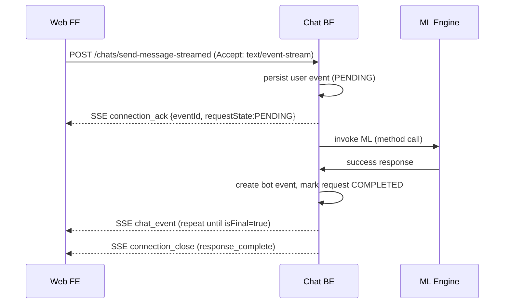
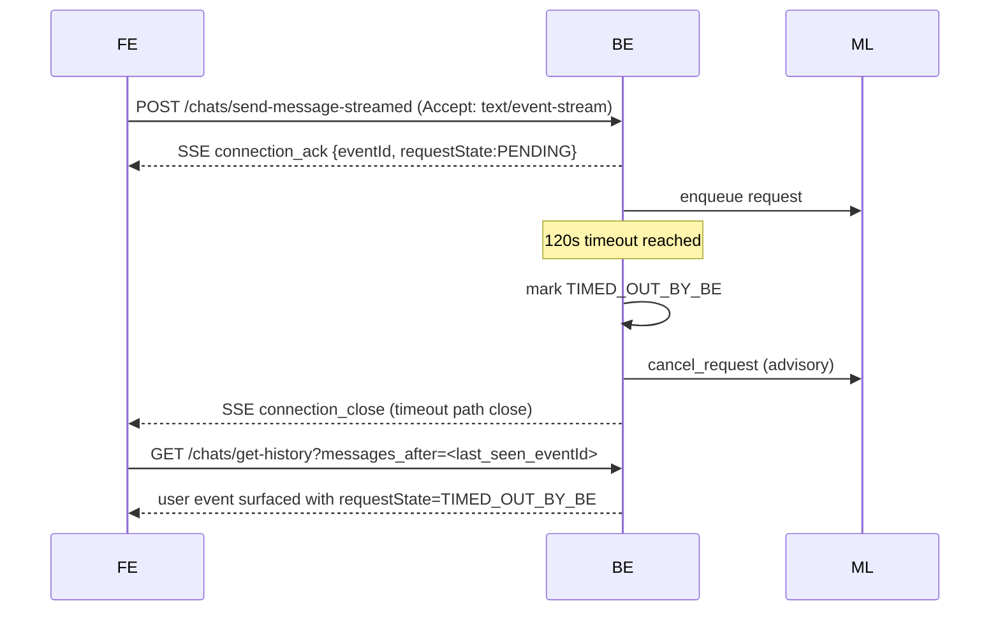
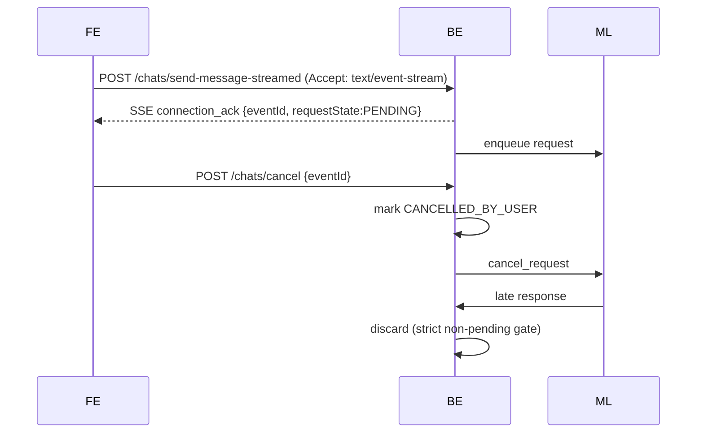
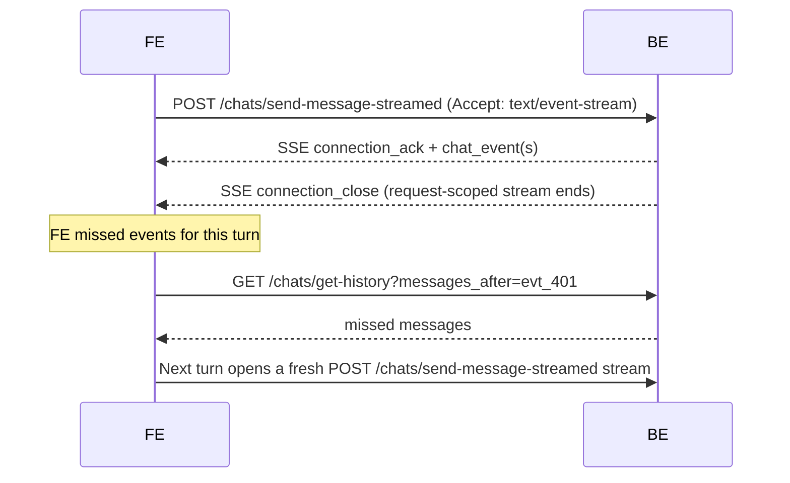

# Chat Platform Specification — v1

Final published **v1** specification for this repository.
This file is the canonical consolidated reference for architecture, API contract, and rich-text rendering.

Source documents merged:
- `chat_system_architecture_v1.md`
- `chat_api_contract_v1_rich_text.md`
- `chat_api_rich_text_rendering_guide.md`

---

## Part A — System Architecture and API

## 1. Formal Request State Machine

### Lifecycle Diagram (Request-Centric)

```
REQUEST_CREATED
      |
      v
   PENDING
      |
      |-------------------------------|
      |               |               |
      v               v               v
 COMPLETED     ERRORED_AT_ML   TIMED_OUT_BY_BE
                                       |
                                       v
                             (cancel signal to ML)

      |
      v
CANCELLED_BY_USER
(soft delete user event)
```

---

## 2. State Semantics

| State | Meaning |
|------|--------|
| PENDING | Awaiting ML response |
| COMPLETED | ML response processed successfully |
| ERRORED_AT_ML | ML returned explicit error |
| TIMED_OUT_BY_BE | No ML response within BE timeout (120s) |
| CANCELLED_BY_USER | User cancelled request |

---

## 3. Hard Invariants (Request Handling)

- Only **PENDING** requests may accept ML responses
- All other ML responses are **discarded and alerted**
- Cancellation is **advisory** to ML
- Requests never transition out of terminal states
- User request event is soft-deleted only for `CANCELLED_BY_USER`

---

## 4. API Contracts

### 4.1 `GET /chats/get-conversation-id`

Returns the active conversation ID (single chat in Phase 1).

**Response**
```json
{
  "conversationId": "conv_1",
  "isNew": false
}
```

`isNew` is a demo-app convenience flag and is not required in production contract responses.

---

### 4.2 `GET /chats/get-chats`

Returns all chats for the user.
Ordering: **latest chat first** (descending by `lastActivityAt`).

```json
{
  "chats": [
    {
      "conversationId": "conv_1",
      "createdAt": "2026-02-06T09:00:00Z",
      "lastActivityAt": "2026-02-06T10:05:00Z"
    }
  ]
}
```

---

### 4.3 `GET /chats/get-history`

**Query params**
- `conversationId` (required)
- `page_size` (optional, default `6`)
- `messages_before` (optional cursor, exclusive)
- `messages_after` (optional cursor, exclusive)
- `messages_before` and `messages_after` cannot be used together.

**Sort order**
- Always ascending by `created_at` (oldest → newest) in returned `messages`.

**Soft-delete filtering (canonical behavior)**
- User request events whose request state is `CANCELLED_BY_USER` are excluded by BE in `get-history` response.
- No other event types are filtered.

**Implicit window (no cursor)**
```
/chats/get-history?conversationId=conv_1
```
Returns latest 6 messages by default (or latest `page_size` when provided).

**Equivalent explicit default page size**
```
/chats/get-history?conversationId=conv_1&page_size=6
```

**Response**
```json
{
  "conversationId": "conv_1",
  "messages": [
    {
      "eventId": "evt_201",
      "eventType": "message",
      "sender": { "type": "bot", "id": "re_bot" },
      "payload": { ... },
      "createdAt": "2026-02-06T10:00:01Z"
    }
  ],
  "hasMore": true
}
```

**Before cursor (load older)**
```
/chats/get-history?conversationId=conv_1&messages_before=evt_12
```
Returns latest 6 messages strictly before `evt_12` (e.g. `evt_6..evt_11`).

**After cursor (recover missed messages)**
```
/chats/get-history?conversationId=conv_1&messages_after=evt_401
```
Returns latest 6 messages strictly after `evt_401` (e.g. `evt_402..evt_407`).

**Response**
```json
{
  "conversationId": "conv_1",
  "messages": [
    { "eventId": "evt_402", "payload": {} },
    { "eventId": "evt_403", "payload": {} },
    { "eventId": "evt_404", "payload": {} },
    { "eventId": "evt_405", "payload": {} },
    { "eventId": "evt_406", "payload": {} },
    { "eventId": "evt_407", "payload": {} }
  ],
  "hasMore": true
}
```

---

### 4.4 `POST /chats/send-message` (non-streaming)

```json
{
  "event": {
    "eventType": "message",
    "sender": { "type": "user" },
    "payload": {
      "messageType": "text",
      "content": { "text": "show me properties" }
    }
  }
}
```

**Response**
JSON only:
```json
{ "eventId": "evt_301", "requestState": "COMPLETED" }
```

**Usage**
- Canonical for fire-and-forget turns (`responseRequired === false`).
- If `responseRequired === true` (or user text), FE must use `POST /chats/send-message-streamed`.

**Message event enrichment**
- Each persisted message may include top-level `requestState` with one of:
  - `PENDING`
  - `COMPLETED`
  - `ERRORED_AT_ML`
  - `TIMED_OUT_BY_BE`
  - `CANCELLED_BY_USER`
- FE rendering by `requestState`:
  - `PENDING`, `COMPLETED`: render as usual
  - `ERRORED_AT_ML`, `TIMED_OUT_BY_BE`: render generic error text
  - `CANCELLED_BY_USER`: do not render message

---

### 4.5 `POST /chats/cancel`

```json
{ "eventId": "evt_301" }
```

- FE invokes cancel using the active user `eventId`.
- Cancellation is advisory toward ML, but BE strictly ignores late updates for cancelled/non-pending requests.

---

### 4.6 `POST /chats/send-message-streamed` (SSE)

Request body is identical to `send-message`. This endpoint requires `Accept: text/event-stream`.

**SSE (example)**
```txt
event: connection_ack
data: {"eventId":"evt_301","requestState":"PENDING"}

id: evt_401
event: chat_event
data: {JSON_CHAT_EVENT}

event: connection_close
data: {"reason":"response_complete"}
```

**Usage**
- Canonical for response-required turns (`responseRequired === true` and user text).
- One request-scoped stream per turn; no long-lived `GET /chats/stream` connection.

### 4.7 FE Request UI Semantics (canonical)

- **Awaiting indicator**: FE shows inline awaiting status only when:
  - outbound event has `payload.responseRequired === true`, and
  - final bot response (`payload.isFinal === true`) has not yet been received.
- **Timeout**: FE maintains a local reply timeout safeguard (current app value: `25s`); after timeout UI is shown, FE relies on polling (`get-history` with `messages_after`) until it receives the response for that message.
- **Input/CTA behavior**:
  - while `sending`: composer submit disabled
  - while `awaiting`: template actions disabled, composer shows **Cancel**
  - on `timeout`/`error`: **Retry** and **Dismiss** actions shown
- **Dismiss/Cancel semantics**:
  - FE dismiss/cancel transitions the active request to `CANCELLED_BY_USER`
  - cancelled message is hidden by rendering rules
  - if dismiss happens before `connection_ack` arrives, FE still marks local pending user event as `CANCELLED_BY_USER`; if ack arrives later, FE immediately cancels by that `eventId`.

### 4.8 Template and Action Handling (canonical)

- **Transient templates**: `share_location`, `shortlist_property`, `contact_seller`, and `nested_qna` render only when they are the latest message.
- **nested_qna contract shape**: `template.data.selections[]` with per-question `questionId` and options.
- FE submission for nested QnA uses `user_action`:
  - `action: "nested_qna_selection"`
  - `selections: [...]`
- **Share location**:
  - ML always returns `share_location` for near-me prompts.
  - FE `ShareLocation` may auto-send `location_shared` when permission is already granted, and template may not be visibly rendered in that case.
- **Auth gating**: shortlist/contact/brochure actions are FE-gated behind login; successful actions post hidden/shown `user_action` events back to BE/ML.

---

## 5. ML ↔ BE Envelopes (Phase 1)

### 5.1 ML Input (BE → ML)

```json
{
  "requestId": "req_123",
  "conversationId": "conv_1",
  "userEventId": "evt_456",
  "event": { "...": "ChatEvent" },
  "ttlMs": 120000
}
```

---

### 5.2 ML Success Output

```json
{
  "requestId": "req_123",
  "respondingToEventId": "evt_456",
  "status": "success",
  "event": { "...": "Bot ChatEvent" }
}
```

---

### 5.3 ML Error Output

```json
{
  "requestId": "req_123",
  "respondingToEventId": "evt_456",
  "status": "error",
  "error": {
    "code": "500",
    "message": "Cannot process request"
  }
}
```

---

### 5.4 Cancel Signal (BE → ML)

```json
{
  "type": "cancel_request",
  "requestId": "req_123",
  "reason": "TIMED_OUT_BY_BE"
}
```

---

## 6. SSE Rules

- SSE is **BE → FE only**
- `id` always equals `eventId` for chat events
- Ordering strictly by creation time
- Analytics & context events are **never sent**
- FE uses history APIs for replay

### 6.1 SSE event types

The stream uses the following **event** values and comment lines:

| Event / line | When | Format | FE handling |
|--------------|------|--------|-------------|
| **`event: chat_event`** | Bot (or visible info) event to display | `id: <eventId>\nevent: chat_event\ndata: <JSON ChatEvent>\n\n` | Parse `data` as `ChatEvent`; append to messages; `id` equals `eventId`. |
| **`event: connection_close`** | BE closing the stream (response complete / no-response / inactivity) | `event: connection_close\ndata: {"reason":"..."}\n\n` | Treat connection as closed for this request stream. |
| **Comment** (no event) | On open | `: connected\n\n` | Keeps connection alive; client detects stream open. |
| **Comment** (no event) | Keepalive while pending ML | `: keepalive\n\n` | Not delivered to EventSource listeners; used to refresh activity so BE does not close at 60s. |

**Chat events (`event: chat_event`)**  
- Only events that should be shown in the chat (e.g. bot messages, visible info) are sent with `event: chat_event`.
- Each line: `id: <eventId>\nevent: chat_event\ndata: <JSON ChatEvent>\n\n`.
- `data` is a single JSON object: the full `ChatEvent` (including `eventId`, `eventType`, `sender`, `payload`, `createdAt`, etc.).

**Other event values**  
- **`connection_close`**: Sent by the BE once, immediately before closing the stream when:
  - inactivity `>= 15s`, or
  - `responseRequired === false`, or
  - final bot response received (`isFinal === true`).

**Comments** (lines starting with `:`) do not set an `event` type and are not delivered to `EventSource` message listeners; they are used for connection liveness and keepalive only.

---

## 7. Connection Lifecycle Rules

### BE
- Close SSE when any of:
  - inactivity `>= 15s`
  - `responseRequired === false`
  - final bot response emitted (`isFinal === true`)

### FE
- Treat each `send-message-streamed` stream as request-scoped and terminal on `connection_close`.

---

## 8. Backend Database Schemas

### 8.1 `conversations`

```sql
conversation_id VARCHAR PK
user_id VARCHAR
ga_id VARCHAR
created_at TIMESTAMP
updated_at TIMESTAMP
```

---

### 8.2 `chat_events` (Immutable)

```sql
event_id VARCHAR PK
conversation_id VARCHAR
sender_type ENUM('user','bot','system')
event_type ENUM('message','info')
message_type VARCHAR
payload JSONB
source ENUM('FE','ML','SYSTEM')
visibility ENUM('active','soft_deleted')
created_at TIMESTAMP
```

---

### 8.3 `chat_requests` (Mutable)

```sql
request_id VARCHAR PK
conversation_id VARCHAR
user_event_id VARCHAR
state ENUM(
  'PENDING',
  'COMPLETED',
  'ERRORED_AT_ML',
  'TIMED_OUT_BY_BE',
  'CANCELLED_BY_USER'
)
retry_of_request_id VARCHAR
created_at TIMESTAMP
updated_at TIMESTAMP
```

---

## 9. System Invariants (Non-Negotiable)

1. One user message → one request
2. Only PENDING requests accept ML output
3. Event log is append-only
4. Request table is mutable
5. FE never talks to ML
6. ML never talks to FE
7. BE is the single source of truth
8. Late ML responses are discarded and logged

---

## 10. Sequence Diagrams (Non-Negotiable)

### 10.1 User Message → ML → FE (Happy Path)


---

### 10.2 Timeout at BE (No ML Response)

---

### 10.3 Cancel by User


---

### 10.4 SSE Reconnect Flow


---

## Appendix A: Implementation diversions (this app)

This section records how the **chat-demo** implementation diverges from or extends the frozen spec above. The spec remains canonical; these notes describe actual behaviour in this codebase.

### A.1 get-history

- Cursor behavior and soft-delete filtering are documented in canonical section §4.3.

### A.2 FE reply timeout and UI

- Canonical FE request UI semantics are documented in §4.7.

### A.3 SSE

- Canonical SSE behavior is documented in §4.6 and §6.

### A.4 Cancel

- Canonical cancel behavior is documented in §4.5 and §4.7.

### A.7 UI behavior for requestState

- Canonical requestState placement and rendering rules are documented in §4.4.

### A.5 Template and action handling

- Canonical template/action rules are documented in §4.8.

### A.6 Demo mode (`/chat?demo=true`)

- On demo mode, FE runs a scripted sequence (text + real UI clicks) with 2s pacing.
- Includes login auto-fill (phone/OTP), nested_qna option/text flows, brochure click, and location-permission pauses.
- Debug tracing is available in browser console with `[demo]` log prefix.

---

---

## Part B — Chat API Contract and Rich Text Examples

## 0. Core Principles (v1.0)

- **One primary enum**: `messageType`: `context | text | template | user_action | markdown` *(analytics — Phase 2)*
- **Message origin**: `system` and `user` messages are generated by the **client app**; `bot` messages are generated by **ML** and relayed via BE.  
  **Rendering rule:** `system` and `bot` messages are rendered as bot-side messages, while only `sender.type = user` is rendered in user bubbles.
- **Message IDs**: `messageId` is generated by **BE** (not FE/ML) for all persisted messages. Every message delivered to FE must include `messageId`.
- **Every bot message MUST have `messageId`, `sourceMessageId`, `sequenceNumber`, and `isFinal`**
- **`sourceMessageId`** ties all bot response messages back to the user message that triggered them
- **`user_action` visibility**: hidden by default — only rendered when `visibility === "shown"` and `derivedLabel` is set
- **`responseRequired`** on `user_action` and user `text`: tells ML whether to generate a response — always `true` for user text, conditional for user_action
- **Templates are FE-owned** (custom rendering is allowed and expected)
- **Templates MUST provide a `fallbackText`** *(Phase 2 — not rendered in Phase 1)*
- **Context is never rendered.** **Analytics** messageType is **Phase 2** — not in Phase 1 scope.
- **All future changes must be additive (v1.x)**

---

## 1. JSON Schema (Draft 7)

```json
{
  "$schema": "http://json-schema.org/draft-07/schema#",
  "title": "ChatEvent",
  "type": "object",
  "required": ["sender", "payload"],
  "properties": {
    "conversationId": { "type": "string" },

    "sender": {
      "type": "object",
      "required": ["type"],
      "properties": {
        "type": { "type": "string", "enum": ["user", "bot", "system"] },
        "id": { "type": "string" }
      }
    },

    "payload": {
      "type": "object",
      "required": ["messageType", "content"],
      "properties": {
        "messageId": {
          "type": "string",
          "description": "Unique ID for this message. Always generated by BE. FE and ML must not generate messageId."
        },

        "sourceMessageId": {
          "type": "string",
          "description": "BE-generated ID assigned to each inbound user message, then relayed to ML. ML echoes it back on every response message so FE/BE can correlate responses to the originating user turn. Required when sender.type = bot."
        },

        "sequenceNumber": {
          "type": "integer",
          "minimum": 0,
          "description": "0-based position of this message within the response sequence for a single user turn. A single user message may produce multiple bot messages (e.g., a text preamble followed by a property carousel). Required when sender.type = bot."
        },

        "isFinal": {
          "type": "boolean",
          "description": "true if this is the last message in the response sequence for the current user turn. FE/BE close the per-request stream when this is received; FE also stops loader/awaiting UI when this is received. Required when sender.type = bot."
        },
        "responseRequired": {
          "type": "boolean",
          "description": "FE-controlled. Applicable to user text and user_action events. true = FE expects ML response and starts loader/awaiting UI. false/absent = fire-and-forget, no ML response expected."
        },

        "messageType": {
          "type": "string",
          "enum": [
            "context",
            "text",
            "template",
            "user_action",
            "markdown"
          ],
          "description": "analytics is Phase 2 — not in Phase 1 schema."
        },

        "visibility": {
          "type": "string",
          "enum": ["shown", "hidden"],
          "description": "Only meaningful for messageType = user_action. Hidden by default. If set to shown, derivedLabel is rendered according to sender type (sender=user => user bubble, sender=system => bot-side message)."
        },

        "content": {
          "type": "object",
          "properties": {
            "text": {
              "type": "string",
              "description": "Plain text or Markdown depending on messageType"
            },
            "templateId": { "type": "string" },
            "data": { "type": "object" },

            // [Phase 2] fallbackText — not implemented in Phase 1
            "fallbackText": {
              "type": "string",
              "description": "[Phase 2] Renderable rich text used when template is unsupported (plain text | Markdown preferred)"
            },

            "derivedLabel": {
              "type": "string",
              "description": "FE-authored display text for user_action. Persisted by BE so history can render the same shown action text."
            }
          },
          "additionalProperties": false
        },

        "actions": {
          "description": "[Phase 2] Deferred. Ignore in Phase 1.",
          "type": "array",
          "items": {
            "type": "object",
            "required": ["id", "label", "replyType", "scope"],
            "properties": {
              "id": { "type": "string" },
              "label": { "type": "string" },
              "replyType": {
                "type": "string",
                "enum": ["visible", "hidden"]
              },
              "scope": {
                "type": "string",
                "enum": ["message", "template_item"]
              }
            }
          }
        }
      }
    },

    "requestState": {
      "type": "string",
      "enum": [
        "PENDING",
        "COMPLETED",
        "ERRORED_AT_ML",
        "TIMED_OUT_BY_BE",
        "CANCELLED_BY_USER"
      ],
      "description": "BE-resolved request lifecycle state for this message/turn."
    },

    "metadata": { "type": "object" }
  },

  "allOf": [
    {
      "if": {
        "properties": {
          "sender": { "properties": { "type": { "const": "bot" } } }
        }
      },
      "then": {
        "properties": {
          "payload": { "required": ["messageId"] }
        }
      }
    },
    {
      "if": {
        "properties": {
          "payload": {
            "properties": { "messageType": { "const": "user_action" } }
          }
        }
      },
      "then": {
        "properties": {
          "payload": {
            "properties": {
              "content": {
                // content.data is required; derivedLabel is required only when visibility = shown
                "required": ["data"]
              }
            }
          }
        }
      }
    }
  ]
}
```
---

## 2. Allowed `messageType` by Sender

| messageType | user | bot | system | responseRequired |
|------------|------|-----|--------|-----------------|
| context | ❌ | ❌ | ✅ | no |
| text | ✅ | ✅ | ✅ | yes when FE expects reply (`responseRequired: true`) |
| markdown | ❌ | ✅ | ❌ | NA |
| template | ❌ | ✅ | ❌ | NA |
| user_action | ✅ | ❌ | ✅ | yes when FE expects a response |

*Analytics is **Phase 2** — not in Phase 1.*

---

## 3. FE Rendering Rules (Decision Table)

| Condition | FE Behavior |
|---------|-------------|
| messageType = context | Do not render |
| requestState = CANCELLED_BY_USER | Do not render |
| requestState = ERRORED_AT_ML or TIMED_OUT_BY_BE | Render generic error text (“Something went wrong. Please try again.”) |
| messageType = user_action AND visibility != shown | Do not render (hidden by default) |
| messageType = user_action AND visibility = shown | Render derivedLabel |
| template supported | Render template |
| markdown | Safe render |
| action scope = template_item | Render per item — **[Phase 2]**  |
| action scope = message | Render once — **[Phase 2]**  |
| replyType = hidden | No echo, no LLM — **[Phase 2]**  |
| template unsupported | Render fallbackText (rich text) — **[Phase 2]** |

---

## 4. Examples

Property payload shape reference APIs (for template `data.property` / `data.properties[]`):

- Venus project details: [PROJECT_DEDICATED_DETAILS](https://venus.housing.com/api/v9/new-projects/288866/android?fixed_images_hash=true&include_derived_floor_plan=true&api_name=PROJECT_DEDICATED_DETAILS&source=android)
- Casa resale details: [RESALE_DEDICATED_DETAILS](https://casa.housing.com/api/v2/flat/18151449/resale/details?api_name=RESALE_DEDICATED_DETAILS&source=android)

### 4.1 Context on Chat Open (SRP)

> 📎 **Filter Reference:** See [`filterMap.js`](https://github.com/elarahq/housing.brahmand/blob/a17bf76ad06f0da180b270c840b1fb4ab14eb627/common/modules/filter-encoder/source/filterMap.js) for all possible filter keys.  
> 📎 **page_type values:** See [`pageTypes.js`](https://github.com/elarahq/housing.brahmand/blob/master/common/constants/pageTypes.js).

```json
{
  "sender": { "type": "system" },
  "payload": {
    "messageType": "context",
    "content": {
      "data": {
        "page_type": "SRP",
        "service": "buy",
        "category": "residential",
        "city": "526acdc6c33455e9e4e9",
        "filters": {
          
          "poly": ["dce9290ec3fe8834a293"], // list of polygon uuids for polygon SRP
          "est": 194298, // landmark SRP page - this is landmark/establishment id
          // below 2 fields are used when chat is initiated either from project SRP or from project dedicated page. 
          "region_entity_id": 31817,
          "region_entity_type": "project",
          "uuid": [], // builder uuid when searching for properties posted by a builder - builder SRP page
          "qv_resale_id": 1234, // property id when chat is initiated from resale details page 
          "qv_rent_id": 12345 // property id when chat is initiated from rent details page 

        // below are all filters
          "apartment_type_id": [1, 2],
          "contact_person_id": [1, 2],
          "facing": ["east", "west"],
          "has_lift": true,
          "is_gated_community": true,
          "is_verified": true,
          "max_area": 4000,
          "max_poss": 0,
          "max_price": 4800000,
          "radius": 3000,
          "routing_range": 10,
          "routing_range_type": "time",
          "min_price": 100,
          "property_type_id": [1, 2],
          "type": "project", // project/resale
        }
      }
    }
  }
}
```

---
### 4.2 Transport-level SSE examples

`POST /chats/send-message-streamed` with `Accept: text/event-stream`:

```txt
event: connection_ack
data: {"eventId":"evt_user_001","requestState":"PENDING"}

id: evt_bot_010
event: chat_event
data: {"sender":{"type":"bot"},"payload":{"messageId":"msg_b1","sourceMessageId":"msg_u1","sequenceNumber":0,"isFinal":false,"messageType":"text","content":{"text":"Here are 2bhk properties in sector 32 gurgaon"}}}

id: evt_bot_011
event: chat_event
data: {"sender":{"type":"bot"},"payload":{"messageId":"msg_b2","sourceMessageId":"msg_u1","sequenceNumber":1,"isFinal":true,"messageType":"template","content":{"templateId":"property_carousel","data":{"properties":[{"id":"p1","type":"project","title":"2, 3 BHK Apartments","name":"Godrej Air","short_address":[{"display_name":"Sector 85"},{"display_name":"Gurgaon"}],"is_rera_verified":true,"inventory_canonical_url":"https://example.com/property/p1","thumb_image_url":"https://images.unsplash.com/photo-1560448204-e02f11c3d0e2?w=600","property_tags":["Ready to move"],"formatted_min_price":"3 Cr","formatted_max_price":"3.5 Cr","unit_of_area":"sq.ft.","display_area_type":"Built up area","min_selected_area_in_unit":2500,"max_selected_area_in_unit":4750,"inventory_configs":[]},{"id":"p2","type":"rent","title":"3 BHK flat","short_address":[{"display_name":"Sector 33"},{"display_name":"Sohna"},{"display_name":"Gurgaon"}],"region_entities":[{"name":"M3M Solitude Ralph Estate"}],"is_rera_verified":false,"is_verified":true,"inventory_canonical_url":"https://example.com/property/p2","thumb_image_url":"https://images.unsplash.com/photo-1560448204-e02f11c3d0e2?w=600","property_tags":[],"formatted_price":"30,000","unit_of_area":"sq.ft.","display_area_type":"Built up area","inventory_configs":[{"furnish_type_id":2,"area_value_in_unit":4750}]},{"id":"p4","type":"rent","title":"2 BHK independent floor","short_address":[{"display_name":"Sector 23"},{"display_name":"Sohna"},{"display_name":"Gurgaon"}],"is_rera_verified":true,"is_verified":false,"inventory_canonical_url":"https://example.com/property/p4","thumb_image_url":"https://images.unsplash.com/photo-1560448204-e02f11c3d0e2?w=600","property_tags":[],"formatted_price":"12,000","unit_of_area":"sq.ft.","display_area_type":"Built up area","inventory_configs":[{"furnish_type_id":3,"area_value_in_unit":750}]}]}}}}

event: connection_close
data: {"reason":"response_complete"}
```

> **Important:** For non-streaming turns (`responseRequired: false`), FE uses `POST /chats/send-message` and receives JSON `{ eventId, requestState: "COMPLETED" }`.

---

### 4.3 Demo-flow-aligned examples

#### 4.3.1 User text: non-real-estate intent
```json
{
  "sender": { "type": "user" },
  "payload": {
    "messageType": "text",
    "responseRequired": true,
    "content": { "text": "hi. tell me about modiji" }
  }
}
```

#### 4.3.2 Bot text fallback
```json
{
  "sender": { "type": "bot" },
  "payload": {
    "messageId": "msg_b_001",
    "sourceMessageId": "msg_u_001",
    "sequenceNumber": 0,
    "isFinal": true,
    "messageType": "text",
    "content": { "text": "Hey! I'm still learning. Wont be able to help you with this. Anything else?" }
  }
}
```

#### 4.3.3 User text: property discovery
```json
{
  "sender": { "type": "user" },
  "payload": {
    "messageType": "text",
    "responseRequired": true,
    "content": { "text": "show me properties according to my preference" }
  }
}
```

#### 4.3.4 Bot multipart: intro text + property carousel
```json
{
  "sender": { "type": "bot" },
  "payload": {
    "messageId": "msg_b_010",
    "sourceMessageId": "msg_u_010",
    "sequenceNumber": 0,
    "isFinal": false,
    "messageType": "text",
    "content": { "text": "Here are 2bhk properties in sector 32 gurgaon" }
  }
}
```
```json
{
  "sender": { "type": "bot" },
  "payload": {
    "messageId": "msg_b_011",
    "sourceMessageId": "msg_u_010",
    "sequenceNumber": 1,
    "isFinal": true,
    "messageType": "template",
    "content": {
      "templateId": "property_carousel",
      "data": {
        // structure should be similar to corresponding venus/casa APIs. this is just sample
        "property_count": 15,
        "service": "buy",
        "category": "residential",
        "city": "526acdc6c33455e9e4e9",
        "filters": {
          "poly": ["dce9290ec3fe8834a293"],
          "est": 194298,
          "region_entity_id": 31817,
          "region_entity_type": "project",
          "uuid": [],
          "qv_resale_id": 1234,
          "qv_rent_id": 12345,
          "apartment_type_id": [1, 2],
          "contact_person_id": [1, 2],
          "facing": ["east", "west"],
          "has_lift": true,
          "is_gated_community": true,
          "is_verified": true,
          "max_area": 4000,
          "max_poss": 0,
          "max_price": 4800000,
          "radius": 3000,
          "routing_range": 10,
          "routing_range_type": "time",
          "min_price": 100,
          "property_type_id": [1, 2],
          "type": "project"
        },
        "properties": [
          {
            "id": "p1",
            "type": "project",
            "title": "2, 3 BHK Apartments",
            "name": "Godrej Air",
            "short_address": [{ "display_name": "Sector 85" }, { "display_name": "Gurgaon" }],
            "is_rera_verified": true,
            "inventory_canonical_url": "https://example.com/property/p1",
            "thumb_image_url": "https://images.unsplash.com/photo-1560448204-e02f11c3d0e2?w=600",
            "property_tags": ["Ready to move"],
            "formatted_min_price": "3 Cr",
            "formatted_max_price": "3.5 Cr",
            "unit_of_area": "sq.ft.",
            "display_area_type": "Built up area",
            "min_selected_area_in_unit": 2500,
            "max_selected_area_in_unit": 4750,
            "inventory_configs": []
          },
          {
            "id": "p2",
            "type": "rent",
            "title": "3 BHK flat",
            "short_address": [{ "display_name": "Sector 33" }, { "display_name": "Sohna" }, { "display_name": "Gurgaon" }],
            "region_entities": [{ "name": "M3M Solitude Ralph Estate" }],
            "is_rera_verified": false,
            "is_verified": true,
            "inventory_canonical_url": "https://example.com/property/p2",
            "thumb_image_url": "https://images.unsplash.com/photo-1560448204-e02f11c3d0e2?w=600",
            "property_tags": [],
            "formatted_price": "30,000",
            "unit_of_area": "sq.ft.",
            "display_area_type": "Built up area",
            "inventory_configs": [{ "furnish_type_id": 2, "area_value_in_unit": 4750 }]
          },
          {
            "id": "p3",
            "type": "resale",
            "title": "3 BHK apartment",
            "short_address": [{ "display_name": "Sector 33" }, { "display_name": "Sohna" }, { "display_name": "Gurgaon" }],
            "region_entities": [{ "name": "M3M Solitude Ralph Estate" }],
            "is_rera_verified": false,
            "is_verified": true,
            "inventory_canonical_url": "https://example.com/property/p3",
            "thumb_image_url": "https://images.unsplash.com/photo-1502672260266-1c1ef2d93688?w=600",
            "property_tags": ["Possession by March, 2026"],
            "formatted_min_price": "3 Cr",
            "unit_of_area": "sq.ft.",
            "display_area_type": "Built up area",
            "inventory_configs": [{ "furnish_type_id": null, "area_value_in_unit": 4750 }]
          }
        ]
      }
    }
  }
}
```

#### 4.3.5 FE action: shortlist from card (hidden signal)
```json
{
  "sender": { "type": "system" },
  "payload": {
    "messageType": "user_action",
    "responseRequired": false,
    "visibility": "hidden",
    "content": {
      "data": {
        "action": "shortlist",
        "messageId": "msg_b_011",
        "property": { "id": "p2", "type": "rent" }
      }
    }
  }
}
```

#### 4.3.6 FE action: contact seller (shown as bot-side text)
```json
{
  "sender": { "type": "system" },
  "payload": {
    "messageType": "user_action",
    "responseRequired": false,
    "visibility": "shown",
    "content": {
      "data": {
        "action": "crf_submitted",
        "messageId": "msg_b_011",
        "property": { "id": "p2", "type": "rent" }
      },
      "derivedLabel": "The seller has been contacted, someone will reach out to you soon!"
    }
  }
}
```

#### 4.3.7 FE action: learn_more_about_property -> markdown replies
```json
{
  "sender": { "type": "user" },
  "payload": {
    "messageType": "user_action",
    "responseRequired": true,
    "visibility": "shown",
    "content": {
      "data": {
        "action": "learn_more_about_property",
        "messageId": "msg_b_011",
        "property": { "id": "p1", "type": "project" }
      },
      "derivedLabel": "Tell me more about Godrej Air"
    }
  }
}
```
```json
{
  "sender": { "type": "bot" },
  "payload": {
    "messageId": "msg_b_018",
    "sourceMessageId": "msg_u_018",
    "sequenceNumber": 0,
    "isFinal": false,
    "messageType": "markdown",
    "content": { "text": "# Godrej Air\n📍 Sector 85, Gurgaon\n\nProperty details..." }
  }
}
```
```json
{
  "sender": { "type": "bot" },
  "payload": {
    "messageId": "msg_b_019",
    "sourceMessageId": "msg_u_018",
    "sequenceNumber": 1,
    "isFinal": true,
    "messageType": "markdown",
    "content": { "text": "## More details\nAmenities, configuration, pricing..." }
  }
}
```

#### 4.3.7 Text fallback: shortlist/contact template route
```json
{
  "sender": { "type": "user" },
  "payload": {
    "messageType": "text",
    "responseRequired": true,
    "content": { "text": "shortlist this property" }
  }
}
```
```json
{
  "sender": { "type": "bot" },
  "payload": {
    "messageId": "msg_b_020",
    "sourceMessageId": "msg_u_020",
    "sequenceNumber": 0,
    "isFinal": true,
    "messageType": "template",
    "content": {
      "templateId": "shortlist_property",
      "data": {
        // structure should be similar to corresponding venus/casa APIs. this is just sample
        "property": {
          "id": "p2",
          "type": "rent",
          "title": "3 BHK flat",
          "short_address": [{ "display_name": "Sector 33" }, { "display_name": "Sohna" }, { "display_name": "Gurgaon" }],
          "region_entities": [{ "name": "M3M Solitude Ralph Estate" }],
          "is_rera_verified": false,
          "is_verified": true,
          "inventory_canonical_url": "https://example.com/property/p2",
          "thumb_image_url": "https://images.unsplash.com/photo-1560448204-e02f11c3d0e2?w=600",
          "property_tags": [],
          "formatted_price": "30,000",
          "unit_of_area": "sq.ft.",
          "display_area_type": "Built up area",
          "inventory_configs": [{ "furnish_type_id": 2, "area_value_in_unit": 4750 }]
        }
      }
    }
  }
}
```
```json
{
  "sender": { "type": "bot" },
  "payload": {
    "messageId": "msg_b_021",
    "sourceMessageId": "msg_u_021",
    "sequenceNumber": 0,
    "isFinal": true,
    "messageType": "template",
    "content": {
      "templateId": "contact_seller",
      "data": {
        // structure should be similar to corresponding venus/casa APIs. this is just sample
        "property": {
          "id": "p2",
          "type": "rent",
          "title": "3 BHK flat",
          "short_address": [{ "display_name": "Sector 33" }, { "display_name": "Sohna" }, { "display_name": "Gurgaon" }],
          "region_entities": [{ "name": "M3M Solitude Ralph Estate" }],
          "is_rera_verified": false,
          "is_verified": true,
          "inventory_canonical_url": "https://example.com/property/p2",
          "thumb_image_url": "https://images.unsplash.com/photo-1560448204-e02f11c3d0e2?w=600",
          "property_tags": [],
          "formatted_price": "30,000",
          "unit_of_area": "sq.ft.",
          "display_area_type": "Built up area",
          "inventory_configs": [{ "furnish_type_id": 2, "area_value_in_unit": 4750 }]
        }
      }
    }
  }
}
```

#### Locality carousel sample (ML response)
```json
{
  "sender": { "type": "bot" },
  "payload": {
    "messageId": "msg_b_025",
    "sourceMessageId": "msg_u_025",
    "sequenceNumber": 0,
    "isFinal": true,
    "messageType": "template",
    "content": {
      "templateId": "locality_carousel",
      "data": {
        "localities": [
          {
            "id": "l1",
            "name": "Sector 32",
            "city": "Gurgaon",
            "url": "https://example.com/locality/sector-32-gurgaon",
            "image": "https://images.unsplash.com/photo-1449824913935-59a10b8d2000?w=1200&auto=format&fit=crop&q=80",
            "priceTrend": 26.7,
            "rating": 4
          },
          {
            "id": "l3",
            "name": "Sector 21",
            "city": "Gurgaon",
            "url": "https://example.com/locality/sector-21-gurgaon",
            "image": "https://images.unsplash.com/photo-1469474968028-56623f02e42e?w=1200&auto=format&fit=crop&q=80",
            "priceTrend": 22,
            "rating": 4
          }
        ]
      }
    }
  }
}
```

#### 4.3.8 Ambiguous locality query -> nested_qna
```json
{
  "sender": { "type": "user" },
  "payload": {
    "messageType": "text",
    "responseRequired": true,
    "content": { "text": "locality comparison of sector 32, sector 21" }
  }
}
```
```json
{
  "sender": { "type": "bot" },
  "payload": {
    "messageId": "msg_b_030",
    "sourceMessageId": "msg_u_030",
    "sequenceNumber": 1,
    "isFinal": true,
    "messageType": "template",
    "content": {
      "templateId": "nested_qna",
      "data": {
        "selections": [
          {
            "questionId": "sub_intent_1",
            "title": "Which sector 32 are you referring to?",
            "type": "locality_single_select",
            "options": [
              { "id": "uuid1", "title": "Sector 32", "city": "Gurgaon", "type": "Locality" },
              { "id": "uuid2", "title": "Sector 32", "city": "Faridabad", "type": "Locality" }
            ]
          },
          {
            "questionId": "sub_intent_2",
            "title": "Which sector 21 are you referring to?",
            "type": "locality_single_select",
            "entity": "sector 21",
            "options": [
              { "id": "uuid3", "title": "Sector 21", "city": "Gurgaon", "type": "Locality" },
              { "id": "uuid4", "title": "Sector 21", "city": "Faridabad", "type": "Locality" }
            ]
          }
        ],
        "canSkip": true
      }
    }
  }
}
```

#### 4.3.9 FE submission for nested_qna
```json
{
  "sender": { "type": "user" },
  "payload": {
    "messageType": "user_action",
    "responseRequired": true,
    "visibility": "shown",
    "content": {
      "data": {
        "action": "nested_qna_selection",
        "messageId": "msg_b_030",
        "selections": [
          { "questionId": "sub_intent_1", "text": "sector 32 gurgaon" },
          { "questionId": "sub_intent_2", "skipped": true }
        ]
      },
      "derivedLabel": "Q. Which sector 32 are you referring to?\nA. sector 32 gurgaon\n\nQ. Which sector 21 are you referring to?\nA. Skipped"
    }
  }
}
```

#### 4.3.10 Near-me flow (ML always sends share_location)
After `4.3.9`, the implemented demo flow includes these canonical examples:

```json
{
  "sender": { "type": "bot" },
  "payload": {
    "messageId": "msg_b_031",
    "sourceMessageId": "msg_u_030",
    "sequenceNumber": 0,
    "isFinal": false,
    "messageType": "markdown",
    "content": { "text": "# Sector 32, Gurgaon\nLocality learn-more summary..." }
  }
}
```
```json
{
  "sender": { "type": "bot" },
  "payload": {
    "messageId": "msg_b_032",
    "sourceMessageId": "msg_u_030",
    "sequenceNumber": 1,
    "isFinal": true,
    "messageType": "markdown",
    "content": { "text": "# Sector 21, Gurgaon\nLocality learn-more summary..." }
  }
}
```
```json
{
  "sender": { "type": "user" },
  "payload": {
    "messageType": "text",
    "responseRequired": true,
    "content": { "text": "show trending localities similar to these" }
  }
}
```
```json
{
  "sender": { "type": "bot" },
  "payload": {
    "messageId": "msg_b_033",
    "sourceMessageId": "msg_u_033",
    "sequenceNumber": 0,
    "isFinal": true,
    "messageType": "template",
    "content": {
      "templateId": "locality_carousel",
      "data": {
        "localities": [
          { "id": "l1", "name": "Sector 32", "city": "Gurgaon", "url": "https://example.com/locality/sector-32-gurgaon", "priceTrend": 26.7, "rating": 4 },
          { "id": "l3", "name": "Sector 21", "city": "Gurgaon", "url": "https://example.com/locality/sector-21-gurgaon", "priceTrend": 22, "rating": 4 }
        ]
      }
    }
  }
}
```
```json
{
  "sender": { "type": "user" },
  "payload": {
    "messageType": "user_action",
    "responseRequired": true,
    "visibility": "shown",
    "content": {
      "data": {
        "action": "learn_more_about_locality",
        "messageId": "msg_b_033",
        "locality": { "localityUuid": "l1" }
      },
      "derivedLabel": "Learn more about Sector 32"
    }
  }
}
```
```json
{
  "sender": { "type": "bot" },
  "payload": {
    "messageId": "msg_b_034",
    "sourceMessageId": "msg_u_034",
    "sequenceNumber": 0,
    "isFinal": true,
    "messageType": "markdown",
    "content": { "text": "# Sector 32\nLocality learn-more details..." }
  }
}
```
```json
{
  "sender": { "type": "user" },
  "payload": {
    "messageType": "text",
    "responseRequired": true,
    "content": { "text": "show price trends of this locality" }
  }
}
```
```json
{
  "sender": { "type": "bot" },
  "payload": {
    "messageId": "msg_b_035",
    "sourceMessageId": "msg_u_035",
    "sequenceNumber": 0,
    "isFinal": true,
    "messageType": "markdown",
    "content": { "text": "# Price Trend\nQ1-Q4 trend markdown..." }
  }
}
```
```json
{
  "sender": { "type": "user" },
  "payload": {
    "messageType": "text",
    "responseRequired": true,
    "content": { "text": "show rating reviews of this locality" }
  }
}
```
```json
{
  "sender": { "type": "bot" },
  "payload": {
    "messageId": "msg_b_036",
    "sourceMessageId": "msg_u_036",
    "sequenceNumber": 0,
    "isFinal": true,
    "messageType": "markdown",
    "content": { "text": "# Rating & Reviews\nLocality review markdown..." }
  }
}
```
```json
{
  "sender": { "type": "user" },
  "payload": {
    "messageType": "text",
    "responseRequired": true,
    "content": { "text": "show transaction data of this locality" }
  }
}
```
```json
{
  "sender": { "type": "bot" },
  "payload": {
    "messageId": "msg_b_037",
    "sourceMessageId": "msg_u_037",
    "sequenceNumber": 0,
    "isFinal": true,
    "messageType": "markdown",
    "content": { "text": "# Transaction Data\nTransaction markdown..." }
  }
}
```

Implemented demo-flow alignment for the later sequence (steps 18-40):

18. user asks `tell more about sector 21`  
19. bot replies nested_qna: which sector 21  
20. user selects first option  
21. bot replies learn-more markdown for sector 21  
22. user asks `to learn more about sector 32`  
23. bot replies nested_qna: which sector 32  
24. user types `sector 32 faridabad` in template textbox  
25. bot replies learn-more markdown for sector 32  
26. user asks `locality comparison of sector 32, sector 21`  
27. bot replies nested_qna for sector 32 + sector 21  
28. user enters `sector 32 gurgaon` and skips sector 21  
29. bot replies learn-more markdown for sector 32 gurgaon  
30. user says `show properties near me`  
31. bot replies with location request (`share_location`)  
32. user denies location  
33. user says `properties near me` again  
34. bot asks location permission again  
35. user grants location this time  
36. bot replies with property carousel  
37. user says `3bhk properties near me`  
38. location already available; FE auto-sends location_shared without rendering share_location template  
39. bot replies with property carousel  
40. user continues with property learn-more + brochure flow + nested_qna for `show me more properties in sector 32, sector 21`

```json
{
  "sender": { "type": "user" },
  "payload": {
    "messageType": "text",
    "responseRequired": true,
    "content": { "text": "show properties near me" }
  }
}
```
```json
{
  "sender": { "type": "bot" },
  "payload": {
    "messageId": "msg_b_040",
    "sourceMessageId": "msg_u_040",
    "sequenceNumber": 0,
    "isFinal": true,
    "messageType": "template",
    "content": { "templateId": "share_location", "data": {} }
  }
}
```

#### 4.3.11 Location actions from FE template
```json
{
  "sender": { "type": "system" },
  "payload": {
    "messageType": "user_action",
    "responseRequired": true,
    "content": { "data": { "action": "location_denied" } }
  }
}
```
```json
{
  "sender": { "type": "system" },
  "payload": {
    "messageType": "user_action",
    "responseRequired": true,
    "content": { "data": { "action": "location_shared", "coordinates": [28.5355, 77.391] } }
  }
}
```

#### 4.3.12 Brochure flow
```json
{
  "sender": { "type": "user" },
  "payload": {
    "messageType": "text",
    "responseRequired": true,
    "content": { "text": "show me brochure" }
  }
}
```
```json
{
  "sender": { "type": "bot" },
  "payload": {
    "messageId": "msg_b_050",
    "sourceMessageId": "msg_u_050",
    "sequenceNumber": 0,
    "isFinal": true,
    "messageType": "template",
    "content": {
      "templateId": "download_brochure",
      "data": {
        // structure should be similar to corresponding venus/casa APIs. this is just sample
        "property": {
          "id": "p2",
          "type": "rent",
          "title": "3 BHK flat",
          "short_address": [{ "display_name": "Sector 33" }, { "display_name": "Sohna" }, { "display_name": "Gurgaon" }],
          "region_entities": [{ "name": "M3M Solitude Ralph Estate" }],
          "is_rera_verified": false,
          "is_verified": true,
          "inventory_canonical_url": "https://example.com/property/p2",
          "thumb_image_url": "https://images.unsplash.com/photo-1560448204-e02f11c3d0e2?w=600",
          "property_tags": [],
          "formatted_price": "30,000",
          "unit_of_area": "sq.ft.",
          "display_area_type": "Built up area",
          "inventory_configs": [{ "furnish_type_id": 2, "area_value_in_unit": 4750 }]
        }
      }
    }
  }
}
```
```json
{
  "sender": { "type": "system" },
  "payload": {
    "messageType": "user_action",
    "responseRequired": false,
    "visibility": "hidden",
    "content": {
      "data": {
        "action": "brochure_downloaded",
        "messageId": "msg_b_050",
        "property": { "id": "p2", "type": "rent" }
      }
    }
  }
}
```

### 4.4 Auth and identity headers

`loginAuthToken` is removed from payload.  
Apps should send identity via cookie headers:

- `login_auth_token` (when available/authenticated),
- otherwise `_ga` as unique identifier:
  - app clients: device identifier in `_ga`,
  - web FE: Google Analytics user identifier in `_ga`.

---

### 4.5 FE runtime behavior notes

- FE starts awaiting UI only when `responseRequired: true` and no final bot event has been received.
- FE stops loader/awaiting and marks response complete on first bot event with `isFinal: true`.
- FE treats `connection_close` as stream completion for the turn.
- FE keeps a local timeout safeguard (current app value: 25s). On timeout, FE shows Retry/Dismiss and then relies on polling (`get-history` with `messages_after`) until it receives the response for that message.
- Input/CTA behavior:
  - while sending: input submit disabled
  - while awaiting: template actions disabled and Cancel shown in composer
  - on timeout/error: Retry/Dismiss shown
- Dismiss and Cancel semantics:
  - both map to `CANCELLED_BY_USER` for the active request
  - message in `CANCELLED_BY_USER` is not rendered
  - if dismiss happens before ack, FE marks the pending local user event cancelled; if ack arrives later, FE immediately cancels using ack `eventId`.
- RequestState rendering semantics:
  - `PENDING`, `COMPLETED`: render as usual
  - `ERRORED_AT_ML`, `TIMED_OUT_BY_BE`: render generic error text
  - `CANCELLED_BY_USER`: do not render
- Transient templates (`share_location`, `shortlist_property`, `contact_seller`, `nested_qna`) are rendered only when they are the latest message to prevent stale CTA/template duplication in history.
- Sticky `nested_qna`: while active as latest message, FE hides the text composer to avoid parallel free-text input during structured disambiguation.
- `property_carousel`: title row is clickable and opens `inventory_canonical_url` in a new tab.
- `property_carousel`: when `property_count > properties.length`, FE shows a trailing **View all** card that opens `getSRPUrl(service, category, city, filters)` in a new tab.
- `locality_carousel`: locality name is clickable and opens locality `url` in a new tab.
- Nested QnA contract:
  - bot template uses `template.data.selections[]` with `questionId` + options
  - FE submit uses `user_action` with `action: "nested_qna_selection"` and `selections`.
- Share location behavior:
  - ML always returns `share_location` for near-me queries.
  - FE may auto-send `location_shared` when permission is already granted; template may not be visibly rendered in that case.
- Auth gating:
  - shortlist/contact/brochure actions are FE-gated behind login
  - successful action posts hidden/shown `user_action` to BE/ML.
- Cancel API semantics:
  - FE calls `POST /chats/cancel` with current user `eventId`
  - cancellation is advisory to ML; BE ignores late updates for cancelled/non-pending requests.

---
### 4.6 `GET /chats/get-history` cursor contract

- Supported query params:
  - `conversationId` (required)
  - `page_size` (optional, default `6`)
  - `messages_before` (optional, exclusive cursor)
  - `messages_after` (optional, exclusive cursor)
- `messages_before` and `messages_after` are mutually exclusive in one request.
- Returned `messages` are always in ascending `created_at` order.
- Behavior:
  - no cursor: latest `page_size` messages (default latest 6)
  - `messages_before=evt_x`: latest `page_size` messages before `evt_x`
  - `messages_after=evt_x`: all messages after `evt_x`
- `hasMore` remains required for FE pagination controls.
- BE applies soft-delete filtering in this API: user request events with `requestState = CANCELLED_BY_USER` are excluded; no other event types are filtered.

---
## 5. FE Renderer Pseudocode

```ts
function renderRichText(value: string) {
  // Detect and safely render plain text / markdown
}

function renderEvent(event) {
  const { payload } = event;

  if (payload.messageType === "context") return;
  // [Phase 2] analytics: never render

  switch (payload.messageType) {
    case "text":
      renderText(payload.content.text);
      break;

    case "markdown":
      renderMarkdown(payload.content.text);
      break;

    case "template":
      if (isTemplateSupported(payload.content.templateId)) {
        renderTemplate(
          payload.content.templateId,
          payload.content.data,
          // [Phase 2] template_item-scoped actions not yet passed through
        );
      } else {
        // [Phase 2] fallbackText rendering not yet implemented
        renderRichText(payload.content.fallbackText || "");
      }
      break;

    case "user_action":
      // hidden by default — only render when visibility is explicitly "shown"
      if (payload.visibility === "shown") {
        renderUserBubble(payload.content.derivedLabel);
      }
      break;
  }

  // [Phase 2] message-scoped footer actions not yet implemented
  const footerActions = payload.actions?.filter(a => a.scope === "message") || [];
  if (footerActions.length) renderActions(footerActions);
}
```

---

## Appendix A: Implementation Notes (chat-demo)

This section documents current behavior in this repository where it differs from or extends the frozen v1.0 examples.

### A.1 Transport and request lifecycle

- FE uses:
  - `POST /api/chats/send-message-streamed` for `responseRequired: true`
  - `POST /api/chats/send-message` for `responseRequired: false`
- Stream sequence is:
  - `connection_ack` (immediate),
  - `chat_event` (0..N),
  - `connection_close` (`reason` in `response_complete | inactivity_15s`).
- FE reply timeout is 25s (`replyStatus: timeout`), with Retry and Dismiss; FE then relies on polling (`get-history` with `messages_after`) until response arrives for that message.
- Canonical stream/cancel/runtime semantics are defined in §4.5 and examples in §4.2.

### A.2 Rendering behavior

- `context` and `analytics` are never rendered.
- `user_action` is rendered only when `visibility === "shown"` and `derivedLabel` exists.
- Transient templates are rendered only for latest bot message:
  - `share_location`, `shortlist_property`, `contact_seller`, `nested_qna`.
- Input composer is hidden while sticky `nested_qna` is active.

### A.3 Template/action behavior in current app

- Property carousel actions are FE-owned:
  - shortlist sends hidden `user_action` (`action: "shortlist"`) after FE/API success.
  - contact sends shown `user_action` (`action: "crf_submitted"`).
  - learn more sends shown `user_action` (`action: "learn_more_about_property"`).
- `download_brochure` click emits hidden `user_action` (`action: "brochure_downloaded"`).
- `nested_qna` uses `data.selections[]`; submit emits:
  - `action: "nested_qna_selection"`,
  - `selections: [{ questionId, selection? | text? | skipped? }]`.

### A.4 Location flow (important)

- ML always responds to near-me prompts with `templateId: "share_location"`.
- FE `ShareLocation` checks permission state:
  - if already granted, it auto-sends `user_action` `location_shared` and does not render CTA.
  - otherwise user may send `location_shared` or `location_denied` via template interaction.

### A.5 Current mock-trigger notes (`lib/mock/ml-flow.ts`)

- Greeting uses **whole-word** matching for `hi|hello|hey` (avoids false positives from words like `this`).
- `locality comparison` returns locality carousel unless text explicitly contains sector ambiguity (`sector 32` / `sector 21`), in which case nested QnA route handles it.
- Additional text triggers supported in implementation include:
  - `show me properties according to my preference`,
  - shortlist/contact via text fallbacks,
  - price trend / ratings & reviews / transaction data markdown reports.

### A.6 Demo mode (`/chat?demo=true`)

- Auto-play script runs one step at a time with 2s delay.
- Uses real DOM clicks for templates, nested_qna typing/selection, and brochure CTA.
- Auth popup is auto-filled (phone + OTP) when shown.
- Near-me steps intentionally pause for user deny/allow actions.
- Debug logs are emitted with `[demo]` prefix in browser console.

### A.7 Feedback row (thumbs up/down + copy)

`FeedbackRow` is FE-rendered metadata UI (not an ML template) and is attached in `ChatMessage` under strict conditions.

#### When it is rendered

- Eligible base condition:
  - `sender.type` is `bot` or `system`, and
  - `payload.isFinal === true`, and
  - message is the latest visible message (`isLastMessage`).
- Text/markdown:
  - rendered for final bot/system `text` and `markdown` messages.
- Template:
  - rendered only if template body is actually rendered and template is not blacklisted.
  - blacklisted templates (no feedback row): `nested_qna`, `shortlist_property`, `contact_seller`.
- If not eligible, row is not shown.

#### Copy button behavior

- Copy icon is shown only when `copyText` is non-empty.
- On click: `navigator.clipboard.writeText(copyText)`; toast shows success/failure.

`copyText` source by message/template type:

- `text` / `markdown`: `payload.content.text`.
- `template: property_carousel`: computed by `getClipboardTextForPropertyCarousel(data)`.
  - one line per property.
  - project example format: `<projectName> in <address>. <area-range> <title> <price>. link: <url>`.
  - rent/resale format: `<title> in <address> for <price>. link: <url>`.
  - when `property_count > properties.length`, copy includes: `View all: <srpUrl>` where `srpUrl = getSRPUrl(service, category, city, filters)`.
- `template: locality_carousel`: computed by `getClipboardTextForLocalityCarousel(data)`.
  - one line per locality: `<name> (<rating>/5, <growth>% YoY)[ - <url>]`.
- `template: download_brochure`: computed by `getClipboardTextForDownloadBrochure(data)`.
  - `<projectName> - <priceRange> - <brochureUrl>` (available parts only).
- No copy row/button for templates that do not provide `copyText` (for example `share_location`, `nested_qna`, `shortlist_property`, `contact_seller`).

#### Thumbs up/down analytics behavior

- Current implementation logs feedback payload to console (`sendAnalytics`) and is marked for Phase-2 wiring.
- Logged payload shape:
  - `category: "chatbot"`
  - `action: "message_feedback"`
  - `label`:
    - `"thumbs_up"` for thumbs-up click
    - selected thumbs-down reason for thumbs-down submit
  - `dimensions`:
    - `template_id`, `message_type`, `sender`
    - optional `user_message` (free-text suggestion from thumbs-down sheet)
- Thumbs-down opens a feedback bottom sheet with predefined reasons and optional free-text; submit sends analytics and closes sheet.

---

## Status

**Chat API Contract v1.0 — FROZEN (Rich Text Clarified) ✅**

---

## Part C — Rich Text Rendering Guide (Markdown Only)

## 1) Scope (Phase 1)

Only these payload fields are used for rich text rendering:

- `payload.content.text` for `messageType: "text"` and `messageType: "markdown"`

The following are **not used in Phase 1** and should be ignored in renderers:

- `preText`
- `fallbackText`
- `followUpText`

HTML rendering support is dropped for Phase 1; treat content as markdown/plain text only.

---

## 2) Web/FE Current Strategy

### Message-type handling

- `context` and `analytics`: never rendered.
- `text`:
  - user sender -> user bubble with plain text.
  - bot/system sender -> bot-side text block.
- `markdown`:
  - bot/system sender -> rendered through markdown renderer (`RichText` component).
- `user_action`:
  - render only when `visibility === "shown"` and `derivedLabel` exists.
  - sender `system`/`bot` -> bot-side text style.
  - sender `user` -> user bubble.
- `template`:
  - template components render FE-owned UI (carousel, nested_qna, location, brochure, etc.).
  - some transient templates render only for latest message.

### Markdown-only rendering behavior

- Input is treated as markdown (plain text is valid markdown and renders naturally).
- No HTML detection branch.
- No HTML sanitization branch in Phase 1 rendering guide.

---

## 3) Current Web Implementation Notes

### Feedback row integration

For final bot/system messages, FE may render a `FeedbackRow` (thumbs up/down + optional copy), based on message/template eligibility.

### Copy content source

- text/markdown: copy `content.text`
- property carousel: computed summary lines from property data
- locality carousel: computed locality summary lines
- download brochure: project/price/url summary string

### Sticky nested-qna behavior

- While latest message is `templateId: "nested_qna"`, the main composer is hidden.
- User completes nested selection flow in template UI.

---

## 4) Minimal Web Pseudocode

```ts
function renderEvent(event: ChatEvent) {
  const { sender, payload } = event;

  if (payload.messageType === "context" || payload.messageType === "analytics") return null;

  if (payload.messageType === "user_action") {
    if (payload.visibility !== "shown" || !payload.content.derivedLabel) return null;
    return sender.type === "user"
      ? renderUserBubble(payload.content.derivedLabel)
      : renderBotText(payload.content.derivedLabel);
  }

  if (sender.type === "user" && payload.messageType === "text") {
    return renderUserBubble(payload.content.text ?? "");
  }

  if (payload.messageType === "text") {
    return renderBotText(payload.content.text ?? "");
  }

  if (payload.messageType === "markdown") {
    return renderMarkdown(payload.content.text ?? "");
  }

  if (payload.messageType === "template") {
    return renderTemplate(payload.content.templateId, payload.content.data);
  }

  return null;
}
```

---

## Status

**Phase 1 Rich Text Guide — Markdown-only ✅**
