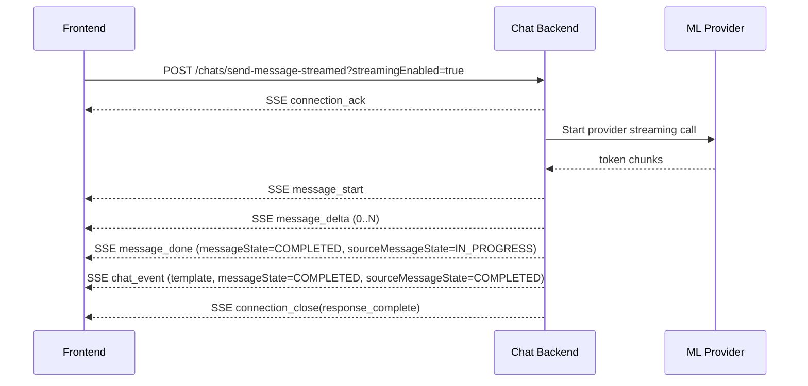
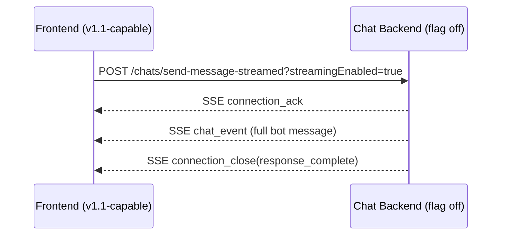

# Chat Platform Specification — v1.1 (Incremental Token Streaming)

Draft specification for incremental bot text streaming (word/phrase/sentence chunks) with full backward compatibility for existing v1 clients.

This document is additive to `chat_v1.md` and only defines v1.1 deltas.

**Turn vs part state (aligned with `chat_v1.md` Appendix A §A.0):** Incremental **`message_done`** and subsequent **`chat_event`** payloads should carry **`sourceMessageState`** for ML turn progress; each materialized bot **part** uses **`messageState: "COMPLETED"`** when stored (see `lib/contract-types.ts`).

---

## 1) Scope and Goals

### In scope
- Incremental streaming for bot `messageType: "text"` and `messageType: "markdown"`.
- Backward-compatible transport behavior so v1 clients continue to work unchanged.
- Provider-agnostic SSE contract from BE to FE.
- Clear fallback rules when FE does not support incremental streaming.

### Out of scope (v1.1)
- Partial streaming for `messageType: "template"` (templates remain atomic).
- Provider-specific contracts exposed to FE.
- Multi-modal token streaming (audio/image).

---

## 2) Backward Compatibility and Capability Negotiation

Incremental (v1.1) streaming is negotiated **only** via the **query parameter** on `POST /chats/send-message-streamed`:

- `streamingEnabled=true` — request v1.1 incremental SSE (`message_start` / `message_delta` / `message_done`) when the BE feature flag allows.
- Omitted or `streamingEnabled=false` — **v1 behavior**: SSE uses full `chat_event` bot messages only (no delta events).

No separate API version header is used; clients rely on this query flag only.

### Effective behavior matrix

| Query parameter | BE behavior |
|---|---|
| `streamingEnabled` absent or `false` (legacy / default) | v1 only: `chat_event` full messages, no `message_*` delta events |
| `streamingEnabled=true` | v1.1 incremental mode if `ENABLE_INCREMENTAL_STREAMING` allows; otherwise v1 `chat_event` fallback |

### Recommended BE feature flag
- `ENABLE_INCREMENTAL_STREAMING=true|false`
- If disabled, BE must gracefully fall back to v1 `chat_event` streaming even when FE requests v1.1.

---

## 3) Endpoint Changes

No new endpoint is required.

- `POST /chats/send-message` remains non-streaming JSON-only.
- `POST /chats/send-message-streamed` remains SSE, with optional v1.1 incremental semantics.

### 3.1 `POST /chats/send-message-streamed`

Request body remains identical to v1.

Additional optional request control:
- Query: `streamingEnabled=true|false` (default `false`) — **only** signal for v1.1 incremental SSE (see §2).

Required header:
- `Accept: text/event-stream`

---

## 4) SSE Event Contract (v1.1)

v1.1 introduces 3 incremental message events:
- `message_start`
- `message_delta`
- `message_done`

`message_delta` may include **optional** `chunkId` — see **§4.4.1**.

Existing v1 events remain valid:
- `connection_ack`
- `chat_event`
- `connection_close`
- `error`

### 4.1 Event ordering rules

For each bot message stream unit (`messageId`):
1. `message_start` exactly once
2. `message_delta` zero or more times
3. `message_done` exactly once

`messageId` values must be unique within conversation history.

### 4.2 Correlation fields

Shared across `message_start`, `message_delta`, and `message_done` for a given streaming unit:

- **`messageId`** — BE-assigned id for the **resulting bot message**. Announced in **`message_start`** and repeated on **`message_done`**; this is the **persisted** message id (same as in `get-history` / `ChatEventToUser.messageId`). **Do not** use a separate `eventId` on `message_done` for persistence identity — **`messageId` is the final persisted id.**

**Intermediate (non-persistent) fragments** are **`message_delta`** payloads only. They are **not** stored as separate history rows; each fragment may carry **`chunkId`** (optional but recommended for dedup) to identify that ephemeral chunk across retries/reconnects.

Also included where applicable:

- `sourceMessageId`
- `sequenceNumber`
- `messageType` (`text` or `markdown`)

### 4.3 `message_start`

```txt
event: message_start
data: {"messageId":"msg_b_101","sourceMessageId":"msg_u_99","sequenceNumber":0,"messageType":"markdown","context":{"user_intent":"SRP","service":"buy","category":"residential","city":"526acdc6c33455e9e4e9","poly":["dce9290ec3fe8834a293"],"est":194298,"properties":[{"id":123,"type":"project"}],"uuid":[],"filters":{"type":"project"}}}
```

Notes:
- Announces a new incremental bot message.
- `context` is optional by schema, but recommended to include (aligned with current strategy).

### 4.4 `message_delta`

```txt
event: message_delta
data: {"messageId":"msg_b_101","chunkIndex":3,"deltaText":" in Sector 32 Gurgaon"}
```

Rules:
- `deltaText` is append-only fragment (word/phrase/sentence).
- `chunkIndex` starts at `0` and increments by 1.
- FE must ignore duplicate or out-of-order chunks (`chunkIndex <= lastAppliedIndex`).

#### 4.4.1 Optional chunk identity (`chunkId`)

On each `message_delta`, **`chunkId`** is **optional**. Clients that ignore it remain fully compatible; **`chunkIndex`** stays **required** and **authoritative for ordering**.

| Field | Type | Required | Description |
|-------|------|----------|-------------|
| `chunkIndex` | number | **Yes** | Monotonic sequence `0, 1, 2, …` within this `messageId`. |
| `deltaText` | string | **Yes** | Append-only UTF-8 fragment (word / phrase / sentence). |
| `chunkId` | string | No | **Identity for this intermediate, non-persisted chunk** (e.g. ULID/UUID). Deltas are not separate `ChatEvent` rows; `chunkId` identifies the fragment for dedup/observability. If the same `chunkId` is received twice (retries, reconnect), FE **must** apply **at most once** (idempotent dedup). |

**Completion:** only **`message_done`** marks the end of the stream for that `messageId` (canonical `fullText`, **`messageState`** on the part, **`sourceMessageState`** for turn progress, persistence). No redundant “final chunk” flags on `message_delta`.

- **Why optional `chunkId`:** BE may normalize provider streams that emit per-chunk ids; exposing them helps idempotency and observability. **`message_done`** remains the sole completion signal.

**FE handling summary:**

1. If `chunkIndex` is not strictly `lastAppliedChunkIndex + 1`, apply §4.4 duplicate/out-of-order rules.
2. If `chunkId` is present and already in `seenChunkIds`, skip (duplicate).
3. Append `deltaText` to `bufferText` for accepted chunks.
4. On **`message_done`**, verify `fullText` matches `bufferText` (or replace buffer with `fullText` if policy allows repair), then finalize.

Optional example with `chunkId`:

```txt
event: message_delta
data: {"messageId":"msg_b_101","chunkIndex":3,"chunkId":"01ARZ3NDEKTSV4RRFFQ69G2FAV","deltaText":" in Sector 32 Gurgaon"}
```

### 4.5 `message_done`

```txt
event: message_done
data: {"messageId":"msg_b_101","sourceMessageId":"msg_u_99","sequenceNumber":0,"messageType":"markdown","messageState":"COMPLETED","sourceMessageState":"IN_PROGRESS","fullText":"# Top picks\nHere are 2BHK options in Sector 32 Gurgaon."}
```

Rules:
- **`messageId`** is the persisted bot message id (matches `message_start` for this unit). No separate `eventId` field is required on `message_done` for storage correlation.
- `fullText` must equal concatenation of all accepted deltas (after applying `chunkIndex` ordering and optional `chunkId` dedup per §4.4.1).
- **`messageState`** on `message_done` reflects the **part** row (typically **`COMPLETED`** once finalized); **`sourceMessageState`** carries **turn** progress (e.g. **`IN_PROGRESS`** when a template `chat_event` still follows).
- `message_done` is idempotent; FE may receive duplicates and should upsert by **`messageId`**.

### 4.6 Existing `chat_event` in v1.1

`chat_event` is still used for:
- `messageType: "template"` events (atomic only)
- non-incremental fallback behavior

Example:
```txt
id: evt_602
event: chat_event
data: {"sender":{"type":"bot"},"payload":{"messageId":"msg_b_102","sourceMessageId":"msg_u_99","sequenceNumber":1,"messageState":"COMPLETED","sourceMessageState":"COMPLETED","messageType":"template","content":{"templateId":"property_carousel","data":{"property_count":15,"service":"buy","category":"residential","city":"526acdc6c33455e9e4e9","filters":{"poly":["dce9290ec3fe8834a293"]},"properties":[{"id":"p1"}]}}}}
```

### 4.7 `connection_close`

No change from v1 reasons:
- `response_complete`
- `request_not_pending`
- `inactivity_timeout`
- `error`

---

## 5) Canonical FE Handling Rules

### 5.1 Capability detection
- FE adds `streamingEnabled=true` to the `send-message-streamed` URL only when the client implements incremental (`message_start` / `message_delta` / `message_done`) handling.

### 5.2 Incremental render state

Maintain per-`messageId` transient state:
- `bufferText: string`
- `lastAppliedChunkIndex: number`
- `seenChunkIds: Set<string>` (optional; only if BE emits `chunkId` on `message_delta`)
- `sourceMessageId`, `sequenceNumber`, `messageType`
- `startedAt`, `updatedAt`

### 5.3 Event handling
- `message_start`: create transient message slot if missing.
- `message_delta`: append `deltaText` when `chunkIndex` is the next expected index; if `chunkId` is present, skip when already in `seenChunkIds` (§4.4.1). Completion is only via `message_done`.
- `message_done`: finalize/persist in UI list and clear transient state.
- `chat_event` template: append directly (no transient buffer).

### 5.4 Rendering cadence
- FE should batch UI updates (recommended 30-80ms throttle) for smoothness/performance.

### 5.5 Reconnect and recovery
- On disconnect before `connection_close`, FE calls:
  - `GET /chats/get-history?conversationId=<id>&messages_after=<lastSeenEventId>`
- History remains source of truth; FE reconciles transient partial text against persisted final events.

---

## 6) Canonical BE Handling Rules

### 6.1 Provider normalization
- BE adapts provider token stream into v1.1 normalized events.
- FE never receives provider-native chunk format.
- When upstream provides stable per-chunk ids, BE **may** emit optional `chunkId` on `message_delta` (§4.4.1); **`chunkIndex`** remains the canonical ordering key.

### 6.2 Persistence strategy
- Persist final bot message at `message_done` (or equivalent completion point).
- Optional: checkpoint partial text in ephemeral cache (Redis/in-memory) for operational resilience.

### 6.3 Cancellation semantics
- If request is cancelled during stream:
  - stop upstream provider stream,
  - emit `connection_close` (`reason: "request_not_pending"` or `"error"` as appropriate),
  - do not emit further deltas.

### 6.4 Timeout semantics
- If BE times out waiting for upstream:
  - mark request terminal (`TIMED_OUT_BY_BE`),
  - close SSE with `connection_close`.
- FE may continue history polling per existing v1 behavior.
- FE clears awaiting / treats the turn as complete when `TIMED_OUT_BY_BE` is surfaced (same terminal semantics as bot `COMPLETED` / `ERRORED_AT_ML` on the stream per canonical `chat_v1.md` §4.5 / §6).

### 6.5 Mock stream pacing (chat-demo `send-message-streamed` only)

When testing the **v1** SSE path (full `chat_event` streaming, not incremental `message_*` deltas), the Next.js mock can slow multipart bot output: set **`ENABLE_MOCK_ML_DELAYS=true`** — see **`chat_v1.md` Appendix A §A.3.1** (initial delay ~6s, **5s** between each `chat_event`). Unrelated to v1.1 incremental token events but useful for observing staged awaiting copy (§4.7 / Appendix A §A.2).

---

## 7) Request/Response Examples

## 7.1 v1 legacy FE (no incremental support)

Request:
```http
POST /api/chats/send-message-streamed
Accept: text/event-stream
Content-Type: application/json
```

SSE response (unchanged v1 pattern):
```txt
event: connection_ack
data: {"eventId":"evt_u_11","messageState":"PENDING"}

id: evt_b_21
event: chat_event
data: {"sender":{"type":"bot"},"payload":{"messageId":"msg_b_21","sourceMessageId":"msg_u_11","sequenceNumber":0,"messageState":"COMPLETED","sourceMessageState":"COMPLETED","messageType":"markdown","content":{"text":"Here are options for you."}}}

event: connection_close
data: {"reason":"response_complete"}
```

## 7.2 v1.1 FE incremental markdown + template

Request:
```http
POST /api/chats/send-message-streamed?streamingEnabled=true
Accept: text/event-stream
Content-Type: application/json
```

SSE response:
```txt
event: connection_ack
data: {"eventId":"evt_u_12","messageState":"PENDING"}

event: message_start
data: {"messageId":"msg_b_31","sourceMessageId":"msg_u_12","sequenceNumber":0,"messageType":"markdown","context":{"user_intent":"SRP","service":"buy","category":"residential","city":"526acdc6c33455e9e4e9","poly":["dce9290ec3fe8834a293"],"est":194298,"properties":[{"id":123,"type":"project"}],"uuid":[],"filters":{"type":"project"}}}

event: message_delta
data: {"messageId":"msg_b_31","chunkIndex":0,"deltaText":"# Great options"}

event: message_delta
data: {"messageId":"msg_b_31","chunkIndex":1,"deltaText":" in Sector 32 Gurgaon"}

event: message_done
data: {"messageId":"msg_b_31","sourceMessageId":"msg_u_12","sequenceNumber":0,"messageType":"markdown","messageState":"COMPLETED","sourceMessageState":"IN_PROGRESS","fullText":"# Great options in Sector 32 Gurgaon"}

id: evt_b_32
event: chat_event
data: {"sender":{"type":"bot"},"payload":{"messageId":"msg_b_32","sourceMessageId":"msg_u_12","sequenceNumber":1,"messageState":"COMPLETED","sourceMessageState":"COMPLETED","messageType":"template","content":{"templateId":"property_carousel","data":{"property_count":15,"service":"buy","category":"residential","city":"526acdc6c33455e9e4e9","filters":{"poly":["dce9290ec3fe8834a293"]},"properties":[{"id":"p1"},{"id":"p2"}]}}}}

event: connection_close
data: {"reason":"response_complete"}
```

## 7.3 v1.1 request but BE feature flag disabled

Request:
```http
POST /api/chats/send-message-streamed?streamingEnabled=true
Accept: text/event-stream
Content-Type: application/json
```

SSE response:
- BE falls back to v1 `chat_event` only (no `message_start/message_delta/message_done`).
- FE must handle this without failure.

---

## 8) Updated Contract Types (v1.1 addenda)

These are transport event payload contracts (SSE `data` field), not stored `ChatEvent` replacements.

### 8.1 `MessageStartEvent`
```json
{
  "messageId": "string",
  "sourceMessageId": "string",
  "sequenceNumber": 0,
  "messageType": "text | markdown",
  "context": {
    "service": "buy",
    "category": "residential",
    "city": "526acdc6c33455e9e4e9",
    "filters": { "poly": ["dce9290ec3fe8834a293"] }
  }
}
```

### 8.2 `MessageDeltaEvent`
```json
{
  "messageId": "string",
  "chunkIndex": 0,
  "deltaText": "string",
  "chunkId": "string"
}
```

`chunkId` is **optional** (§4.4.1). When present, it identifies that **non-persisted** intermediate fragment.

### 8.3 `MessageDoneEvent`
```json
{
  "messageId": "string",
  "sourceMessageId": "string",
  "sequenceNumber": 0,
  "messageType": "text | markdown",
  "fullText": "string",
  "messageState": "COMPLETED",
  "sourceMessageState": "IN_PROGRESS | COMPLETED | ERRORED_AT_ML",
  "context": {
    "service": "buy",
    "category": "residential",
    "city": "526acdc6c33455e9e4e9",
    "filters": { "poly": ["dce9290ec3fe8834a293"] }
  }
}
```

**Persistence:** `messageId` is the sole id for the stored bot row; **`message_done` does not carry `eventId`** for that purpose.

---

## 9) Sequence Diagrams

## 9.1 Incremental happy path (v1.1-enabled FE)



## 9.2 Backward-compatible fallback



---

## 10) Rollout Plan

1. Ship BE support behind `ENABLE_INCREMENTAL_STREAMING`.
2. FE adds parser for new events; keep v1 `chat_event` path intact.
3. Enable incremental mode for internal users first (`streamingEnabled=true` on the request URL).
4. Monitor:
   - time to first chunk
   - stream completion rate
   - chunk reorder/drop metrics
   - cancel/error rates
5. Gradually ramp traffic.

---

## 11) Open Decisions Before Implementation

1. Should `message_done.fullText` be mandatory (recommended) or optional when BE can guarantee exact reconstruction?
2. Should `context` be emitted only in `message_done`, or both `message_start` and `message_done` (current recommendation: both)?

