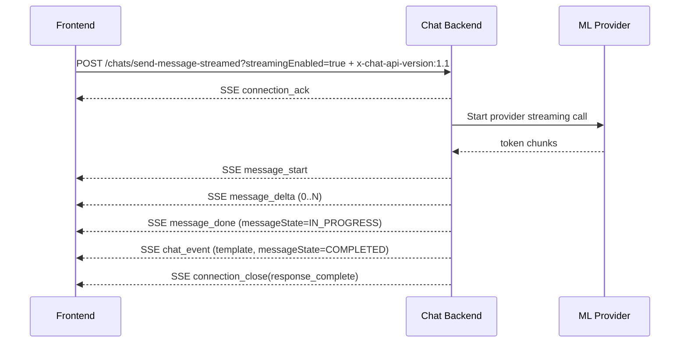
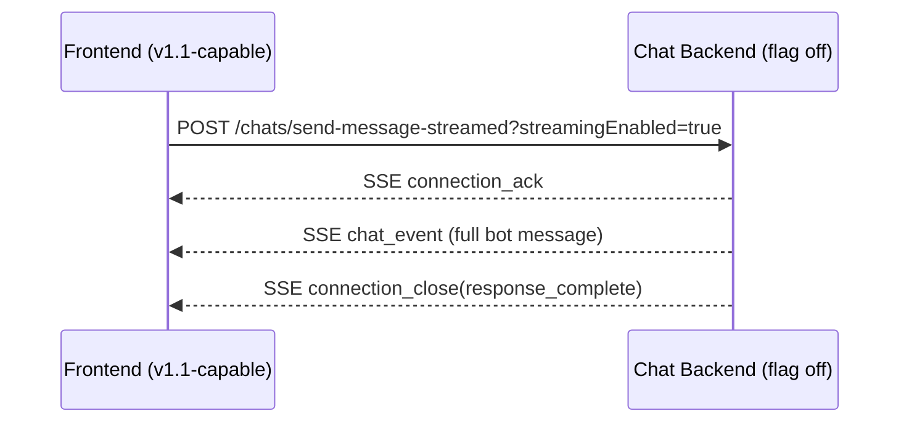

# Chat Platform Specification — v1.1 (Incremental Token Streaming)

Draft specification for incremental bot text streaming (word/phrase/sentence chunks) with full backward compatibility for existing v1 clients.

This document is additive to `chat_v1.md` and only defines v1.1 deltas.

---

## 1) Scope and Goals

### In scope
- Incremental streaming for bot `messageType: "text"` and `messageType: "markdown"`.
- Backward-compatible transport behavior so v1 clients continue to work unchanged.
- Provider-agnostic SSE contract from BE to FE.
- Clear fallback rules when FE does not support incremental streaming.

### Out of scope (v1.1)
- Partial streaming for `messageType: "template"` (templates remain atomic).
- Provider-specific contracts exposed to FE.
- Multi-modal token streaming (audio/image).

---

## 2) Backward Compatibility and Version Negotiation

Two compatibility knobs are supported. BE should accept both:

1. Query parameter flag:
   - `POST /chats/send-message-streamed?streamingEnabled=true`
2. Version header:
   - `x-chat-api-version: 1.1`

### Effective behavior matrix

| FE capability signal | BE behavior |
|---|---|
| No flag/header (legacy FE) | v1 behavior only: `chat_event` full messages, no deltas |
| `streamingEnabled=true`, no version header | v1.1 incremental mode if BE feature flag allows; otherwise v1 fallback |
| `x-chat-api-version: 1.1`, no query flag | v1.1 incremental mode if BE feature flag allows; otherwise v1 fallback |
| both supplied | v1.1 incremental mode if BE feature flag allows; otherwise v1 fallback |

### Recommended BE feature flag
- `ENABLE_INCREMENTAL_STREAMING=true|false`
- If disabled, BE must gracefully fall back to v1 `chat_event` streaming even when FE requests v1.1.

---

## 3) Endpoint Changes

No new endpoint is required.

- `POST /chats/send-message` remains non-streaming JSON-only.
- `POST /chats/send-message-streamed` remains SSE, with optional v1.1 incremental semantics.

### 3.1 `POST /chats/send-message-streamed`

Request body remains identical to v1.

Additional optional request controls:
- Query: `streamingEnabled=true|false` (default `false`)
- Header: `x-chat-api-version: 1.1` (optional)

Required header:
- `Accept: text/event-stream`

---

## 4) SSE Event Contract (v1.1)

v1.1 introduces 3 incremental message events:
- `message_start`
- `message_delta`
- `message_done`

Existing v1 events remain valid:
- `connection_ack`
- `chat_event`
- `connection_close`
- `error`

### 4.1 Event ordering rules

For each bot message stream unit (`messageId`):
1. `message_start` exactly once
2. `message_delta` zero or more times
3. `message_done` exactly once

`messageId` values must be unique within conversation history.

### 4.2 Correlation fields

All incremental events include:
- `eventId`: persisted event id where relevant (`message_done` must include final persisted id)
- `messageId`
- `sourceMessageId`
- `sequenceNumber`
- `messageType` (`text` or `markdown`)

### 4.3 `message_start`

```txt
event: message_start
data: {"messageId":"msg_b_101","sourceMessageId":"msg_u_99","sequenceNumber":0,"messageType":"markdown","context":{"service":"buy","category":"residential","city":"526acdc6c33455e9e4e9","filters":{"poly":["dce9290ec3fe8834a293"]}}}
```

Notes:
- Announces a new incremental bot message.
- `context` is optional by schema, but recommended to include (aligned with current strategy).

### 4.4 `message_delta`

```txt
event: message_delta
data: {"messageId":"msg_b_101","chunkIndex":3,"deltaText":" in Sector 32 Gurgaon","isFinalChunk":false}
```

Rules:
- `deltaText` is append-only fragment (word/phrase/sentence).
- `chunkIndex` starts at `0` and increments by 1.
- FE must ignore duplicate or out-of-order chunks (`chunkIndex <= lastAppliedIndex`).

### 4.5 `message_done`

```txt
event: message_done
data: {"eventId":"evt_601","messageId":"msg_b_101","sourceMessageId":"msg_u_99","sequenceNumber":0,"messageType":"markdown","messageState":"IN_PROGRESS","fullText":"# Top picks\nHere are 2BHK options in Sector 32 Gurgaon.","summarisedChatContext":{"service":"buy","category":"residential","city":"526acdc6c33455e9e4e9","filters":{"poly":["dce9290ec3fe8834a293"]}}}
```

Rules:
- `fullText` must equal concatenation of all accepted deltas.
- `messageState` follows existing response sequencing semantics.
- `message_done` is idempotent; FE may receive duplicates and should upsert by `eventId` or `messageId`.

### 4.6 Existing `chat_event` in v1.1

`chat_event` is still used for:
- `messageType: "template"` events (atomic only)
- non-incremental fallback behavior

Example:
```txt
id: evt_602
event: chat_event
data: {"sender":{"type":"bot"},"payload":{"messageId":"msg_b_102","sourceMessageId":"msg_u_99","sequenceNumber":1,"messageState":"COMPLETED","messageType":"template","content":{"templateId":"property_carousel","data":{"property_count":15,"service":"buy","category":"residential","city":"526acdc6c33455e9e4e9","filters":{"poly":["dce9290ec3fe8834a293"]},"properties":[{"id":"p1"}]}}}}
```

### 4.7 `connection_close`

No change from v1 reasons:
- `response_complete`
- `request_not_pending`
- `inactivity_timeout`
- `error`

---

## 5) Canonical FE Handling Rules

### 5.1 Capability detection
- FE sends `streamingEnabled=true` only when client implements incremental logic.
- FE may additionally send `x-chat-api-version: 1.1`.

### 5.2 Incremental render state

Maintain per-`messageId` transient state:
- `bufferText: string`
- `lastAppliedChunkIndex: number`
- `sourceMessageId`, `sequenceNumber`, `messageType`
- `startedAt`, `updatedAt`

### 5.3 Event handling
- `message_start`: create transient message slot if missing.
- `message_delta`: append `deltaText` if chunk index is next expected.
- `message_done`: finalize/persist in UI list and clear transient state.
- `chat_event` template: append directly (no transient buffer).

### 5.4 Rendering cadence
- FE should batch UI updates (recommended 30-80ms throttle) for smoothness/performance.

### 5.5 Reconnect and recovery
- On disconnect before `connection_close`, FE calls:
  - `GET /chats/get-history?conversationId=<id>&messages_after=<lastSeenEventId>`
- History remains source of truth; FE reconciles transient partial text against persisted final events.

---

## 6) Canonical BE Handling Rules

### 6.1 Provider normalization
- BE adapts provider token stream into v1.1 normalized events.
- FE never receives provider-native chunk format.

### 6.2 Persistence strategy
- Persist final bot message at `message_done` (or equivalent completion point).
- Optional: checkpoint partial text in ephemeral cache (Redis/in-memory) for operational resilience.

### 6.3 Cancellation semantics
- If request is cancelled during stream:
  - stop upstream provider stream,
  - emit `connection_close` (`reason: "request_not_pending"` or `"error"` as appropriate),
  - do not emit further deltas.

### 6.4 Timeout semantics
- If BE times out waiting for upstream:
  - mark request terminal (`TIMED_OUT_BY_BE`),
  - close SSE with `connection_close`.
- FE may continue history polling per existing v1 behavior.

---

## 7) Request/Response Examples

## 7.1 v1 legacy FE (no incremental support)

Request:
```http
POST /api/chats/send-message-streamed
Accept: text/event-stream
Content-Type: application/json
```

SSE response (unchanged v1 pattern):
```txt
event: connection_ack
data: {"eventId":"evt_u_11","messageState":"PENDING"}

id: evt_b_21
event: chat_event
data: {"sender":{"type":"bot"},"payload":{"messageId":"msg_b_21","sourceMessageId":"msg_u_11","sequenceNumber":0,"messageState":"COMPLETED","messageType":"markdown","summarisedChatContext":{"service":"buy","category":"residential","city":"526acdc6c33455e9e4e9","filters":{"poly":["dce9290ec3fe8834a293"]}},"content":{"text":"Here are options for you."}}}

event: connection_close
data: {"reason":"response_complete"}
```

## 7.2 v1.1 FE incremental markdown + template

Request:
```http
POST /api/chats/send-message-streamed?streamingEnabled=true
Accept: text/event-stream
Content-Type: application/json
x-chat-api-version: 1.1
```

SSE response:
```txt
event: connection_ack
data: {"eventId":"evt_u_12","messageState":"PENDING"}

event: message_start
data: {"messageId":"msg_b_31","sourceMessageId":"msg_u_12","sequenceNumber":0,"messageType":"markdown","context":{"service":"buy","category":"residential","city":"526acdc6c33455e9e4e9","filters":{"poly":["dce9290ec3fe8834a293"]}}}

event: message_delta
data: {"messageId":"msg_b_31","chunkIndex":0,"deltaText":"# Great options","isFinalChunk":false}

event: message_delta
data: {"messageId":"msg_b_31","chunkIndex":1,"deltaText":" in Sector 32 Gurgaon","isFinalChunk":false}

event: message_done
data: {"eventId":"evt_b_31","messageId":"msg_b_31","sourceMessageId":"msg_u_12","sequenceNumber":0,"messageType":"markdown","messageState":"IN_PROGRESS","fullText":"# Great options in Sector 32 Gurgaon","summarisedChatContext":{"service":"buy","category":"residential","city":"526acdc6c33455e9e4e9","filters":{"poly":["dce9290ec3fe8834a293"]}}}

id: evt_b_32
event: chat_event
data: {"sender":{"type":"bot"},"payload":{"messageId":"msg_b_32","sourceMessageId":"msg_u_12","sequenceNumber":1,"messageState":"COMPLETED","messageType":"template","summarisedChatContext":{"service":"buy","category":"residential","city":"526acdc6c33455e9e4e9","filters":{"poly":["dce9290ec3fe8834a293"]}},"content":{"templateId":"property_carousel","data":{"property_count":15,"service":"buy","category":"residential","city":"526acdc6c33455e9e4e9","filters":{"poly":["dce9290ec3fe8834a293"]},"properties":[{"id":"p1"},{"id":"p2"}]}}}}

event: connection_close
data: {"reason":"response_complete"}
```

## 7.3 v1.1 request but BE feature flag disabled

Request:
```http
POST /api/chats/send-message-streamed?streamingEnabled=true
Accept: text/event-stream
x-chat-api-version: 1.1
```

SSE response:
- BE falls back to v1 `chat_event` only (no `message_start/message_delta/message_done`).
- FE must handle this without failure.

---

## 8) Updated Contract Types (v1.1 addenda)

These are transport event payload contracts (SSE `data` field), not stored `ChatEvent` replacements.

### 8.1 `MessageStartEvent`
```json
{
  "messageId": "string",
  "sourceMessageId": "string",
  "sequenceNumber": 0,
  "messageType": "text | markdown",
  "context": {
    "service": "buy",
    "category": "residential",
    "city": "526acdc6c33455e9e4e9",
    "filters": { "poly": ["dce9290ec3fe8834a293"] }
  }
}
```

### 8.2 `MessageDeltaEvent`
```json
{
  "messageId": "string",
  "chunkIndex": 0,
  "deltaText": "string",
  "isFinalChunk": false
}
```

### 8.3 `MessageDoneEvent`
```json
{
  "eventId": "string",
  "messageId": "string",
  "sourceMessageId": "string",
  "sequenceNumber": 0,
  "messageType": "text | markdown",
  "fullText": "string",
  "messageState": "COMPLETED",
  "context": {
    "service": "buy",
    "category": "residential",
    "city": "526acdc6c33455e9e4e9",
    "filters": { "poly": ["dce9290ec3fe8834a293"] }
  }
}
```

---

## 9) Sequence Diagrams

## 9.1 Incremental happy path (v1.1-enabled FE)



## 9.2 Backward-compatible fallback



---

## 10) Rollout Plan

1. Ship BE support behind `ENABLE_INCREMENTAL_STREAMING`.
2. FE adds parser for new events; keep v1 `chat_event` path intact.
3. Enable FE flag for internal users only (`streamingEnabled=true` + version header).
4. Monitor:
   - time to first chunk
   - stream completion rate
   - chunk reorder/drop metrics
   - cancel/error rates
5. Gradually ramp traffic.

---

## 11) Open Decisions Before Implementation

1. Should `streamingEnabled=true` alone be sufficient, or must FE also send `x-chat-api-version: 1.1`?
2. Should `message_done.fullText` be mandatory (recommended) or optional when BE can guarantee exact reconstruction?
3. Should `context` be emitted only in `message_done`, or both `message_start` and `message_done` (current recommendation: both)?

