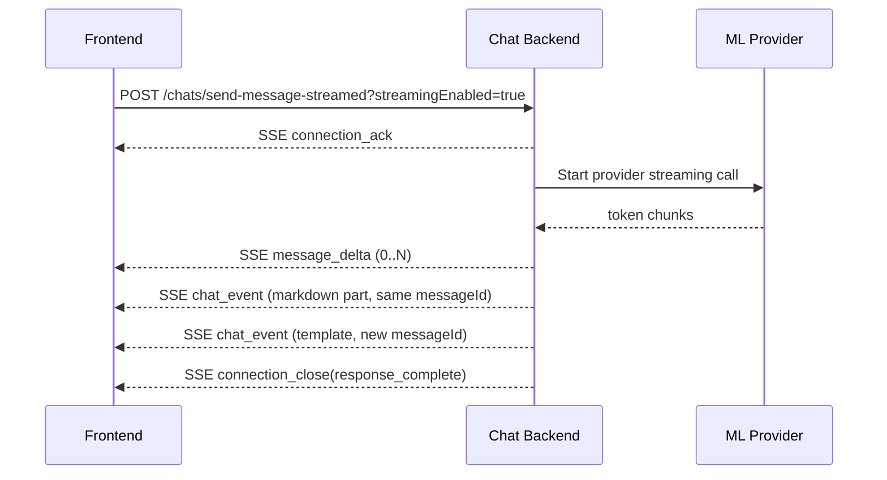
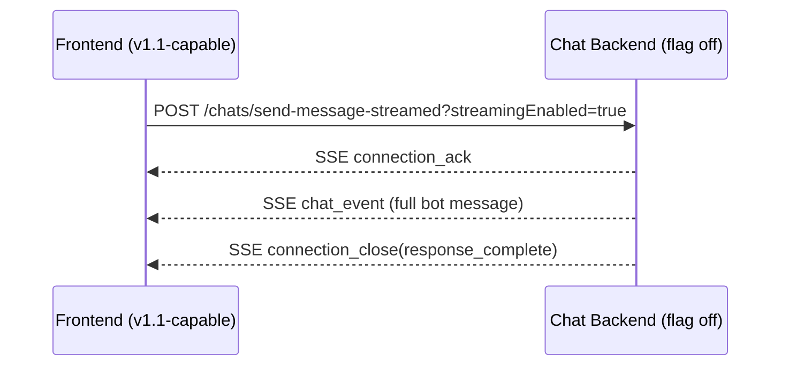

# Chat Platform Specification — v1.1 (Incremental Token Streaming)

Draft specification for incremental bot text streaming (word/phrase/sentence chunks) with full backward compatibility for existing v1 clients.

This document is additive to `chat_v1.md` and only defines v1.1 deltas.

**Turn vs part state (aligned with `chat_v1.md` Appendix A §A.0):** **`message_delta`** lines do **not** carry **`sourceMessageState`** on the wire — while deltas arrive for a part, FE may assume the turn is **in progress**; the **final `chat_event`** for that **`messageId`** (and persisted rows) carries authoritative **`sourceMessageState`** / **`messageState`**. Each materialized bot **part** uses **`messageState: "COMPLETED"`** when stored (see `lib/contract-types.ts`).

---

## 0) v1 model (recap — prerequisite for v1.1)

This section restates behaviour that is **already implemented in v1** (`chat_v1.md`, `ChatEventFromML` / `ChatEventToUser`) and does **not** change in v1.1 except where v1.1 adds **streaming transport** for a subset of bot text.

- For **one user message**, ML may emit **multiple bot responses** (“parts” / “partial responses”). Each part is a distinct logical unit with its own persisted **`messageId`** once materialized to the client/DB.
- Every part includes **`sourceMessageId`** linking it to the **user message** that triggered the turn.
- **`sourceMessageState`** describes **ML’s progress on the whole turn** for that **`sourceMessageId`**, not the lifecycle of an individual part row:
  - **`IN_PROGRESS`** — ML may still send **further parts** for this turn (e.g. intro text then template).
  - **`COMPLETED`** or **`ERRORED_AT_ML`** — terminal from ML for that turn (subject to v1 rules).
- In storage, the **original user message’s** **`messageState`** is updated from the **last** relevant ML signal (**`sourceMessageState`** on the ML envelope / persisted bot row per v1 — see `chat_v1.md` Appendix A §A.0).

v1.1 **does not replace** this model; it adds **optional token-level streaming** for a **single text/markdown part** before that part is finalized and, where applicable, still followed by atomic **`chat_event`** parts (e.g. templates).

---

## 1) Scope and Goals

### In scope
- Incremental streaming for bot `messageType: "text"` and `messageType: "markdown"`.
- Backward-compatible transport behavior so v1 clients continue to work unchanged.
- Provider-agnostic SSE contract from BE to FE.
- Clear fallback rules when FE does not support incremental streaming.

### Out of scope (v1.1)
- Partial streaming for `messageType: "template"` (templates remain atomic).
- Provider-specific contracts exposed to FE.
- Multi-modal token streaming (audio/image).

---

## 2) Backward Compatibility and Capability Negotiation

Incremental (v1.1) streaming is negotiated **only** via the **query parameter** on `POST /chats/send-message-streamed`:

- `streamingEnabled=true` — request v1.1 incremental SSE (`message_delta` chunks + final v1 **`chat_event`** per part, same **`messageId`**) when the BE feature flag allows.
- Omitted or `streamingEnabled=false` — **v1 behavior**: SSE uses full `chat_event` bot messages only (no delta events).

No separate API version header is used; clients rely on this query flag only.

### Effective behavior matrix

| Query parameter | BE behavior |
|---|---|
| `streamingEnabled` absent or `false` (legacy / default) | v1 only: `chat_event` full messages, no `message_*` delta events |
| `streamingEnabled=true` | v1.1 incremental mode if `ENABLE_INCREMENTAL_STREAMING` allows; otherwise v1 `chat_event` fallback |

### Recommended BE feature flag
- `ENABLE_INCREMENTAL_STREAMING=true|false`
- If disabled, BE must gracefully fall back to v1 `chat_event` streaming even when FE requests v1.1.

---

## 3) Endpoint Changes

No new endpoint is required.

- `POST /chats/send-message` remains non-streaming JSON-only.
- `POST /chats/send-message-streamed` remains SSE, with optional v1.1 incremental semantics.

### 3.1 `POST /chats/send-message-streamed`

Request body remains identical to v1.

Additional optional request control:
- Query: `streamingEnabled=true|false` (default `false`) — **only** signal for v1.1 incremental SSE (see §2).

Required header:
- `Accept: text/event-stream`

---

## 4) SSE Event Contract (v1.1)

v1.1 adds **one** incremental SSE event type:
- **`message_delta`** — append-only token chunks for a text/markdown part.

There is **no** `message_start` or `message_done`. The **first** chunk (`chunkIndex === 0`) carries the same correlation fields a separate “start” event would have (`messageId`, `sourceMessageId`, `sequenceNumber`, **`messageType`**). The **canonical persisted body** for history, `get-history`, and final UI is the **v1 `chat_event`** with the **same `messageId`** as the stream (full text/markdown in `content`).

`message_delta` may include **optional** `chunkId` — see **§4.3.1**.

Existing v1 events remain valid:
- `connection_ack`
- `chat_event`
- `connection_close`
- `error`

### 4.1 Event ordering rules

For each streamed bot part (`messageId`):
1. **`message_delta`** one or more times (`chunkIndex` from `0` upward).
2. **`chat_event`** (v1 shape) **once** for that part, **same `messageId`**, carrying the **full** `content` — authoritative for persistence and for clients that only understand full rows.

**Recommended:** BE emits the final **`chat_event`** for that **`messageId`** soon after the last **`message_delta`** (same ordering guarantees as §4.4). The **arrival of that `chat_event`** is what completes the streamed part for FE (no separate “stream complete” flag on deltas).

`messageId` values must be unique within conversation history.

### 4.2 Correlation fields

Shared across **`message_delta`** lines for a given streaming unit (and repeated on the final **`chat_event`**):

- **`messageId`** — BE-assigned id for the **resulting bot message**. Present from the **first** delta onward and on the final **`chat_event`**; this is the **persisted** message id (same as in `get-history` / `ChatEventToUser.messageId`).

**Intermediate (non-persistent) fragments** are **`message_delta`** payloads only. They are **not** stored as separate history rows and **must not** be returned by **`get-history`** — history lists **complete persisted messages only** (v1 **`chat_event`** rows). Each fragment may carry **`chunkId`** (optional but recommended for dedup) to identify that ephemeral chunk across retries/reconnects.

Also included where applicable:

- `sourceMessageId`
- `sequenceNumber`
- `messageType` (`text` or `markdown`) — **required on `chunkIndex === 0`**

### 4.2.1 Part identity, `messageId`, and ML envelope alignment (v1.1)

- **One streamed bot part = one `messageId`.** All **`message_delta`** lines for that token stream reuse the **same** **`messageId`** as the following **`chat_event`** for that part. That id is the id the **final** persisted bot row will use (same as v1 **part** semantics; see §0).
- **`sourceMessageId`** is repeated on deltas so each chunk is traceable back to the **user message** and consistent with v1 **`ChatEventFromML`**.
- **No `sourceMessageState` on `message_delta` (FE):** BE may still apply ML turn signals **when persisting** the user row / final **`chat_event`**, but the incremental transport does not need to repeat turn state per chunk. FE infers **in progress** while **`message_delta`** lines are arriving; the **`chat_event`** gives the real **`sourceMessageState`** update.
- **Envelope shape:** Each **`message_delta`** carries correlation (`messageId`, `sourceMessageId`, `sequenceNumber`, `messageType` on chunk 0, …) and **`content.text`** as the append-only fragment (ordering via **`chunkIndex`** / **`chunkId`**). Wire format is SSE `event: message_delta`, not `event: chat_event` (see **§4.3.2**).
- **Storage:** BE **does not** persist individual chunks as separate **`ChatEvent`** / DB rows; persistence of the text part happens when BE emits the **final `chat_event`** for that **`messageId`** (see **§4.4**, **§6.2**).

### 4.3 `message_delta`

First chunk (`chunkIndex === 0`) **must** include **`messageId`**, **`sourceMessageId`**, **`sequenceNumber`**, and **`messageType`** (`text` \| `markdown`).

```txt
event: message_delta
data: {"messageId":"msg_b_101","sourceMessageId":"msg_u_99","sequenceNumber":0,"messageType":"markdown","chunkIndex":0,"content":{"text":"# Top picks"}}
```

```txt
event: message_delta
data: {"messageId":"msg_b_101","chunkIndex":3,"content":{"text":" in Sector 32 Gurgaon"}}
```

Rules:
- **`content.text`** is the append-only fragment (word/phrase/sentence); FE treats every `message_delta` as a **delta** (incremental), not a full replacement.
- `chunkIndex` starts at `0` and increments by 1.
- FE must ignore duplicate or out-of-order chunks (`chunkIndex <= lastAppliedIndex`).

#### 4.3.1 Optional chunk identity (`chunkId`)

On each `message_delta`, **`chunkId`** is **optional**. Clients that ignore it remain fully compatible; **`chunkIndex`** stays **required** and **authoritative for ordering**.

| Field | Type | Required | Description |
|-------|------|----------|-------------|
| `chunkIndex` | number | **Yes** | Monotonic sequence `0, 1, 2, …` within this `messageId`. |
| `content.text` | string | **Yes** | Append-only UTF-8 fragment (word / phrase / sentence). |
| `chunkId` | string | No | **Identity for this intermediate, non-persisted chunk** (e.g. ULID/UUID). Deltas are not separate `ChatEvent` rows; `chunkId` identifies the fragment for dedup/observability. If the same `chunkId` is received twice (retries, reconnect), FE **must** apply **at most once** (idempotent dedup). |

**Completion (persistence boundary):** The **final v1 `chat_event`** for this **`messageId`** is the canonical source for **full text**, **`messageState`**, **`sourceMessageState`**, and alignment with **`get-history`**. The **`message_delta`** stream is implicitly **in progress** until that **`chat_event`** arrives (no extra “complete” field on deltas).

- **Why optional `chunkId`:** BE may normalize provider streams that emit per-chunk ids; exposing them helps idempotency and observability.

#### 4.3.2 Core fields (FE wire shape)

Each **`message_delta`** (BE → FE) includes:

| Field | Required | Description |
|-------|----------|-------------|
| `messageId` | **Yes** | Same id for all chunks of this streamed part (§4.2). |
| `sourceMessageId` | **Yes** | User message id for the turn (v1 semantics). |
| `chunkIndex` | **Yes** | Monotonic fragment index (§4.3.1). |
| `content.text` | **Yes** | Append-only fragment. |
| `chunkId` | No | Optional dedup id (§4.3.1). |
| `sequenceNumber` / `messageType` | See §4.2 | `messageType` required on chunk `0`. |

**No `sourceMessageState` on deltas (FE):** The **presence** of **`message_delta`** events for a **`messageId`** means streaming is **ongoing**; the **matching `chat_event`** supplies authoritative turn/part state. **No** separate “stream complete” flag on deltas.

**Relationship to ML:** **`MessageDeltaEventFromML`** (ML → BE) uses the same fragment shape; BE normalizes and emits **`MessageDeltaEventToUser`** on SSE (see **§8**). **BE does not** append a **`chat_event`** per chunk.

**FE handling summary:**

1. If `chunkIndex` is not strictly `lastAppliedChunkIndex + 1`, apply §4.3 duplicate/out-of-order rules.
2. If `chunkId` is present and already in `seenChunkIds`, skip (duplicate).
3. Append `content.text` to `bufferText` for accepted chunks.
4. On the **final `chat_event`** for this **`messageId`**, replace the transient buffer with the canonical **`ChatEventToUser`** (verify `content` text matches `bufferText` if desired; **`chat_event`** wins on conflict).

Optional example with `chunkId`:

```txt
event: message_delta
data: {"messageId":"msg_b_101","chunkIndex":3,"chunkId":"01ARZ3NDEKTSV4RRFFQ69G2FAV","content":{"text":" in Sector 32 Gurgaon"}}
```

### 4.4 Existing `chat_event` in v1.1

`chat_event` is still used for:
- `messageType: "template"` events (atomic only)
- non-incremental fallback behavior
- **Final materialization of a streamed text/markdown part** for **`get-history`** and for clients that only understand full rows: once ML has produced the **complete** part, BE emits a **`chat_event`** whose **`messageId`** matches the **`messageId`** on every **`message_delta`** for that stream (same id throughout).

**FE behaviour:** While **`message_delta`** lines are arriving, FE shows a **transient** buffer keyed by **`messageId`**. When FE receives the final **`chat_event`** for that **`messageId`**, FE **removes** the transient streaming UI and **renders** the final message from the **`chat_event`** payload (equivalently: replace buffered text with the canonical **`ChatEventToUser`**). This keeps a single logical message in the thread and matches **`get-history`** after refresh.

Example:
```txt
id: evt_602
event: chat_event
data: {"sender":{"type":"bot"},"payload":{"messageId":"msg_b_102","sourceMessageId":"msg_u_99","sequenceNumber":1,"messageState":"COMPLETED","sourceMessageState":"COMPLETED","messageType":"template","content":{"templateId":"property_carousel","data":{"property_count":15,"service":"buy","category":"residential","city":"526acdc6c33455e9e4e9","filters":{"poly":["dce9290ec3fe8834a293"]},"properties":[{"id":"p1"}]}}}}
```

### 4.5 `connection_close`

No change from v1 reasons:
- `response_complete`
- `request_not_pending`
- `inactivity_timeout`
- `error`

---

## 5) Canonical FE Handling Rules

### 5.1 Capability detection
- FE adds `streamingEnabled=true` to the `send-message-streamed` URL only when the client implements incremental **`message_delta`** handling and final **`chat_event`** reconciliation for the same **`messageId`**.

### 5.2 Incremental render state

Maintain per-`messageId` transient state:
- `bufferText: string`
- `lastAppliedChunkIndex: number`
- `seenChunkIds: Set<string>` (optional; only if BE emits `chunkId` on `message_delta`)
- `sourceMessageId`, `sequenceNumber`, `messageType`
- `startedAt`, `updatedAt`

### 5.3 Event handling
- `message_delta` (`chunkIndex === 0`): create transient message slot if missing; read **`messageType`**, **`sourceMessageId`**, **`sequenceNumber`**.
- `message_delta`: append **`content.text`** when `chunkIndex` is the next expected index; if `chunkId` is present, skip when already in `seenChunkIds` (§4.3.1). The **token stream** for this part ends when the final **`chat_event`** for that **`messageId`** arrives (§4.4).
- `chat_event` **for the same `messageId`**: replace transient streaming UI with the canonical **`ChatEventToUser`** row (§4.4); clear transient streaming state.
- `chat_event` **template** (different `messageId`): append directly (no transient buffer for that event).

### 5.4 Rendering cadence
- FE should batch UI updates (recommended 30-80ms throttle) for smoothness/performance.

### 5.5 Reconnect and recovery
- On disconnect before `connection_close`, FE calls:
  - `GET /chats/get-history?conversationId=<id>&messages_after=<lastSeenEventId>`
- History remains source of truth; FE reconciles transient partial text against persisted final events.

---

## 6) Canonical BE Handling Rules

### 6.1 Provider normalization
- BE adapts provider token stream into v1.1 normalized events.
- FE never receives provider-native chunk format.
- When upstream provides stable per-chunk ids, BE **may** emit optional `chunkId` on `message_delta` (§4.3.1); **`chunkIndex`** remains the canonical ordering key.

### 6.2 Persistence strategy
- **Chunks are not stored** as separate chat rows: **`message_delta`** fragments are **ephemeral** on the wire only.
- Persist the **final** bot **part** when emitting the **`chat_event`** with full **`content`** for that **`messageId`** (same row v1 clients already consume).
- **`GET /chats/get-history`** returns **only** complete persisted **`ChatEventToUser`** rows. **`message_delta`** payloads **must not** appear in **`get-history`** — they are not history entities. Until the **`chat_event`** is committed, a client that only polls history may not see that part yet (see **§5.5**).
- Optional: checkpoint partial text in ephemeral cache (Redis/in-memory) for operational resilience or reconnect (**§5.5**).

### 6.3 Cancellation semantics
- If request is cancelled during stream:
  - stop upstream provider stream,
  - emit `connection_close` (`reason: "request_not_pending"` or `"error"` as appropriate),
  - do not emit further deltas.

### 6.4 Timeout semantics
- If BE times out waiting for upstream:
  - mark request terminal (`TIMED_OUT_BY_BE`),
  - close SSE with `connection_close`.
- FE may continue history polling per existing v1 behavior.
- FE clears awaiting / treats the turn as complete when `TIMED_OUT_BY_BE` is surfaced (same terminal semantics as bot `COMPLETED` / `ERRORED_AT_ML` on the stream per canonical `chat_v1.md` §4.5 / §6).

### 6.5 Mock stream pacing (chat-demo `send-message-streamed` only)

When testing the **v1** SSE path (full `chat_event` streaming, not incremental `message_*` deltas), the Next.js mock can slow multipart bot output: set **`ENABLE_MOCK_ML_DELAYS=true`** — see **`chat_v1.md` Appendix A §A.3.1** (initial delay ~6s, **5s** between each `chat_event`). Unrelated to v1.1 incremental token events but useful for observing staged awaiting copy (§4.5 / Appendix A §A.2).

---

## 7) Request/Response Examples

## 7.1 v1 legacy FE (no incremental support)

Request:
```http
POST /api/chats/send-message-streamed
Accept: text/event-stream
Content-Type: application/json
```

SSE response (unchanged v1 pattern):
```txt
event: connection_ack
data: {"eventId":"evt_u_11","messageState":"PENDING"}

id: evt_b_21
event: chat_event
data: {"sender":{"type":"bot"},"payload":{"messageId":"msg_b_21","sourceMessageId":"msg_u_11","sequenceNumber":0,"messageState":"COMPLETED","sourceMessageState":"COMPLETED","messageType":"markdown","content":{"text":"Here are options for you."}}}

event: connection_close
data: {"reason":"response_complete"}
```

## 7.2 v1.1 FE incremental markdown + template

Request:
```http
POST /api/chats/send-message-streamed?streamingEnabled=true
Accept: text/event-stream
Content-Type: application/json
```

SSE response:
```txt
event: connection_ack
data: {"eventId":"evt_u_12","messageState":"PENDING"}

event: message_delta
data: {"messageId":"msg_b_31","sourceMessageId":"msg_u_12","sequenceNumber":0,"messageType":"markdown","chunkIndex":0,"content":{"text":"# Great options"}}

event: message_delta
data: {"messageId":"msg_b_31","chunkIndex":1,"content":{"text":" in Sector 32 Gurgaon"}}

id: evt_b_31
event: chat_event
data: {"sender":{"type":"bot"},"payload":{"messageId":"msg_b_31","sourceMessageId":"msg_u_12","sequenceNumber":0,"messageState":"COMPLETED","sourceMessageState":"IN_PROGRESS","messageType":"markdown","content":{"text":"# Great options in Sector 32 Gurgaon"}}}

id: evt_b_32
event: chat_event
data: {"sender":{"type":"bot"},"payload":{"messageId":"msg_b_32","sourceMessageId":"msg_u_12","sequenceNumber":1,"messageState":"COMPLETED","sourceMessageState":"COMPLETED","messageType":"template","content":{"templateId":"property_carousel","data":{"property_count":15,"service":"buy","category":"residential","city":"526acdc6c33455e9e4e9","filters":{"poly":["dce9290ec3fe8834a293"]},"properties":[{"id":"p1"},{"id":"p2"}]}}}}

event: connection_close
data: {"reason":"response_complete"}
```

## 7.3 v1.1 request but BE feature flag disabled

Request:
```http
POST /api/chats/send-message-streamed?streamingEnabled=true
Accept: text/event-stream
Content-Type: application/json
```

SSE response:
- BE falls back to v1 `chat_event` only (no `message_delta` chunks).
- FE must handle this without failure.

---

## 8) Updated Contract Types (v1.1 addenda)

These are **non-persisted** transport payloads — not stored `ChatEvent` rows. **Canonical persisted fields** (`messageState`, **`sourceMessageState`**, full body) live on the **v1 `chat_event`** with the same **`messageId`**. **`get-history`** only returns those persisted rows, never **`message_delta`** fragments (§6.2).

### 8.1 `MessageDeltaEventToUser` (BE → FE, SSE `message_delta` `data`)

```json
{
  "messageId": "string",
  "sourceMessageId": "string",
  "sequenceNumber": 0,
  "messageType": "text | markdown",
  "chunkIndex": 0,
  "content": { "text": "string" },
  "chunkId": "string"
}
```

- **`messageType`** — **required** on **`chunkIndex === 0`**; may be repeated on later chunks.
- **`chunkId`** is **optional** (§4.3.1).
- **No `sourceMessageState`** on the wire — FE treats **`message_delta`** as “stream in flight” for that **`messageId`** until the **`chat_event`** arrives.

No **`context`** on **`message_delta`**: search / intent context uses v1 **`messageType: "context"`** via normal **`chat_event`**.

### 8.2 `MessageDeltaEventFromML` (ML → BE)

Same fields as **`MessageDeltaEventToUser`**, plus optional **`conversationId`** for pipeline correlation. BE normalizes to **`MessageDeltaEventToUser`** on SSE. ML does not send turn state on deltas — BE persists **`sourceMessageState`** / **`messageState`** when materializing the final **`chat_event`**.

---

## 9) Sequence Diagrams

## 9.1 Incremental happy path (v1.1-enabled FE)



## 9.2 Backward-compatible fallback



---

## 10) Rollout Plan

1. Ship BE support behind `ENABLE_INCREMENTAL_STREAMING`.
2. FE adds parser for new events; keep v1 `chat_event` path intact.
3. Enable incremental mode for internal users first (`streamingEnabled=true` on the request URL).
4. Monitor:
   - time to first chunk
   - stream completion rate
   - chunk reorder/drop metrics
   - cancel/error rates
5. Gradually ramp traffic.

---

## 11) Open Decisions Before Implementation

1. **Ordering:** Must **`chat_event`** always follow the last **`message_delta`** for the same **`messageId`**, or can they arrive in the same tick / interleaved with later events? (FE should treat **`chat_event`** as authoritative for that **`messageId`** either way.)

---

## 12) Design review: proposed streaming model (risks & flaws)

This section records issues to resolve **before** implementation. It does **not** reject the approach; it tightens contracts.

### 12.1 Naming collision: overloading `messageState` on deltas vs v1 `MessageState`

v1.1 avoids putting **`messageState`** / **`sourceMessageState`** on **`message_delta`** so there is no collision with persisted enums — completion and turn state live on **`chat_event`** only.

### 12.2 Deltas vs final `chat_event`

The **final `chat_event`** carries the canonical full body. FE must not render **duplicate** text: keep a **single** slot per **`messageId`**; when **`chat_event`** arrives, **replace** the buffer with the **`ChatEventToUser`** payload.

**Authority:** **`chat_event`** / stored row is canonical for **`get-history`**. Deltas are for **live typing** UX only and **never** appear in **`get-history`**.

**Mitigation:** Specify that **`chat_event`** for a streamed part **follows** the last delta for that **`messageId`** (recommended), or document any allowed alternate ordering.

### 12.3 Turn state on the wire

**`sourceMessageState`** is not repeated on each delta; the final **`chat_event`** (and persisted rows) carry the authoritative update.

### 12.4 Full `ChatEventFromML` on every delta

Mirroring the **entire** ML envelope on each chunk increases payload size. Consider a **minimal** delta schema plus optional **enrichment** fields for debugging.

### 12.5 Reconnect without stored chunks

If BE **does not** persist chunks, after reconnect **`get-history`** may only show the **final** row once the part is committed. In-flight streams may **lose** partial text unless FE buffers locally or BE uses ephemeral recovery (**§6.2**). This is inherent; document UX (e.g. spinner until final row appears).

### 12.6 Multi-part turns

**`sourceMessageState: IN_PROGRESS`** on the **final** streamed markdown **`chat_event`** correctly allows a later **template** `chat_event` with another **`messageId`**. Incremental **`message_delta`** lines apply **only** within one **`messageId`**, not across parts.

### 12.7 Backward compatibility

Legacy clients ignore **`message_delta`**; they still need a **full** **`chat_event`** (or v1-only path). Ensure **`streamingEnabled=false`** path always delivers complete parts without requiring v1.1 fields.

